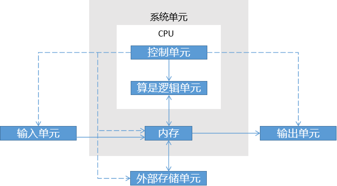

# 计算机

电脑五大组成单元

- [计算机基础](010_计算机基础/000_导读.md)
    - [计算机发展历程](010_计算机基础/010_计算机发展历程/000-导读.md)
    - [计算机分类与发展方向](010_计算机基础/020_计算机的分类与发展方向/000-导读.md)
    - [计算机工作过程](010_计算机基础/040_计算机工作过程/000-导读.md)
    - [计算机软件系统](010_计算机基础/050_计算机软件系统/000-导读.md)
    - [计算机编程语言](010_计算机基础/060_计算机编程语言/000-导读.md)
    - [计算机系统的层次结构](010_计算机基础/070_计算机系统的层次结构/000-导读.md)
    - [冯·诺依曼计算机](010_计算机基础/080_冯诺依曼计算机/000-导读.md)
    - [计算机性能指标](010_计算机基础/100_计算机性能指标/000-导读.md)
  - [数据的表示和运算](150_数据的表示和运算/000-导读.md)
  - [存储系统](060_存储系统/000-导读.md)
  - [指令系统](070_指令系统/000-导读.md)
  - [中央处理器](050_中央处理器/000-导读.md)
- [计算机组成原理](020_计算机组成原理/000-导读.md)
- [计算机操作系统](030_计算机操作系统/000-导读.md)
- [计算机网络](040_计算机网络/000-导读.md)
- [文件系统](090_文件系统/000-导读.md)
- [输入与输出系统](080_输入输出系统/000-导读.md)
- [进程与线程](170_进程与线程/000-导读.md)
- [数据库系统](180_数据库系统/000-导读.md)

