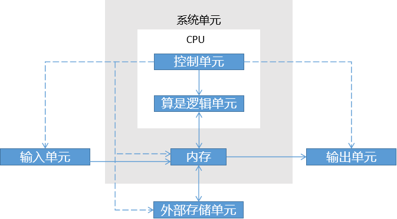
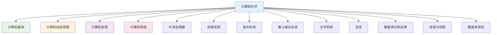

# 计算机科学

## 概述

!!! note "计算机科学"
    计算机科学是研究计算机系统、软件、算法和信息处理的学科,涵盖硬件、软件、网络、数据库等多个领域。

## 电脑五大组成单元

## 知识体系结构

```mermaid
graph TB
    A[计算机科学] --> B[计算机基础]
    A --> C[计算机组成原理]
    A --> D[计算机系统]
    A --> E[计算机网络]
    A --> F[中央处理器]
    A --> G[存储系统]
    A --> H[指令系统]
    A --> I[输入输出系统]
    A --> J[文件系统]
    A --> K[总线]
    A --> L[数据表示和运算]
    A --> M[进程与线程]
    A --> N[数据库系统]

    style A fill:#E3F2FD
    style B fill:#E8F5E9
    style C fill:#FFF3E0
    style D fill:#F3E5F5
    style E fill:#FCE4EC
```

## 主要内容

### 硬件系统

    <strong>硬件系统</strong>
    <ul style="margin: 5px 0;">
        <li><strong>中央处理器</strong>: CPU结构、指令系统、流水线</li>
        <li><strong>存储系统</strong>: 内存、缓存、虚拟存储</li>
        <li><strong>输入输出系统</strong>: I/O控制、中断、DMA</li>
        <li><strong>总线系统</strong>: 总线结构、仲裁、时序</li>
    </ul>

### 软件系统

!!! tip "软件系统"
    - **操作系统**: 进程管理、内存管理、文件系统
    - **数据库系统**: 关系数据库、SQL、事务管理
    - **网络系统**: 网络协议、网络架构、网络安全

### 基础理论

    <strong>基础理论</strong>
    
数据表示、算法设计、计算理论

## 学习路径

!!! info "推荐学习路径"
    1. 计算机基础 → 计算机组成原理
    2. 数据表示和运算 → 中央处理器 → 指令系统
    3. 存储系统 → 文件系统
    4. 输入输出系统 → 总线系统
    5. 进程与线程 → 数据库系统
    6. 计算机网络

## 目录

- [计算机基础](010_计算机基础/000_导读.md)
    - [计算机发展历程](010_计算机基础/010_计算机发展历程/000-导读.md)
    - [计算机分类与发展方向](010_计算机基础/020_计算机的分类与发展方向/000-导读.md)
    - [计算机工作过程](010_计算机基础/040_计算机工作过程/000-导读.md)
    - [计算机软件系统](010_计算机基础/050_计算机软件系统/000-导读.md)
    - [计算机编程语言](010_计算机基础/060_计算机编程语言/000-导读.md)
    - [计算机系统的层次结构](010_计算机基础/070_计算机系统的层次结构/000-导读.md)
    - [冯·诺依曼计算机](010_计算机基础/080_冯诺依曼计算机/000-导读.md)
    - [计算机性能指标](010_计算机基础/100_计算机性能指标/000-导读.md)
  - [数据的表示和运算](150_数据的表示和运算/000-导读.md)
  - [存储系统](060_存储系统/000-导读.md)
  - [指令系统](070_指令系统/000-导读.md)
  - [中央处理器](050_中央处理器/000-导读.md)
- [计算机组成原理](020_计算机组成原理/000-导读.md)
- [计算机操作系统](030_计算机系统/000-导读.md)
- [计算机网络](040_计算机网络/000-导读.md)
- [文件系统](090_文件系统/000-导读.md)
- [输入与输出系统](080_输入输出系统/000-导读.md)
- [进程与线程](170_进程与线程/000-导读.md)
- [数据库系统](180_数据库系统/000-导读.md)

## 参考资料

- [计算机科学 百度百科](https://baike.baidu.com/item/计算机科学)
