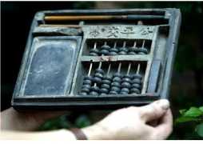
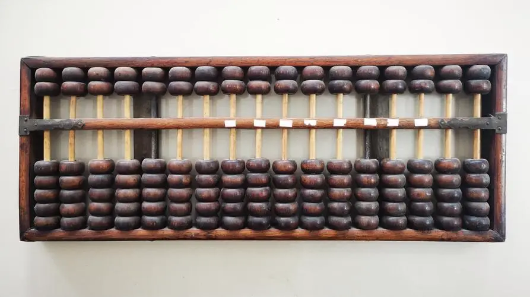
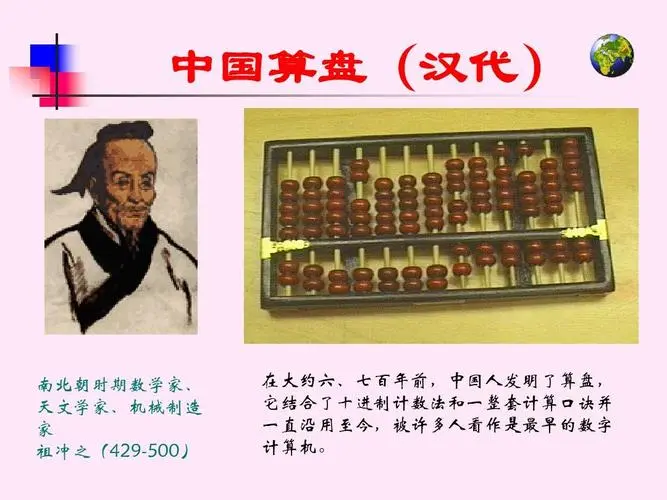
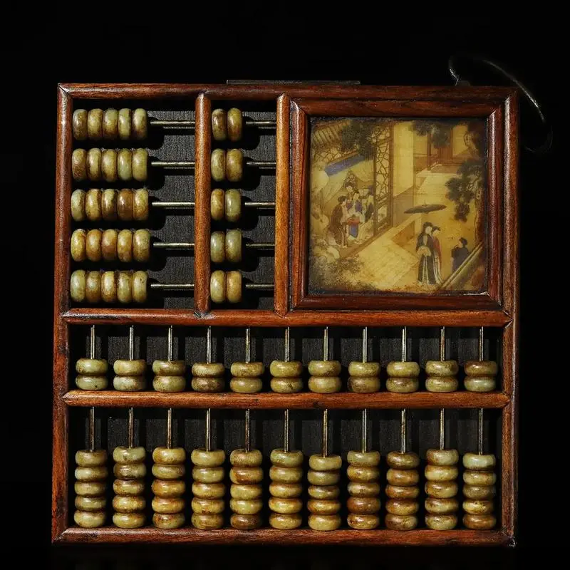
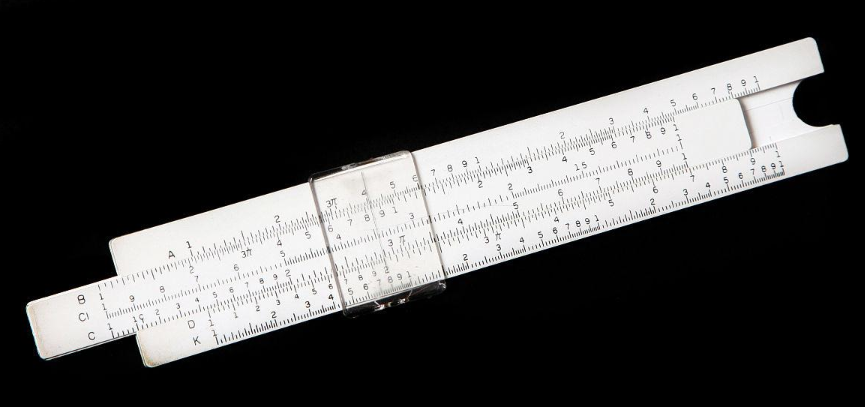
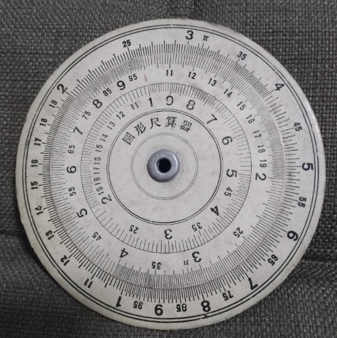
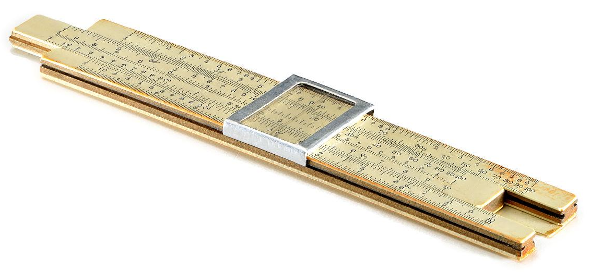
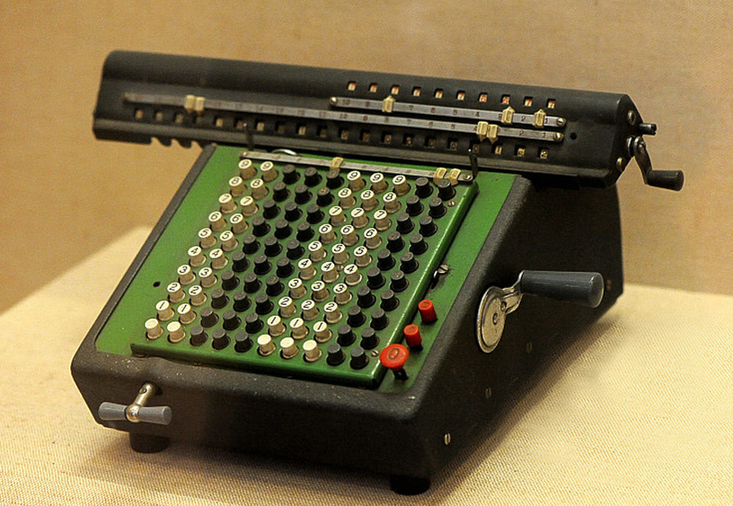

# 史前计算机时代

在人类历史上，早期计算工具的出现标志着对数量关系的探索与处理的初步尝试。

早在公元前，人们就使用手指、石子、绳结等简单工具进行计数和基本的算术运算。

在公元前5世纪，中国人发明了算盘，逐渐被广泛应用于商业贸易中，算盘被认为是最早的计算机，并一直使用至今。算盘在某些方面的运算能力要超过一些早期的计算机。我国“两弹一星”的问世，也与算盘有着不解之缘，来源[中国第一颗核弹是算盘算出来的吗？丨老照片里的“两弹一星”故事](https://baijiahao.baidu.com/s?id=1709147197036586077&wfr=spider&for=pc)

随着文明的进步，出现了计算尺、算表、算图等更为精确和高效的计算工具。这些工具虽然简单，但为后续的计算机械发展奠定了基础。有些工具到现在依然在使用。

## 算盘

比较古老的算盘了，个人觉得可能是早期商铺掌柜用的

常规算盘，这个80后应该大部分都用过，小时候有学的，还有口诀

## 计算尺

现在的教材中依然有着计算尺的存在，比如数学分解尺，图就不贴了，百度一大堆呢。

旧苏联制造的袖珍计算尺机械计算器

## 手摇计算机

计算中国第一颗原子弹数据的手摇计算机

西洋古董手摇机械计算机