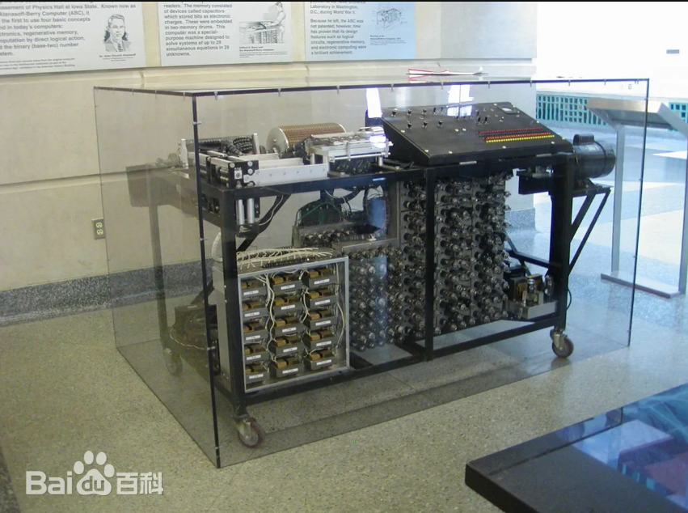
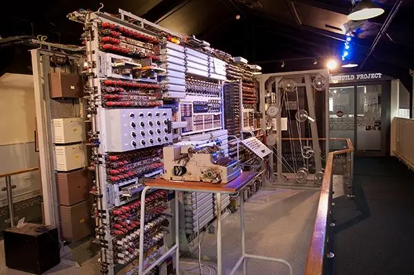
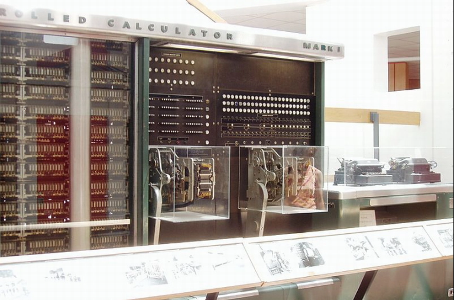
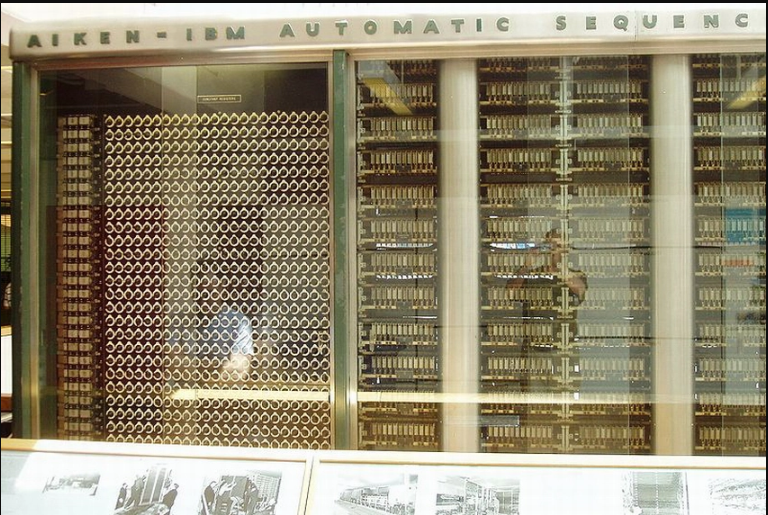
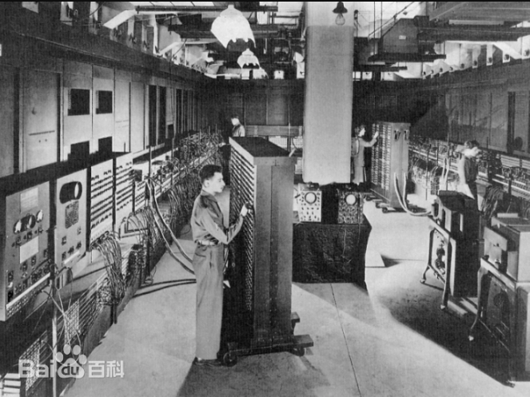

# 010-电子管计算机  第一代电子计算机

在这之前的计算机，都是基于机械运行方式，尽管有个别产品开始引入一些电学内容，却都是从属与机械的，还没有进入计算机的擅长的灵活的逻辑运算领域。而在这之后，随着电子技术的飞速发展，计算机就开始了由机械向电子时代的过渡，电子越来越成为计算机的主体，机械越来越成为从属，二者的地位发生了变化，计算机也开始了质的转变。

20世纪40年代，第一台真正意义上的电子计算机——ENIAC（电子数字积分计算机）在美国诞生。它采用了大量的电子管作为计算元件，实现了高速的数值计算。这一时期的计算机体积庞大、功耗高、可靠性差，但它们的出现标志着计算机时代的开启。

## 19世纪

### 1895年

1895年： 英国青年工程师弗莱明（J.Fleming）通过“爱迪生效应”发明了人类第一只电子管。 

## 20世纪

### 1912年

1912年：美国青年发明家德.福雷斯特（L.De Forest）在帕洛阿托小镇首次发现了电子管的放大作用，为电子工业奠定了基础，而今日的帕洛阿托小镇也已成为硅谷的中心地带。 

### 1939年

1939年10 月，约翰.阿塔纳索夫（John Vincent Atanasoff(1903-1995)）制造了后来举世闻名的ABC计算机的第一台样机，并提出了计算机的三条原则，

- （1）以二进制的逻辑基础来实现数字运算，以保证精度； 
- （2）利用电子技术来实现控制，逻辑运算和算术运算，以保证计算速度； 
- （3）采用把计算功能和二进制数更新存贮的功能相分离的结构。

这就是著名的计算机三原则。

ABC计算机 即阿塔纳索夫-贝瑞计算机（Atanasoff-Berry Computer），是世界上第一台电子计算机，由艾奥瓦州立大学的约翰·文森特·阿塔纳索夫（John Vincent Atanasoff）和他的研究生克利福特·贝瑞（Clifford Berry）在1937年开始设计，不可编程，仅仅设计用于求解线性方程组，并在1942年成功进行了测试。它被认定为世界上第一台计算机的过程较为曲折，涉及与ENIAC关于“世界上第一台计算机”称号的争议，最终在1973年经由美国联邦地方法院判决，得出ENIAC的发明者是从阿塔纳索夫那里继承了电子数字计算机的主要构想的事实，ABC才被认定为世界上第一台计算机。

ABC计算机的设计中已经包含了现代计算机中四个最重要的基本概念，即采用二进制、电子真空管执行数字计算与逻辑运算、电容器存储数值、程序与数据的分离，从这个角度来说它是一台真正现代意义上的电子计算机。而且，其“分而治之”的设计一直沿用至今，除了在计算机领域，还在通信等其他电子领域发挥出巨大的潜力。

[阿塔纳索夫-贝瑞计算机_百度百科 (baidu.com)](https://baike.baidu.com/item/阿塔纳索夫-贝瑞计算机/8177846)

### 1940 年

1940 年：9月，贝尔实验室使用电报线连接M—1型机，首次实现了人类对计算机进行的远距离控制的梦想。
 
控制论之父维纳提出了计算机五原则：

- （1）不是模拟式，而是数字式；
- （2）由电子元件构成，尽量减少机械部件；
- （3）采用二进制，而不是十进制；
- （4）内部存放计算表；
- （5）在计算机内部存贮数据。 

### 1943年

1943年：10月，绰号为“巨人”的用来破译德军密码的计算机在英国布雷契莱庄园制造成功，此后又制造多台，为第二次世界大战的胜利立下了汗马功劳。 

巨人计算机复制品

[巨人计算机_百度百科 (baidu.com)](https://baike.baidu.com/item/巨人计算机/4797760?fr=ge_ala)

[第一代电子计算机_百度百科 (baidu.com)_科普中国·科学百科](https://baike.baidu.com/item/%E7%AC%AC%E4%B8%80%E4%BB%A3%E7%94%B5%E5%AD%90%E8%AE%A1%E7%AE%97%E6%9C%BA)

### 1944年

美国哈佛大学应用数学教授霍华德·阿肯受巴贝奇思想启发，在1937年得到美国海军部的经费支持，开始设计“马克1号”（由IBM承建），于1944年交付使用。总耗资四五十万美元。 “马克1号”做乘法运算一次最多需要6秒，除法10多秒。运算速度不算太快，但精确度很高（小数点后23位）。 

1944年首台自动按序控制计算器——Mark Ⅰ

### 1946 年

1946 年：2月14日，美国宾西法尼亚大学研制成功了ENIAC  计算机。这台计算机总共安装了17468只电子管，7200个二极管，70000多电阻器，10000多 只电容器和6000只继电器，电路的焊接点多达 50万个,机器被安装在一排2.75米高的金属柜里，占地面积为170平方米左右，总重量达到30吨，其运算速度达到每秒钟5000次加法，可以在 3/1000秒时间内做完两个10位数乘法。

[ENIAC计算机_百度百科 (baidu.com)](https://baike.baidu.com/item/ENIAC/431133?fr=ge_ala)

[ENIAC计算机

