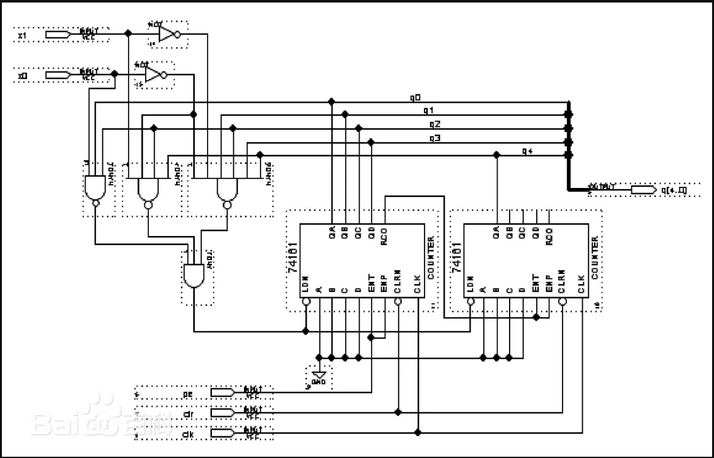
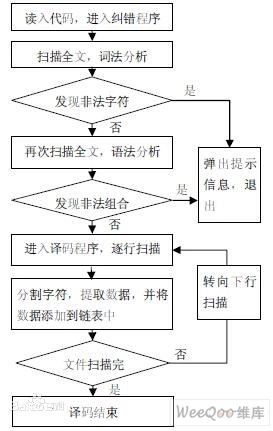
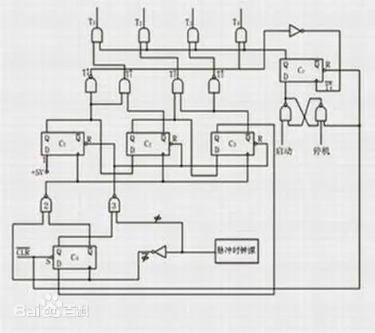

# 001-控制器

[控制器 百度百科(baidu.com)](https://baike.baidu.com/item/控制器/2206126)

控制器（controller）是指按照预定顺序改变主电路或控制电路的接线和改变电路中电阻值来控制电动机的启动、调速、制动和反向的主令装置。由**程序计数器、指令寄存器、指令译码器、时序产生器和操作控制器**组成，它是发布命令的“决策机构”，即完成协调和指挥整个计算机系统的操作。

控制器：协调各个部件相关的问题
- CU 分析指令 给出控制信号
- IR
- PC

## CU

Control Unit（控制单元）：在计算机的中央处理器（CPU）中，控制单元（CU）是负责协调和控制整个计算过程的组件。它解释和执行指令、管理数据流动、协调各个部件之间的操作等。控制单元通常与算术逻辑单元（ALU）一起构成 CPU 的核心部分。

Compute Unit（计算单元）：在图形处理器（GPU）或其他加速处理器中，计算单元（CU）是处理并行计算任务的基本单元。GPU 中的每个计算单元包含多个执行单元（ALU），可以同时执行大量的计算操作。这使得 GPU 在需要高度并行计算的场景下能够提供较高的性能。

控制器CU（Controller Unit）是计算机的指挥系统，控制器一般由指令寄存器、指令译码器、时序电路和控制电路组成。它的基本功能是从内存取指令和执行指令。指令是指示计算机如何工作的一步操作，由操作码（操作方法）及操作数（操作对象）两部分组成。控制器通过地址访问存储器、逐条取出选中单元指令，分析指令，并根据指令产生的控制信号作用于其它各部件来完成指令要求的工作。上述工作周而复始，保证了计算机能自动连续地工作。

### 指令寄存器 IR

- [指令寄存器 百度百科(baidu.com)_科普中国科学百科](https://baike.baidu.com/item/指令寄存器/3219483?fr=ge_ala)
- [什么是指令寄存器 百度网页](https://baijiahao.baidu.com/s?id=1797560358438311815&wfr=spider&for=pc)

指令寄存器（IR，Instruction Register），用于暂存当前正在执行的指令。指令寄存器的时钟信号是clk，在clk的上升沿触发。

指令寄存器是CPU内部的一个硬件寄存器，是CPU芯片中的一个标准电路元件。指令寄存器与CPU 8根数据总线相连接，当程序计数器访问存储器地址时，存储在该地址单元内的信息经数据总线送出，并储存在指令寄存器中。指令寄存器的位数应满足指令长度的要求。除了存储CPU当前指令的地址外，指令寄存器还可能用于存储其他与程序控制有关的信息，例如处理器状态、中断向量等

指令寄存器将数据总线送来的指令存入16位的寄存器中，但并不是每次数据总线上的数据都需要寄存，因为数据总线上有时传输指令，有时传输数据。由CPU状态控制器的 Ir_ena信号控制数据是否需要寄存。复位时，指令寄存器被清零

### 程序计数器

- [程序计数器 百度百科(baidu.com)_科普中国科学百科](https://baike.baidu.com/item/程序计数器/3219536)

程序计数器是用于存放下一条指令所在单元的地址的地方。

当执行一条指令时，首先需要根据PC中存放的指令地址，将指令由内存取到指令寄存器中，此过程称为“取指令”。与此同时，PC中的地址或自动加1或由转移指针给出下一条指令的地址。此后经过分析指令，执行指令。完成第一条指令的执行，而后根据PC取出第二条指令的地址，如此循环，执行每一条指令

### 指令译码器

- [指令译码器 百度百科(baidu.com)](https://baike.baidu.com/item/指令译码器/3295261)

指令译码器(Instruction Decoder,ID)是控制器中的主要部件之一。计算机能且只能执行“指令”。

#### 指令

计算机指令通常由操作码和地址码两部分组成：

- 操作码：指明计算机执行的某种操作的性质和功能；
- 地址码：指出被操作的数据（简称操作数）存放在何处，即指明操作数地址，有的指令格式允许其他地址码部分就是操作数本身。

指令由操作码和地址码组成。操作码表示要执行的操作性质，即执行什么操作，或做什么；地址码是操作码执行时的操作对象的地址。

#### 译码器

译码器是组合逻辑电路的一个重要的器件，其可以分为：变量译码和显示译码两类。

- 变量译码：一般是一种较少输入变为较多输出的器件，一般分为2n译码和8421BCD码译码两类。
- 显示译码：主要解决二进制数显示成对应的十、或十六进制数的转换功能，一般其可分为驱动LED和驱动LCD两类。

译码是编码的逆过程，在编码时，每一种二进制代码，都赋予了特定的含义，即都表示了一个确定的信号或者对象。把代码状态的特定含义“翻译”出来的过程叫做译码，实现译码操作的电路称为译码器。或者说，译码器是可以将输入二进制代码的状态翻译成输出信号，以表示其原来含义的电路。

根据需要，输出信号可以是脉冲，也可以是高电平或者低电平。

#### 过程

计算机执行指令时，从内存中取出的一条指令经数据总线送往指令寄存器中。指令的操作码被送到指令译码器中译码，地址码则送到地址形成部件。地址形成部件根据指令特征将地址码形成有效地址，送往主存的地址寄存器。对于转移指令，要将形成的有效转移地址送往程序计数器中，实现程序的转移。操作控制器根据指令译码器对于指令操作码的译码，产生出实现指令功能所需要的全部动作的控制信号。这些控制信号按照一定的时间顺序发往各个部件，控制各部件的动作。

计算机执行一条指定的指令时，必须首先分析这条指令的操作码是什么，以决定操作的性质和方法，然后才能控制计算机其他各部件协同完成指令表达的功能。这个分析工作由指令译码器来完成。

指令执行通过控制部件进行指令译码，标量指令由标量处理机执行向量指令各Cache控制器监听总线所有操作，并对操作做相应处理（修改或作废），如MESI协议。

### 时序产生器

- [时序产生器 百度百科(baidu.com)](https://baike.baidu.com/item/时序产生器/9276164)

时序产生器是CPU中一个类似作息时间的东西，使计算机可以准确、迅速、有条不紊地工作。

机器一旦被启动，即CPU开始取指令并执行指令时，操作控制器就利用定时脉冲的顺序和不同的脉冲间隔，有条理、有节奏地指挥机器的动作，规定在这个脉冲到来时做什么，在那个脉冲到来时又做什么，给计算机 各部分提供工作所需的时间标志。

### 操作控制器

- [操作控制器 百度百科(baidu.com)](https://baike.baidu.com/item/操作控制器/1921725)

操作控制器是CPU控制器的5个组成部分之一，用来产生各种操作控制信号。

操作控制器的功能就是根据指令操作码和时序信号，产生各种操作控制信号，以便正确地建立数据通路，从而完成取指令和执行指令的控制。