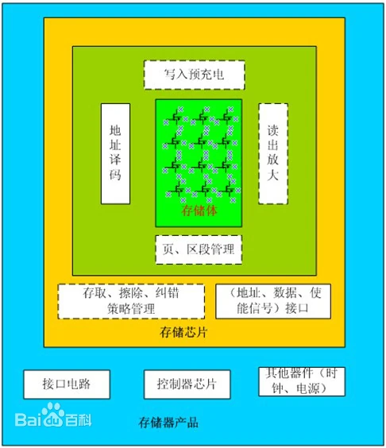
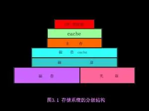

# 002-存储器

[存储器 百度百科(baidu.com)](https://baike.baidu.com/item/存储器/1583185?fr=aladdin)

存储器单元实际上是时序逻辑电路的一种。按存储器的使用类型可分为只读存储器（ROM）和随机存取存储器（RAM），两者的功能有较大的区别，因此在描述上也有所不同 。

## 工作原理

存储器是许多存储单元的集合，按单元号顺序排列。每个单元由若干二进制位构成，以表示存储单元中存放的数值，这种结构和数组的结构非常相似，故在VHDL语言中，通常由数组描述存储器 。

存储器是用来存储程序和各种数据信息的记忆部件。存储器可分为主存储器（简称主存或内存）和辅助存储器（简称辅存或外存）两大类。和CPU直接交换信息的是主存。 

主存的工作方式是按存储单元的地址存放或读取各类信息，统称访问存储器。主存中汇集存储单元的载体称为存储体，存储体中每个单元能够存放一串二进制码表示的信息，该信息的总位数称为一个存储单元的字长。存储单元的地址与存储在其中的信息是一一对应的，单元地址只有一个，固定不变，而存储在其中的信息是可以更换的。

指示每个单元的二进制编码称为地址码。寻找某个单元时，先要给出它的地址码。暂存这个地址码的寄存器叫存储器地址寄存器(MAR)。为可存放从主存的存储单元内取出的信息或准备存入某存储单元的信息，还要设置一个存储器数据寄存器(MDR)。

## 特点

计算机的存储器可分成内存储器和外存储器。

- 内存储器在程序执行期间被计算机频繁地使用，并且在一个指令周期期间是可直接访问的。
- 外存储器要求计算机从一个外贮藏装置例如磁带或磁盘中读取信息。
- 这与学生在课堂上做笔记相类似。如果学生没有看笔记就知道内容，信息就被存储在“内存储器”中。如果学生必须查阅笔记，那么信息就在“外存储器”中。

内存储器有很多类型。

- 随机存取存储器（ RAM）在计算期间被用作高速暂存记忆区。数据可以在RAM中存储、读取和用新的数据代替。当计算机在运行时RAM是可得到的。它包含了放置在计算机此刻所处理的问题处的信息。大多数RAM是“不稳定的”，这意味着当关闭计算机时信息将会丢失。
- 只读存储器（ROM）是稳定的。它被用于存储计算机在必要时需要的指令集。存储在ROM内的信息是硬接线的”（即，它是电子元件的一个物理组成部分），且不能被计算机改变（因此称为“只读”）。
- 可变的ROM，称为可编程只读存储器（PROM），可以将其暴露在一个外部电器设备或光学器件（如激光）中来改变。 

数字成像设备中的内存储器必须足够大以存放至少一幅数字图像。一幅512 x512 x8位的图像需要1/4兆字节。因此，一台处理几幅这样的图像的成像设备需要几兆字节的内存。

外存储器用来储存不是实时成像任务中获取的图像，其与计算机有不同的分离层面。已经作出诊断的图像通常因为法律目的而存储多年。这些图像被称为“归档”（如磁带），它们必须在计算机上重新安装才能取回信息．硬盘驱动器中的图像被物理地安装在计算机上，且能在几毫秒内被访问。磁存储器中单个位被记录为磁畴，“北极向上”可能意味着1，“北极向下”可能意味着0。 

最常用的外存储器设备以两种方式之一来存储信息。磁带，以大的盘式装置的形式在20世纪70年代作为计算机存储的一大支柱，现在则以小而封闭的盒式磁带的形式成为一种相对便宜的“离线”存储选择。尽管它在加载现代录音磁带和寻找到感兴趣数据的存储位置时可能花费几秒甚至几分钟，但购买和维修这一存储媒质的长期花费是较低的。 

各种光学存储器装置也是可得到的。在光学存储器装置中存取一串特定数据所需的时间，可能与在（磁）硬盘存取数据所需的时间一样短。在光盘某一平滑镜面上存在着微小的缺陷。在光盘表面烧一个孔洞表示二进制数1，没有烧孔洞则表示0。烧制而成的光盘是“写一次，读多次”（WORM）光盘的实例。这个特征使得它们适合于长期的档案存储，且保持较高的存取速率。直径是12 cm的盘已经成为音乐录制和常规PC使用的标准。这些磁盘被称为“高密度盘”或CD ROM。与CD ROM具有相同大小，但能存储足够的数字信息来支持几小时的高质量视频的高容量盘，被称为数字视频盘（DVD）。有时候根据要求利用机械装置从一大批光盘中提取和安装盘。这些装置被称为是“自动唱片点唱机”。

### 存储系统的层次结构

为提高存储器的性能，通常把各种不同存储容量、存取速度和价格的存储器按层次结构组成多层存储器，并通过管理软件和辅助硬件有机组合成统一的整体，使所存放的程序和数据按层次分布在各存储器中。 

主要采用三级层次结构来构成存储系统，由高速缓冲存储器Cache、主存储器和辅助存储器组成。图中自上向下容量逐渐增大，速度逐级降低，成本则逐次减少。 

整个结构可看成主存一辅存和Cache-主存两个层次。在辅助硬件和计算机操作系统的管理下，可把主存一辅存作为一个存储整体，形成的可寻址存储空间比主存储器空间大得多。由于辅存容量大，价格低，使得存储系统的整体平均价格降低。Cache-主存层次可以缩小主存和CPU之间的速度差距，从整体上提高存储器系统的存取速度。 

一个较大的存储系统由各种不同类型的存储设备构成，形成具有多级层次结构的存储系统。该系统既有与CPU相近的速度，又有极大的容量，而价格又是较低的。可见，采用多级层次结构的存储器系统可有效地解决存储器的速度、容量和价格之间的矛盾

### 存储器阵列

如何增加磁盘的存取速度，如何防止数据因磁盘的故障而丢失及如何有效地利用磁盘空间，一直是电脑专业人员和用户的困扰；而大容量磁盘的价格非常昂贵，对用户形成很大的负担。磁盘阵列技术的产生一举解决了这些问题。 

过去十多年来，CPU的处理速度几乎是呈几何级数的跃升，内存（memory）的存取速度亦大幅增加，而数据储存装置主要是在与磁盘（hard disk）的存取速度相较之下，较为缓慢。整个I/O吞吐量不能和系统匹配，形成电脑系统的瓶颈，拉低了电脑系统的整体性能。若不能有效地提升磁盘的存取速度，CPU、内存及磁盘问的不平衡将使CPU及内存的改进形成浪费。 

目前改进磁盘存取速度的方式主要有两种。 

- 一是磁盘快取控制（disk cache controller），它将从磁盘读取的数据存在快取内存（cachememory）中以减少磁盘存取的次数，数据的读写都在快取内存中进行，大幅增加存取的速度，如要读取的数据不在快取内存中，或要写数据到磁盘时，才做磁盘的存取动作。这种方式在单工期环境（single-tasking environment)如DOS之下，对大量数据的存取有很好的性能（量小且频繁的存取则不然），但在多工（multi-tasking）环境之下（因为要不停地做数据交换的动作）或数据库的存取（因每一记录都很小）就不能显示其性能。这种方式没有任何安全保障。
- 二是使用磁盘阵列的技术。磁盘阵列是把多个磁盘组成一个阵列，当作单一磁盘使用，它将数据以分段(striping)的方式储存在不同的磁盘中，存取数据时，阵列中的相关磁盘一起动作，大幅减低数据的存取时间，同时有更佳的空间利用率。磁盘阵列所利用的不同的技术，称为RAID level，不同的level针对不同的系统及应用，以解决数据安全的问题。 

一般高性能的磁盘阵列都是以硬件的形式来达成，进一步把磁盘快取控制及磁盘阵列结合在一个控制器（RAID controller）或控制卡上，针对不同的用户解决人们对磁盘输出/输入系统的四大要求：

- 增加存取速度；
- 容错（fault tolerance），即安全性；
- 有效利用磁盘空间；
- 尽量平衡CPU、内存及磁盘的性能差异，提高电脑的整体工作性能。 [10]

关于磁盘阵列技术的阵列原理，1987年，加州伯克利大学的一位人员发表了名为“磁盘阵列研究”的论文，正式提到了RAID也就是磁盘阵列，论文提出廉价的5.25〞及3.5〞的硬盘也能如大机器上的8”盘一样能提供大容量、高性能和数据的一致性，并详述了RAID的技术。 

磁盘阵列针对不同的应用，使用不同技术，称为RAID level。RAID是RedundantArray of Inexpensive Disks的缩写，每- level代表一种技术。 目前业界公认的标准是RAIDO- RAID5。这个level并不代表技术的高低，leve15并不高于leve13，levell也不低于level4，至于要选择哪一种RAID level的产品，视用户的操作环境（operating environment）及应用（application）而定，与level的高低没有必然的关系。

- RAIDO没有安全的保障，但其快速，所以适合高速I/O的系统；
- RAID1适用于需安全性又要兼顾速度的系统
- RAID2及RAID3适用于大型电脑及影像、CAD/CAM等处理；
- RAID5多用于OLTP，因有金融机构及大型数据处理中心的迫切需要，故使用较多而较有名气，但也因此形成很多人对磁盘阵列的误解，以为磁盘阵列非要RAID5不可
- RAID4较少使用，和RAID5有其共同之处，但RAID4适合大量数据的存取。
- 其他如RAID6、RAID7，乃至RAID10、RAID50、RAID100等，都是厂商各做各的，并无一致的标准，在此不作说明。