# 000-导读

- [计算机组成原理（详细）](https://blog.csdn.net/weixin_42303403/article/details/129932204)
- [存储系统的概念与基本组成 CSDN](https://blog.csdn.net/qq_41587740/article/details/109090441)

## 存储系统的基本概念

### 导图

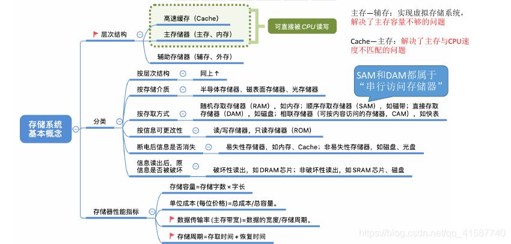

### 现代计算机结构

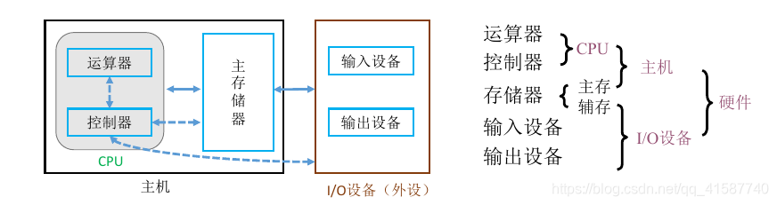

### 存储器的层次结构

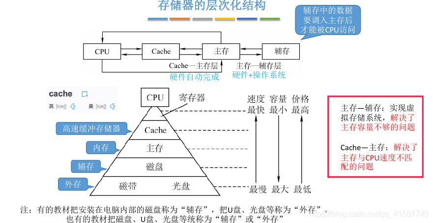

### 存储器的分类

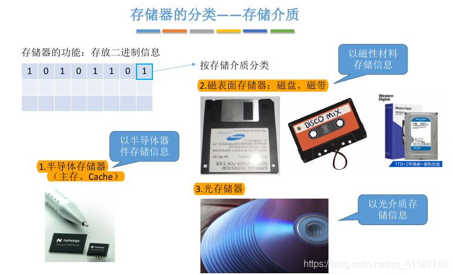

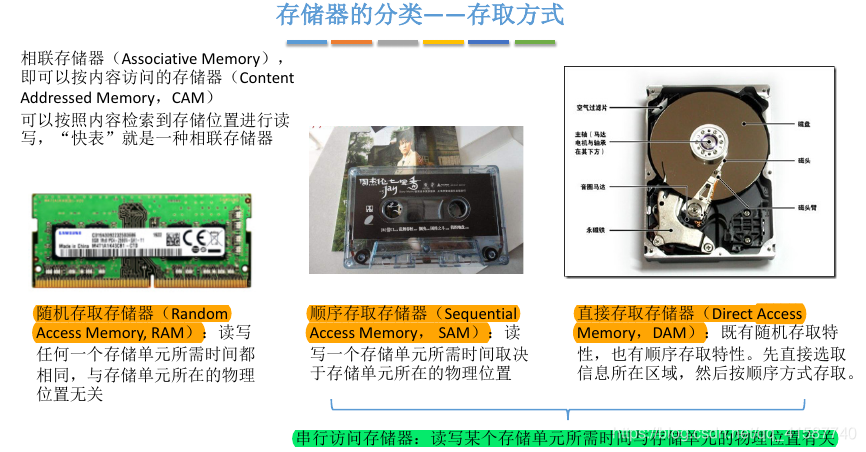

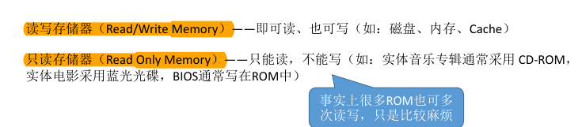

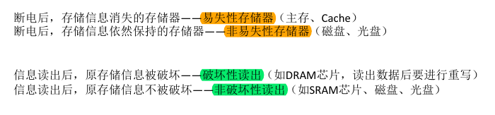

### 存储器的性能指标

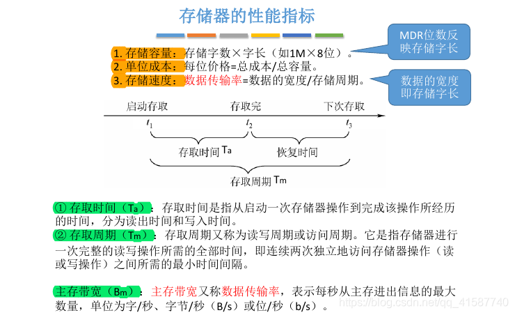

## 存储器的基本组成

### 导图

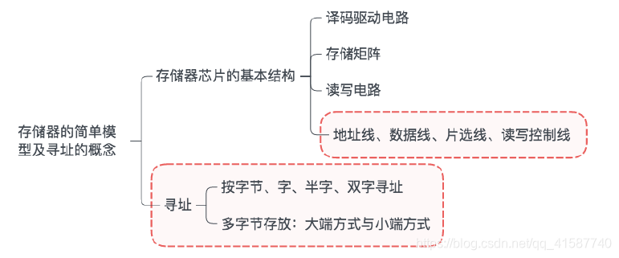

### 存储器的基本结构

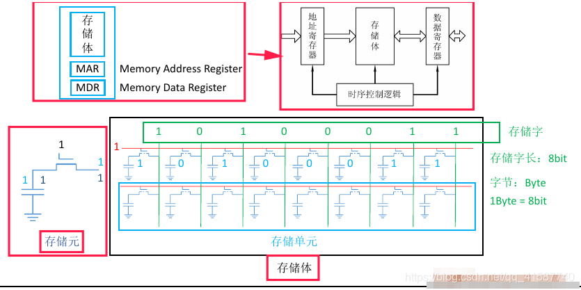

- 1、存储器大致由MAR、MDR、存储体、时序控制电路组成
- 2、存储元电路用于存储一个二进制位
- 3、多个存储元的有序排列形成存储体
- 4、一行存储元的个数 = 存储字 = MAR位数

### 存储器的简单模型

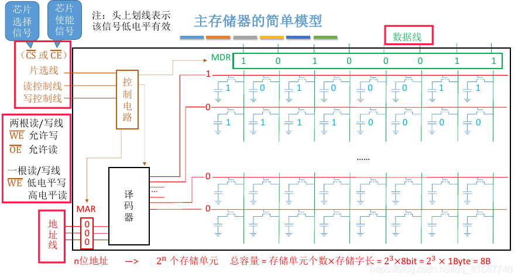

### 简化模型

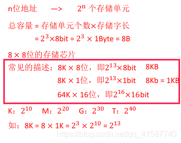

### 寻址

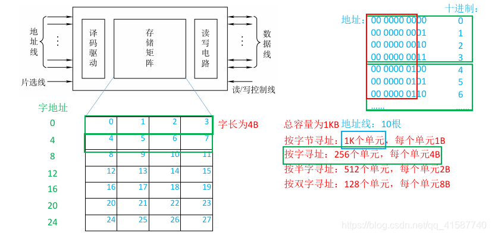