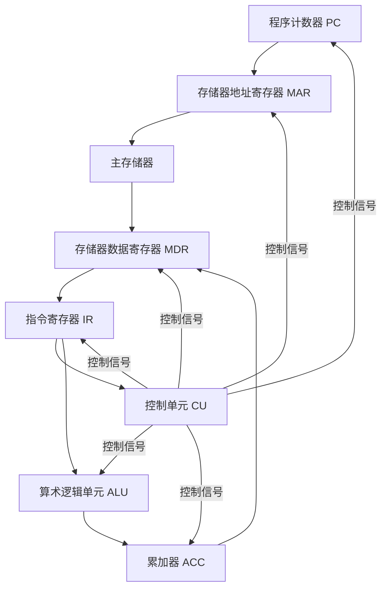
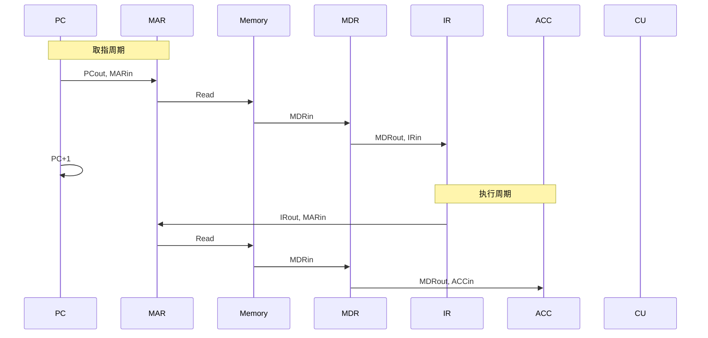
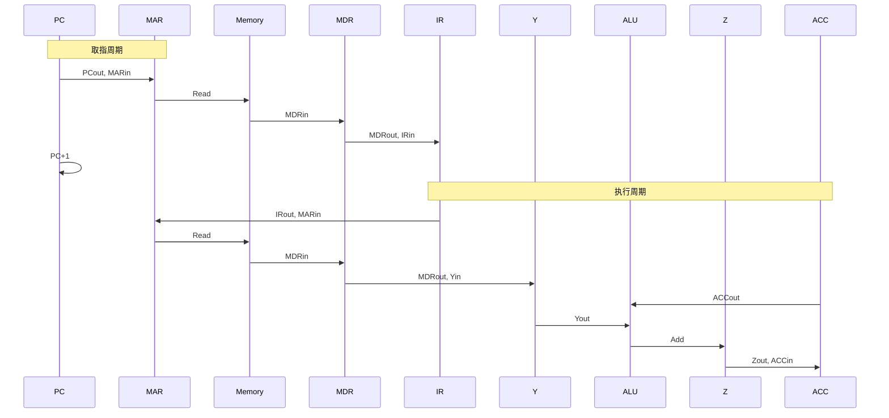
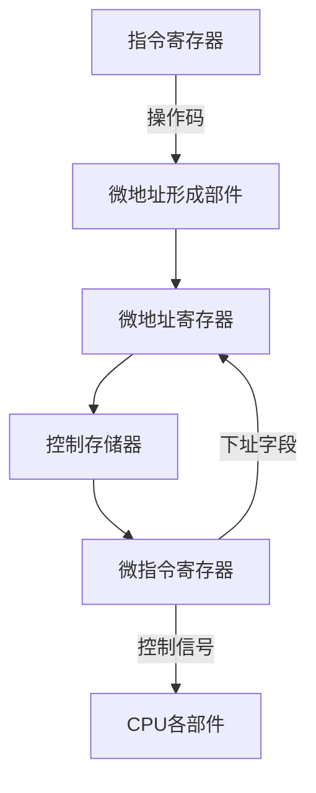

# 控制信号与数据通路

## 概述

控制信号是控制器产生的用于控制计算机各部件工作的信号。数据通路是数据在功能部件之间传送的路径。理解控制信号和数据通路对于深入理解计算机的工作原理至关重要。

## 数据通路的基本结构

### 数据通路的组成

数据通路主要由以下部件组成:



### 内部总线

内部总线用于连接CPU内部各寄存器和运算器,实现数据传送。

**总线类型:**

- **单总线结构**: 所有部件连接到一条总线
- **双总线结构**: 两条总线,提高并行性
- **三总线结构**: 三条总线,进一步提高性能

## 控制信号

### 寄存器控制信号

!!! note "寄存器控制信号说明"
    寄存器控制信号用于控制寄存器与总线之间的数据传送。

**主要控制信号:**

| 信号名称 | 功能说明 | 示例 |
|---------|---------|------|
| PCout | PC内容输出到总线 | (PC) → BUS |
| PCin | 总线内容输入到PC | (BUS) → PC |
| MARout | MAR内容输出到总线 | (MAR) → BUS |
| MARin | 总线内容输入到MAR | (BUS) → MAR |
| MDRout | MDR内容输出到总线 | (MDR) → BUS |
| MDRin | 总线内容输入到MDR | (BUS) → MDR |
| IRin | 总线内容输入到IR | (BUS) → IR |
| ACCout | ACC内容输出到总线 | (ACC) → BUS |
| ACCin | 总线内容输入到ACC | (BUS) → ACC |
| Yin | 总线内容输入到Y寄存器 | (BUS) → Y |
| Zout | Z寄存器内容输出到总线 | (Z) → BUS |

### 存储器控制信号

!!! warning "存储器控制信号"
    存储器控制信号用于控制CPU与主存储器之间的数据交换。

**主要控制信号:**

- **Read**: 读存储器命令
  - 功能: M(MAR) → MDR
  - 时序: 需要一个存储周期
  
- **Write**: 写存储器命令
  - 功能: (MDR) → M(MAR)
  - 时序: 需要一个存储周期

### 运算器控制信号

!!! tip "运算器控制信号"
    运算器控制信号用于控制ALU执行各种运算。

**主要控制信号:**

| 信号名称 | 功能说明 | 操作 |
|---------|---------|------|
| Add | 加法运算 | (ACC) + (Y) → Z |
| Sub | 减法运算 | (ACC) - (Y) → Z |
| And | 与运算 | (ACC) ∧ (Y) → Z |
| Or | 或运算 | (ACC) ∨ (Y) → Z |
| Not | 非运算 | ¬(ACC) → Z |
| Xor | 异或运算 | (ACC) ⊕ (Y) → Z |
| Shl | 左移运算 | (ACC) << 1 → Z |
| Shr | 右移运算 | (ACC) >> 1 → Z |

### 控制单元控制信号

- **PC+1**: PC自动加1
- **Clear**: 清除寄存器
- **Set**: 设置寄存器

## 典型指令的控制信号序列

### 取数指令的控制信号

!!! example "取数指令 LOAD A 的控制信号序列"



**控制信号序列:**

1. **取指周期:**
   - PCout, MARin
   - Read
   - MDRout, IRin
   - PC+1

2. **执行周期:**
   - IRout, MARin
   - Read
   - MDRout, ACCin

### 加法指令的控制信号

!!! example "加法指令 ADD A 的控制信号序列"



**控制信号序列:**

1. **取指周期:**
   - PCout, MARin
   - Read
   - MDRout, IRin
   - PC+1

2. **执行周期:**
   - IRout, MARin
   - Read
   - MDRout, Yin
   - ACCout, Yout, Add
   - Zout, ACCin

### 存数指令的控制信号

!!! example "存数指令 STORE A 的控制信号序列"

**控制信号序列:**

1. **取指周期:**
   - PCout, MARin
   - Read
   - MDRout, IRin
   - PC+1

2. **执行周期:**
   - IRout, MARin
   - ACCout, MDRin
   - Write

## 控制信号的产生方式

### 1. 硬布线控制

!!! info "硬布线控制"
    控制信号由组合逻辑电路直接产生,速度快但灵活性差。

**特点:**

- 控制信号由硬件电路产生
- 速度快,效率高
- 设计复杂,不易修改
- 适用于简单指令集

**设计步骤:**

1. 分析指令执行过程
2. 确定控制信号序列
3. 设计布尔表达式
4. 实现逻辑电路

### 2. 微程序控制

!!! success "微程序控制"
    控制信号由微指令产生,灵活性好但速度较慢。

**基本概念:**

- **微指令**: 控制信号的集合
- **微程序**: 微指令的有序集合
- **控制存储器**: 存放微程序的ROM

**微指令格式:**

```
操作控制字段 + 顺序控制字段
```

**特点:**

- 控制信号由微指令产生
- 灵活性好,易于修改
- 速度较慢
- 适用于复杂指令集

**微程序控制器结构:**



## 数据通路的设计

### 单总线数据通路

!!! warning "单总线数据通路的限制"
    单总线结构中,同一时刻只能有一个部件向总线输出数据。

**结构特点:**

- 所有部件连接到一条总线
- 结构简单,成本低
- 并行性差,效率低

**设计约束:**

- 同一时刻只能有一个输出
- 需要暂存寄存器

### 双总线数据通路

**结构特点:**

- 两条总线,提高并行性
- 可以同时传送两个数据
- 效率比单总线高

### 三总线数据通路

**结构特点:**

- 三条总线,进一步提高性能
- 可以同时传送多个数据
- 效率最高,成本也最高

## 参考资料

- [计算机组成原理（详细）CSDN社区](https://blog.csdn.net/weixin_42303403/article/details/129932204)
