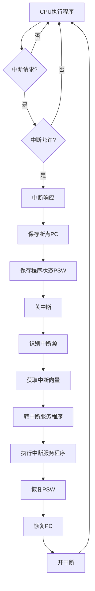
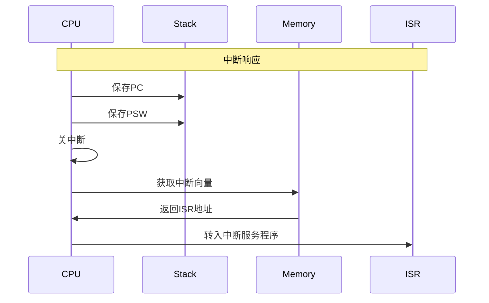
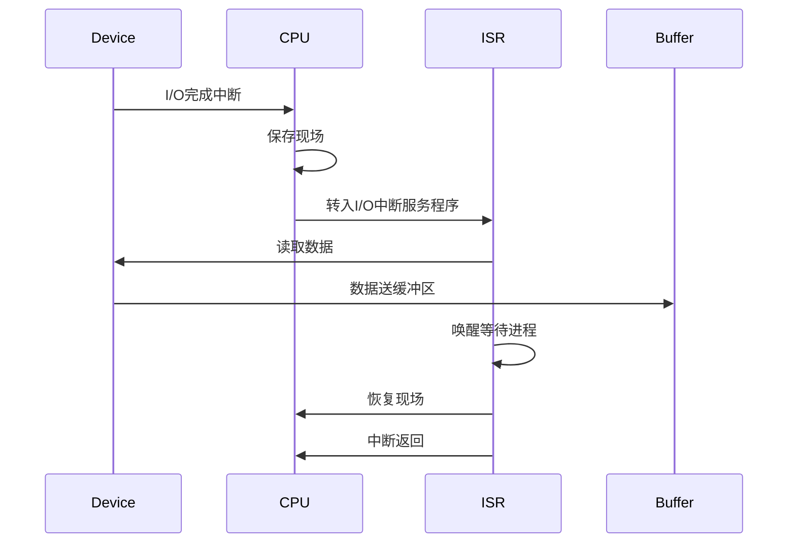

# 中断处理

## 概述

中断是指CPU暂停当前程序的执行,转去处理突发事件,处理完后再返回原程序继续执行的过程。中断机制是现代计算机系统的重要特性,它使CPU能够响应外部事件,实现与外设的并行工作。

## 中断的作用

!!! note "中断的重要作用"
    中断机制使计算机系统具有以下重要能力:

1. **实现CPU与外设的并行工作**
   - CPU启动外设后继续执行程序
   - 外设完成后通过中断通知CPU
   - 提高系统效率

2. **处理硬件故障和软件错误**
   - 及时响应硬件故障
   - 处理程序运行错误
   - 提高系统可靠性

3. **实现人机交互**
   - 响应键盘输入
   - 处理鼠标事件
   - 提供交互式操作

4. **支持多道程序设计**
   - 实现进程切换
   - 支持时间片轮转
   - 提高资源利用率

## 中断的类型

### 1. 硬件中断

!!! tip "硬件中断"
    由外部硬件设备产生的中断,也称为外中断。

**类型:**

- **可屏蔽中断**: 可以被CPU禁止的中断
  - I/O中断: 外设完成中断
  - 时钟中断: 定时器中断
  
- **不可屏蔽中断**: 不能被CPU禁止的中断
  - 电源故障中断
  - 总线错误中断

**特点:**

- 异步产生,与程序执行无关
- 可以被禁止(可屏蔽中断)
- 优先级相对较低

### 2. 软件中断

!!! info "软件中断"
    由程序执行中断指令产生的中断,也称为内中断。

**类型:**

- **系统调用**: 用户程序请求操作系统服务
- **陷阱(Trap)**: 程序主动产生的中断
  - 断点设置
  - 单步执行

**特点:**

- 同步产生,与程序执行相关
- 不能被禁止
- 用于实现系统功能

### 3. 异常

!!! warning "异常"
    由程序运行错误产生的中断。

**类型:**

- **故障(Fault)**: 可以修复的错误
  - 缺页异常
  - 除零异常
  - 非法操作码
  
- **终止(Abort)**: 不可修复的错误
  - 硬件故障
  - 系统表错误

**特点:**

- 同步产生,与程序执行相关
- 不能被禁止
- 需要特殊处理

## 中断处理过程

### 中断处理的完整流程



### 1. 中断请求

!!! example "中断请求过程"

**硬件中断请求:**

- 外设完成操作后发出中断请求信号
- 中断请求信号送到中断控制器
- 中断控制器向CPU发出中断请求

**软件中断请求:**

- 程序执行中断指令(INT n)
- CPU识别中断类型号n
- 转入相应的中断处理程序

### 2. 中断判优

当多个中断源同时请求时,需要判断优先级。

**判优方法:**

- **硬件判优**: 由中断控制器硬件实现
- **软件判优**: 由软件查询实现

**优先级原则:**

- 不可屏蔽中断 > 可屏蔽中断
- 硬件故障 > 软件错误 > 外设请求
- 高速设备 > 低速设备
- 实时设备 > 非实时设备

### 3. 中断响应

!!! success "中断响应条件"
    CPU响应中断需要满足以下条件:

1. CPU处于开中断状态(IF=1)
2. 当前指令执行完成
3. 没有更高优先级的中断正在处理

**响应过程:**



### 4. 中断服务

**中断服务程序的结构:**

```
中断服务程序:
    保存现场        // 保存寄存器内容
    开中断          // 允许嵌套中断
    中断处理        // 执行中断处理功能
    关中断          // 禁止嵌套中断
    恢复现场        // 恢复寄存器内容
    中断返回        // 返回原程序
```

### 5. 中断返回

- 恢复程序状态字(PSW)
- 恢复程序计数器(PC)
- 开中断
- 返回原程序继续执行

## 中断嵌套

!!! note "中断嵌套"
    在处理一个中断时,又响应了更高优先级的中断,称为中断嵌套。

**实现条件:**

- 在中断服务程序中开中断
- 新中断的优先级更高

**嵌套过程:**


**注意事项:**

- 嵌套深度有限制
- 需要合理设置优先级
- 避免中断风暴

## 中断屏蔽

!!! warning "中断屏蔽"
    通过设置中断屏蔽字,可以禁止某些中断。

**屏蔽字的作用:**

- 禁止低优先级中断
- 保证重要中断的响应
- 实现中断优先级的动态调整

**屏蔽字设置:**

```
中断屏蔽寄存器:
    位0: 屏蔽中断0
    位1: 屏蔽中断1
    位2: 屏蔽中断2
    ...
```

## 中断向量

!!! info "中断向量"
    中断向量是中断服务程序的入口地址。

**中断向量表:**

| 中断类型号 | 中断向量 | 中断类型 |
|-----------|---------|---------|
| 0 | 0000H | 除零异常 |
| 1 | 0004H | 单步中断 |
| 2 | 0008H | 不可屏蔽中断 |
| 3 | 000CH | 断点中断 |
| ... | ... | ... |
| n | n×4 | 用户定义中断 |

**中断向量的获取:**

- 硬件中断: 由中断控制器提供
- 软件中断: 由中断指令提供
- 异常: 由CPU自动产生

## 典型中断处理示例

### 1. I/O中断处理

!!! example "I/O中断处理流程"



### 2. 时钟中断处理

**功能:**

- 维护系统时间
- 实现时间片轮转
- 处理定时任务

**处理过程:**

1. 更新系统时间
2. 检查时间片是否用完
3. 如果用完,进行进程调度
4. 检查定时器队列
5. 处理到期的定时任务

### 3. 缺页异常处理

**功能:**

- 处理虚拟存储器的缺页
- 实现按需调页

**处理过程:**

1. 保存异常信息
2. 计算缺页的逻辑地址
3. 查找页表,获取页面信息
4. 如果页面不在内存:
   - 分配物理页框
   - 从磁盘读入页面
   - 更新页表
5. 重新执行引起异常的指令

## 中断与异常的比较

| 特性 | 中断 | 异常 |
|------|------|------|
| 产生方式 | 外部事件 | 内部事件 |
| 产生时机 | 异步 | 同步 |
| 返回位置 | 下条指令 | 当前指令或下条指令 |
| 处理方式 | 转中断服务程序 | 转异常处理程序 |
| 屏蔽性 | 可屏蔽(部分) | 不可屏蔽 |

## 参考资料

- [操作系统整理 知乎](https://zhuanlan.zhihu.com/p/557894163)
- [计算机组成原理（详细）CSDN社区](https://blog.csdn.net/weixin_42303403/article/details/129932204)
