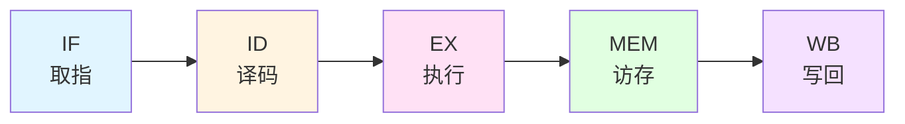
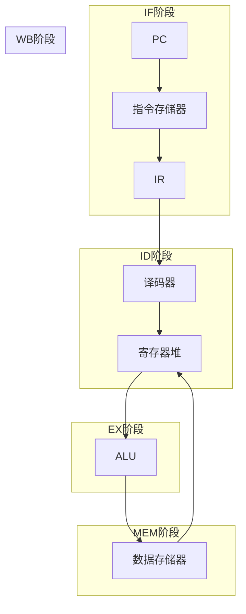

# 流水线技术

## 概述

流水线技术是提高CPU性能的重要技术,它通过将指令执行过程划分为多个阶段,使多条指令的不同阶段可以并行执行,从而提高CPU的吞吐率。

## 流水线的基本原理

!!! note "流水线的核心思想"
    将一个重复的时序过程分解为若干个子过程,每个子过程可以有效地与其他子过程并行执行。

### 时空图

<div style="background-color: #f5f5f5; padding: 15px; margin: 10px 0; border-radius: 5px;">
    <h4 style="margin-top: 0; color: #333;">流水线时空图示例</h4>
    <pre style="background-color: white; padding: 10px; border-radius: 3px; overflow-x: auto;">
时间:  1   2   3   4   5   6   7   8
指令1: IF  ID  EX  MEM WB
指令2:     IF  ID  EX  MEM WB
指令3:         IF  ID  EX  MEM WB
指令4:             IF  ID  EX  MEM WB
指令5:                 IF  ID  EX  MEM WB
    </pre>
</div>

**说明:**

- IF: 取指 (Instruction Fetch)
- ID: 译码 (Instruction Decode)
- EX: 执行 (Execute)
- MEM: 访存 (Memory Access)
- WB: 写回 (Write Back)

## 经典的五级流水线



### 各阶段的功能

#### 1. 取指阶段 (IF)

<div style="border-left: 4px solid #2196F3; padding: 10px; margin: 10px 0; background-color: #E3F2FD;">
    <strong>功能:</strong>
    <ul style="margin: 5px 0;">
        <li>从指令Cache取指令</li>
        <li>PC + 4 → PC (假设指令长度为4字节)</li>
    </ul>
</div>

**操作:**

```
IR ← Mem[PC]
PC ← PC + 4
```

#### 2. 译码阶段 (ID)

<div style="border-left: 4px solid #FF9800; padding: 10px; margin: 10px 0; background-color: #FFF3E0;">
    <strong>功能:</strong>
    <ul style="margin: 5px 0;">
        <li>指令译码</li>
        <li>读寄存器操作数</li>
    </ul>
</div>

**操作:**

```
A ← Reg[rs]
B ← Reg[rt]
```

#### 3. 执行阶段 (EX)

<div style="border-left: 4px solid #E91E63; padding: 10px; margin: 10px 0; background-color: #FCE4EC;">
    <strong>功能:</strong>
    <ul style="margin: 5px 0;">
        <li>ALU运算</li>
        <li>计算有效地址</li>
    </ul>
</div>

**操作:**

```
ALUOut ← A op B
或
ALUOut ← A + imm
```

#### 4. 访存阶段 (MEM)

<div style="border-left: 4px solid #4CAF50; padding: 10px; margin: 10px 0; background-color: #E8F5E9;">
    <strong>功能:</strong>
    <ul style="margin: 5px 0;">
        <li>访问数据Cache</li>
        <li>读或写存储器</li>
    </ul>
</div>

**操作:**

```
LMD ← Mem[ALUOut]  (Load)
或
Mem[ALUOut] ← B    (Store)
```

#### 5. 写回阶段 (WB)

<div style="border-left: 4px solid #9C27B0; padding: 10px; margin: 10px 0; background-color: #F3E5F5;">
    <strong>功能:</strong>
    <ul style="margin: 5px 0;">
        <li>将结果写回寄存器</li>
    </ul>
</div>

**操作:**

```
Reg[rd] ← ALUOut  (ALU指令)
或
Reg[rt] ← LMD     (Load指令)
```

## 流水线的性能指标

### 1. 吞吐率 (Throughput)

!!! tip "吞吐率"
    单位时间内流水线完成的指令数。

**公式:**

```
TP = n / T
```

其中:
- n: 完成的指令数
- T: 完成n条指令所需的时间

**最大吞吐率:**

```
TPmax = 1 / Δt
```

其中 Δt 为流水线时钟周期。

### 2. 加速比 (Speedup)

!!! tip "加速比"
    流水线方式与串行方式的速度比。

**公式:**

```
S = T串行 / T流水线
```

**理想加速比:**

```
S = k (流水线级数)
```

### 3. 效率 (Efficiency)

!!! tip "效率"
    流水线各段的利用率。

**公式:**

```
E = n个任务占用的时空区 / k个段的总时空区
E = S / k
```

## 流水线冲突

!!! warning "流水线冲突"
    流水线冲突会降低流水线的性能,需要妥善处理。

### 1. 结构冲突 (Structural Hazard)

<div style="background-color: #ffebee; padding: 10px; margin: 10px 0; border-left: 4px solid #f44336;">
    <strong>原因:</strong> 硬件资源冲突
</div>

**示例:** 多条指令同时访问存储器

**解决方法:**

- 指令Cache和数据Cache分离
- 增加硬件资源
- 指令暂停等待

### 2. 数据冲突 (Data Hazard)

<div style="background-color: #fff8e1; padding: 10px; margin: 10px 0; border-left: 4px solid #ff9800;">
    <strong>原因:</strong> 数据依赖关系
</div>

**类型:**

#### RAW (Read After Write)

```
ADD R1, R2, R3
SUB R4, R1, R5    // 需要R1的结果
```

#### WAR (Write After Read)

```
SUB R4, R1, R5
ADD R1, R2, R3    // 需要先读R1
```

#### WAW (Write After Write)

```
ADD R1, R2, R3
SUB R1, R4, R5    // 两条指令都写R1
```

**解决方法:**

- **暂停**: 插入气泡周期
- **转发(旁路)**: 直接传送结果
- **乱序执行**: 调整执行顺序

### 3. 控制冲突 (Control Hazard)

<div style="background-color: #e8f5e9; padding: 10px; margin: 10px 0; border-left: 4px solid #4caf50;">
    <strong>原因:</strong> 转移指令引起
</div>

**示例:**

```
BEQ R1, R2, Label  // 条件转移
ADD R3, R4, R5     // 下条指令不确定
```

**解决方法:**

- **分支预测**: 预测转移方向
- **延迟槽**: 在转移指令后插入有用指令
- **预取**: 预取两个分支的指令

## 流水线的实现

### 简单流水线的数据通路



### 流水线寄存器

!!! info "流水线寄存器"
    流水线各阶段之间需要寄存器保存中间结果。

**主要流水线寄存器:**

- IF/ID: 保存取指阶段的结果
- ID/EX: 保存译码阶段的结果
- EX/MEM: 保存执行阶段的结果
- MEM/WB: 保存访存阶段的结果

## 超标量流水线

!!! success "超标量技术"
    在一个时钟周期内发射多条指令。

**特点:**

- 多个执行单元
- 每周期发射多条指令
- 动态调度
- 乱序执行

**示例:**

```
周期1: 发射指令1, 2, 3
周期2: 发射指令4, 5, 6
...
```

## 参考资料

- [计算机组成原理（详细）CSDN社区](https://blog.csdn.net/weixin_42303403/article/details/129932204)
