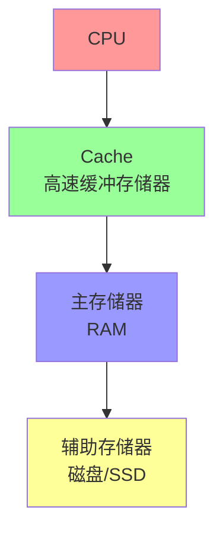

# 存储器层次结构

## 概述

存储器层次结构是计算机系统为了解决存储器速度、容量和成本之间的矛盾而采用的一种组织方式。通过将不同性能的存储器按层次组织,形成Cache-主存-辅存的三级结构。

## 存储器层次结构的基本原理

!!! note "程序局部性原理"
    存储器层次结构有效的基础是程序局部性原理。

### 时间局部性

<div style="background-color: #E3F2FD; padding: 10px; margin: 10px 0; border-left: 4px solid #2196F3;">
    <strong>时间局部性:</strong> 如果一个存储单元被访问,那么不久后它可能再次被访问。
</div>

**示例:**

- 循环体中的指令
- 循环计数器
- 累加变量

### 空间局部性

<div style="background-color: #E8F5E9; padding: 10px; margin: 10px 0; border-left: 4px solid #4CAF50;">
    <strong>空间局部性:</strong> 如果一个存储单元被访问,那么它附近的单元也可能被访问。
</div>

**示例:**

- 数组元素
- 顺序执行的指令
- 结构体字段

## 三级存储器结构



### 各级存储器的特点

<div style="overflow-x: auto;">
    <table style="width: 100%; border-collapse: collapse; margin: 10px 0;">
        <tr style="background-color: #4CAF50; color: white;">
            <th style="padding: 10px; border: 1px solid #ddd;">存储器</th>
            <th style="padding: 10px; border: 1px solid #ddd;">速度</th>
            <th style="padding: 10px; border: 1px solid #ddd;">容量</th>
            <th style="padding: 10px; border: 1px solid #ddd;">成本</th>
            <th style="padding: 10px; border: 1px solid #ddd;">介质</th>
        </tr>
        <tr>
            <td style="padding: 10px; border: 1px solid #ddd; text-align: center;">Cache</td>
            <td style="padding: 10px; border: 1px solid #ddd; text-align: center;">最快</td>
            <td style="padding: 10px; border: 1px solid #ddd; text-align: center;">最小</td>
            <td style="padding: 10px; border: 1px solid #ddd; text-align: center;">最高</td>
            <td style="padding: 10px; border: 1px solid #ddd; text-align: center;">SRAM</td>
        </tr>
        <tr style="background-color: #f9f9f9;">
            <td style="padding: 10px; border: 1px solid #ddd; text-align: center;">主存</td>
            <td style="padding: 10px; border: 1px solid #ddd; text-align: center;">中等</td>
            <td style="padding: 10px; border: 1px solid #ddd; text-align: center;">中等</td>
            <td style="padding: 10px; border: 1px solid #ddd; text-align: center;">中等</td>
            <td style="padding: 10px; border: 1px solid #ddd; text-align: center;">DRAM</td>
        </tr>
        <tr>
            <td style="padding: 10px; border: 1px solid #ddd; text-align: center;">辅存</td>
            <td style="padding: 10px; border: 1px solid #ddd; text-align: center;">最慢</td>
            <td style="padding: 10px; border: 1px solid #ddd; text-align: center;">最大</td>
            <td style="padding: 10px; border: 1px solid #ddd; text-align: center;">最低</td>
            <td style="padding: 10px; border: 1px solid #ddd; text-align: center;">磁盘/SSD</td>
        </tr>
    </table>
</div>

## Cache存储器

### Cache的基本原理

!!! tip "Cache的作用"
    Cache是位于CPU和主存之间的高速小容量存储器,用于存放当前最活跃的程序和数据。

**工作原理:**

1. CPU访问存储器时,先访问Cache
2. 如果命中,直接从Cache读取
3. 如果未命中,从主存读取,并调入Cache

### Cache的映射方式

#### 1. 直接映射

<div style="background-color: #FFF3E0; padding: 10px; margin: 10px 0; border-left: 4px solid #FF9800;">
    <strong>直接映射:</strong> 每个主存块只能映射到Cache的一个特定行。
</div>

**映射公式:**

```
Cache行号 = 主存块号 mod Cache行数
```

**优点:**

- 硬件实现简单
- 成本低

**缺点:**

- 灵活性差
- 冲突率高

#### 2. 全相联映射

<div style="background-color: #FCE4EC; padding: 10px; margin: 10px 0; border-left: 4px solid #E91E63;">
    <strong>全相联映射:</strong> 每个主存块可以映射到Cache的任意一行。
</div>

**优点:**

- 灵活性好
- 冲突率低

**缺点:**

- 硬件复杂
- 成本高

#### 3. 组相联映射

<div style="background-color: #E8F5E9; padding: 10px; margin: 10px 0; border-left: 4px solid #4CAF50;">
    <strong>组相联映射:</strong> 每个主存块可以映射到Cache的一个特定组中的任意一行。
</div>

**映射公式:**

```
Cache组号 = 主存块号 mod Cache组数
```

**优点:**

- 兼顾灵活性和成本
- 应用最广泛

### Cache的替换算法

!!! info "替换算法"
    当Cache满时,需要替换已有的块。

#### 1. 随机替换 (RAND)

- 随机选择一行替换
- 实现简单
- 性能不稳定

#### 2. 先进先出 (FIFO)

- 替换最早进入的块
- 实现简单
- 不考虑使用情况

#### 3. 最近最少使用 (LRU)

<div style="background-color: #E3F2FD; padding: 10px; margin: 10px 0; border-left: 4px solid #2196F3;">
    <strong>LRU算法:</strong> 替换最近最少使用的块,性能最好。
</div>

**实现方法:**

- 计数器法
- 堆栈法
- 对位矩阵法

#### 4. 最不经常使用 (LFU)

- 替换使用次数最少的块
- 需要计数器
- 考虑长期使用情况

### Cache的写策略

#### 1. 写回法 (Write Back)

<div style="background-color: #F3E5F5; padding: 10px; margin: 10px 0; border-left: 4px solid #9C27B0;">
    <strong>写回法:</strong> 只写Cache,替换时才写回主存。
</div>

**特点:**

- 写速度快
- 需要修改位
- 一致性问题

#### 2. 写直达法 (Write Through)

<div style="background-color: #FFF8E1; padding: 10px; margin: 10px 0; border-left: 4px solid #FFC107;">
    <strong>写直达法:</strong> 同时写Cache和主存。
</div>

**特点:**

- 一致性好
- 写速度慢
- 实现简单

### Cache的性能指标

#### 1. 命中率 (Hit Rate)

```
命中率 = Cache命中次数 / 总访问次数
```

#### 2. 平均访问时间

```
平均访问时间 = 命中率 × Cache访问时间 + (1 - 命中率) × 主存访问时间
```

## 虚拟存储器

### 虚拟存储器的概念

!!! success "虚拟存储器"
    虚拟存储器是主存和辅存的结合,为用户提供一个比实际主存大得多的存储空间。

**特点:**

- 逻辑地址空间 > 物理地址空间
- 按需调入
- 对用户透明

### 虚拟存储器的实现方式

#### 1. 页式虚拟存储器

<div style="border: 2px solid #4CAF50; padding: 10px; margin: 10px 0; border-radius: 5px;">
    <strong>页式管理:</strong> 将程序和主存划分为大小相等的页。
</div>

**地址结构:**

```
逻辑地址 = 页号 + 页内地址
物理地址 = 页框号 + 页内地址
```

**页表:**

- 页号 → 页框号
- 有效位、修改位、访问位等

#### 2. 段式虚拟存储器

<div style="border: 2px solid #2196F3; padding: 10px; margin: 10px 0; border-radius: 5px;">
    <strong>段式管理:</strong> 按程序的逻辑结构分段。
</div>

**特点:**

- 段长可变
- 便于共享和保护
- 产生碎片

#### 3. 段页式虚拟存储器

<div style="border: 2px solid #FF9800; padding: 10px; margin: 10px 0; border-radius: 5px;">
    <strong>段页式管理:</strong> 先分段,再分页。
</div>

**特点:**

- 兼顾段式和页式的优点
- 地址变换复杂
- 应用广泛

### 页面置换算法

!!! warning "页面置换"
    当缺页时,如果主存已满,需要置换页面。

#### 1. 最佳置换 (OPT)

- 置换将来最长时间不用的页面
- 理论最优,无法实现
- 用于性能评估

#### 2. 先进先出 (FIFO)

- 置换最早进入的页面
- 实现简单
- 可能出现Belady异常

#### 3. 最近最少使用 (LRU)

<div style="background-color: #E8F5E9; padding: 10px; margin: 10px 0; border-left: 4px solid #4CAF50;">
    <strong>LRU算法:</strong> 置换最近最少使用的页面,性能接近OPT。
</div>

**实现方法:**

- 计数器法
- 堆栈法
- 近似LRU

#### 4. 时钟置换 (Clock)

- 循环检查各页的访问位
- 访问位为0则置换
- 实现简单,性能较好

## 参考资料

- [计算机组成原理（详细）CSDN社区](https://blog.csdn.net/weixin_42303403/article/details/129932204)
