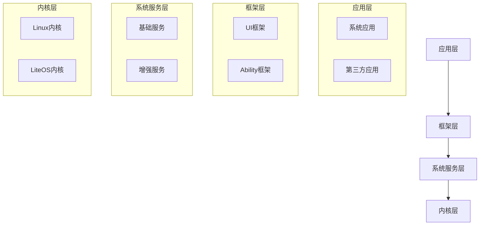

# 操作系统

## 概述

操作系统(Operating System, OS)是计算机系统中最重要的系统软件,它管理和控制计算机硬件与软件资源,合理组织计算机工作流程,为用户提供友好的接口。操作系统是用户和计算机硬件之间的桥梁。

## 操作系统的功能

### 1. 处理机管理

管理CPU资源,合理分配CPU时间。

**主要功能:**

- **进程控制**: 进程的创建、撤销、挂起、恢复
- **进程同步**: 协调进程的执行顺序
- **进程通信**: 进程间的信息交换
- **进程调度**: 分配CPU时间给进程

**关键概念:**

- 进程: 程序的一次执行过程
- 线程: 进程中的一个执行单元
- 进程状态: 就绪、运行、阻塞
- 进程调度算法: FCFS、SJF、优先级、时间片轮转

### 2. 存储器管理

管理内存资源,为程序分配内存空间。

**主要功能:**

- **内存分配与回收**: 为进程分配内存,回收释放的内存
- **地址映射**: 逻辑地址到物理地址的转换
- **内存保护**: 防止进程相互干扰
- **内存扩充**: 虚拟存储技术

**关键概念:**

- 连续分配: 单一连续、固定分区、动态分区
- 非连续分配: 分页、分段、段页式
- 虚拟存储: 请求分页、请求分段
- 页面置换算法: OPT、FIFO、LRU、Clock

### 3. 设备管理

管理外部设备,控制设备与CPU、内存之间的数据交换。

**主要功能:**

- **缓冲管理**: 缓解CPU与设备速度不匹配
- **设备分配**: 分配设备给进程
- **设备处理**: 实现设备驱动
- **设备独立性**: 用户程序与具体设备无关

**关键概念:**

- I/O控制方式: 程序查询、中断、DMA、通道
- 缓冲技术: 单缓冲、双缓冲、循环缓冲
- SPOOLing技术: 假脱机技术
- 设备驱动程序: 控制具体设备

### 4. 文件管理

管理文件资源,提供文件的存储、检索和共享功能。

**主要功能:**

- **文件存储空间管理**: 分配和回收文件存储空间
- **目录管理**: 文件的组织和查找
- **文件读写管理**: 文件的读写操作
- **文件保护**: 文件的共享和保护

**关键概念:**

- 文件系统: FAT、NTFS、ext2、ext3、ext4
- 目录结构: 单级、两级、树形、无环图
- 文件分配方式: 连续、链接、索引
- 文件保护: 访问控制矩阵、访问控制表

### 5. 用户接口

为用户提供使用计算机的接口。

**接口类型:**

- **命令接口**: 命令行方式
  - 联机命令: 交互式命令
  - 脱机命令: 批处理命令
- **程序接口**: 系统调用
  - 进程控制: fork、exec、exit
  - 文件操作: open、read、write、close
  - 设备操作: ioctl
- **图形用户接口(GUI)**: 窗口、图标、菜单

## 操作系统的类型

### 1. 批处理系统

**特点:**

- 成批处理作业
- 多道程序设计
- 吞吐量大,系统利用率高
- 无交互能力

**适用场景:** 科学计算、数据处理

### 2. 分时系统

**特点:**

- 多用户同时使用
- 时间片轮转
- 交互性强
- 及时响应

**适用场景:** 多用户交互环境

### 3. 实时系统

**特点:**

- 及时响应
- 高可靠性
- 实时处理

**类型:**

- 硬实时: 必须严格满足时间要求
- 软实时: 允许偶尔超时

**适用场景:** 工业控制、航空航天、医疗设备

### 4. 个人计算机操作系统

**特点:**

- 单用户多任务
- 图形用户界面
- 丰富的应用软件

**代表:** Windows、macOS

### 5. 网络操作系统

**特点:**

- 网络通信功能
- 资源共享
- 网络管理

**代表:** Windows Server、Linux

### 6. 分布式操作系统

**特点:**

- 多计算机协同工作
- 资源透明访问
- 分布式处理

**代表:** Google Chrome OS

### 7. 嵌入式操作系统

**特点:**

- 实时性强
- 资源受限
- 高可靠性

**代表:** VxWorks、μC/OS、Android

## 操作系统的特征

### 1. 并发性

多个事件在同一时间间隔内发生。

- 宏发: 多个事件在同一时刻发生
- 并行: 多个事件在同一时刻发生

### 2. 共享性

系统资源被多个进程共同使用。

- 互斥共享: 一段时间只允许一个进程访问
- 同时共享: 一段时间允许多个进程访问

### 3. 虚拟性

将物理实体变为多个逻辑实体。

- 虚拟处理器: 多道程序技术
- 虚拟存储器: 虚拟存储技术
- 虚拟设备: SPOOLing技术

### 4. 异步性

进程执行顺序和速度不确定。

- 进程以不可预知的速度推进
- 需要同步机制保证正确性

## 操作系统的运行机制

### 1. 特权级

- **用户态**: 用户程序运行的状态
- **核心态**: 操作系统内核运行的状态

**特权指令:** 只能在核心态执行的指令

- I/O指令
- 置中断指令
- 存取PSW指令

### 2. 系统调用

用户程序请求操作系统服务的接口。

**系统调用过程:**

1. 用户程序执行系统调用指令
2. 从用户态切换到核心态
3. 执行系统调用服务程序
4. 返回用户态,继续执行用户程序

### 3. 中断与异常

**中断:** 外部事件引起

- I/O中断
- 时钟中断
- 外部中断

**异常:** 内部事件引起

- 算态异常: 系统调用
- 故障: 除零、缺页
- 陷阱: 断点、单步

## 常见操作系统

### 1. Windows系列

- Windows 10/11: 个人计算机
- Windows Server: 服务器
- Windows Embedded: 嵌入式系统

### 2. Unix系列

- AIX: IBM
- Solaris: Oracle
- HP-UX: HP

### 3. Linux系列

- Ubuntu: 桌面版
- CentOS: 服务器版
- Red Hat: 企业版
- Debian: 稳定版

### 4. macOS

- Apple公司的操作系统
- 基于Unix
- 图形界面友好

### 5. 移动操作系统

- Android: Google,基于Linux
- iOS: Apple,基于Unix
- **HarmonyOS**: 华为,分布式操作系统

### 6. HarmonyOS

!!! success "HarmonyOS 鸿蒙操作系统"
    HarmonyOS是华为开发的分布式操作系统,具有以下特点:

**核心特性:**

- **分布式架构**: 支持多设备协同工作
- **确定时延引擎**: 提供确定性的响应时间
- **方舟编译器**: 提高运行效率
- **多语言支持**: 支持Java、JavaScript、C/C++等

**技术架构:**

**主要优势:**

1. **分布式能力**
   - 跨设备无缝协同
   - 硬件资源共享
   - 数据分布式管理

2. **性能优化**
   - 方舟编译器提升性能
   - 确定时延引擎保证响应
   - 内存管理优化

3. **安全特性**
   - 多级安全机制
   - 数据加密保护
   - 权限管理

**应用场景:**

- 智能手机
- 平板电脑
- 智能手表
- 智能电视
- 车联网设备
- IoT设备

**开发语言:**

- ArkTS: HarmonyOS官方开发语言
- Java: 兼容Android应用
- JavaScript: Web应用开发
- C/C++: 原生应用开发

## 参考资料

- [操作系统整理 知乎](https://zhuanlan.zhihu.com/p/557894163)
- [操作系统的体系结构 CSDN社区](https://blog.csdn.net/2301_76197086/article/details/132976687)
- [HarmonyOS官方网站](https://www.harmonyos.com/)
