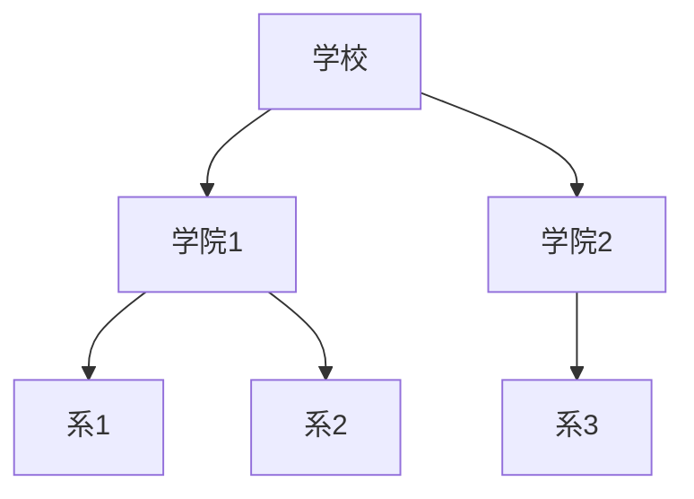

# 数据库管理系统

## 概述

数据库管理系统(Database Management System, DBMS)是用于定义、创建、维护和使用数据库的软件系统。它是现代信息系统的核心,广泛应用于各个领域。

## 数据库管理系统的功能

!!! note "DBMS的主要功能"
    DBMS提供数据定义、数据操纵、数据库运行管理等功能。

### 1. 数据定义功能

<div style="background-color: #E3F2FD; padding: 15px; margin: 10px 0; border-left: 4px solid #2196F3; border-radius: 5px;">
    <strong>数据定义语言(DDL)</strong>
    <p style="margin: 5px 0;">用于定义数据库的结构,包括:</p>
    <ul style="margin: 5px 0;">
        <li>定义数据库模式</li>
        <li>定义表结构</li>
        <li>定义视图</li>
        <li>定义索引</li>
    </ul>
</div>

**示例:**

```sql
-- 创建表
CREATE TABLE Student (
    id INT PRIMARY KEY,
    name VARCHAR(50) NOT NULL,
    age INT,
    department VARCHAR(30)
);

-- 创建索引
CREATE INDEX idx_name ON Student(name);

-- 创建视图
CREATE VIEW StudentView AS
SELECT id, name, department FROM Student;
```

### 2. 数据操纵功能

<div style="background-color: #E8F5E9; padding: 15px; margin: 10px 0; border-left: 4px solid #4CAF50; border-radius: 5px;">
    <strong>数据操纵语言(DML)</strong>
    <p style="margin: 5px 0;">用于对数据库中的数据进行增删改查:</p>
    <ul style="margin: 5px 0;">
        <li>INSERT: 插入数据</li>
        <li>UPDATE: 更新数据</li>
        <li>DELETE: 删除数据</li>
        <li>SELECT: 查询数据</li>
    </ul>
</div>

**示例:**

```sql
-- 插入数据
INSERT INTO Student VALUES (1, '张三', 20, '计算机系');

-- 查询数据
SELECT * FROM Student WHERE age > 18;

-- 更新数据
UPDATE Student SET age = 21 WHERE id = 1;

-- 删除数据
DELETE FROM Student WHERE id = 1;
```

### 3. 数据库运行管理

<div style="background-color: #FFF3E0; padding: 15px; margin: 10px 0; border-left: 4px solid #FF9800; border-radius: 5px;">
    <strong>运行管理功能</strong>
    <ul style="margin: 5px 0;">
        <li>并发控制: 多用户并发访问控制</li>
        <li>安全性检查: 用户权限管理</li>
        <li>完整性检查: 数据完整性约束</li>
        <li>故障恢复: 数据库恢复机制</li>
    </ul>
</div>

### 4. 数据组织与存储管理

- 数据存储结构管理
- 存储空间管理
- 数据存取路径管理
- 缓冲区管理

### 5. 数据库的建立与维护

- 数据库初始化
- 数据转换
- 数据库重组
- 性能监控与优化

## 数据模型

!!! tip "数据模型"
    数据模型是数据库系统中用于描述数据结构和数据之间联系的方式。

### 1. 层次模型

<div style="border: 2px solid #9C27B0; padding: 10px; margin: 10px 0; border-radius: 5px;">
    <strong>层次模型</strong>
    <p style="margin: 5px 0;">用树形结构表示实体之间的联系</p>
</div>

**特点:**

- 有且只有一个根节点
- 除根节点外,其他节点有且只有一个父节点
- 适合一对多的层次关系

**示例:**



### 2. 网状模型

<div style="border: 2px solid #FF5722; padding: 10px; margin: 10px 0; border-radius: 5px;">
    <strong>网状模型</strong>
    <p style="margin: 5px 0;">用图结构表示实体之间的联系</p>
</div>

**特点:**

- 允许一个节点有多个父节点
- 允许多对多的关系
- 结构复杂

### 3. 关系模型

<div style="border: 2px solid #4CAF50; padding: 10px; margin: 10px 0; border-radius: 5px;">
    <strong>关系模型</strong>
    <p style="margin: 5px 0;">用二维表表示实体之间的联系</p>
</div>

**特点:**

- 数据结构简单
- 理论基础扎实
- 应用最广泛

**示例:**

| 学号 | 姓名 | 年龄 | 系别 |
|------|------|------|------|
| 001 | 张三 | 20 | 计算机系 |
| 002 | 李四 | 21 | 数学系 |
| 003 | 王五 | 19 | 物理系 |

## 关系数据库

### 关系代数

!!! info "关系代数运算"
    关系代数是关系数据库的数学基础。

#### 1. 传统的集合运算

- **并(∪)**: R ∪ S
- **差(-)**: R - S
- **交(∩)**: R ∩ S
- **笛卡尔积(×)**: R × S

#### 2. 专门的关系运算

- **选择(σ)**: 从关系中选取满足条件的元组

```sql
σ_{age>20}(Student)
```

- **投影(π)**: 从关系中选取若干属性列

```sql
π_{name,age}(Student)
```

- **连接(⋈)**: 两个关系的连接运算

```sql
Student ⋈_{Student.id=SC.sid} SC
```

### SQL语言

!!! success "SQL语言"
    SQL是结构化查询语言,是关系数据库的标准语言。

#### 1. 数据定义语言(DDL)

```sql
-- 创建表
CREATE TABLE Course (
    cid INT PRIMARY KEY,
    cname VARCHAR(50),
    credit INT
);

-- 修改表
ALTER TABLE Student ADD email VARCHAR(50);

-- 删除表
DROP TABLE Student;
```

#### 2. 数据操纵语言(DML)

```sql
-- 插入
INSERT INTO Student VALUES (1, '张三', 20);

-- 更新
UPDATE Student SET age = 21 WHERE id = 1;

-- 删除
DELETE FROM Student WHERE id = 1;

-- 查询
SELECT name, age FROM Student WHERE age > 18;
```

#### 3. 数据控制语言(DCL)

```sql
-- 授权
GRANT SELECT, INSERT ON Student TO user1;

-- 收回权限
REVOKE INSERT ON Student FROM user1;
```

## 数据库设计

### 数据库设计步骤


### 1. 需求分析

- 收集用户需求
- 分析数据要求
- 分析处理要求
- 编写需求说明书

### 2. 概念结构设计

!!! note "E-R图"
    实体-联系图,用于描述概念模型。

**E-R图的基本元素:**

- 矩形: 实体
- 椭圆: 属性
- 菱形: 联系
- 线段: 连接

### 3. 逻辑结构设计

- 将E-R图转换为关系模式
- 规范化处理
- 模式优化

### 4. 物理结构设计

- 确定数据存储结构
- 设计存取路径
- 确定数据存放位置

## 数据库的完整性

!!! warning "数据完整性"
    保证数据库中数据的正确性和一致性。

### 1. 实体完整性

- 主键不能为空
- 主键值唯一

```sql
CREATE TABLE Student (
    id INT PRIMARY KEY,  -- 主键约束
    name VARCHAR(50)
);
```

### 2. 参照完整性

- 外键值必须是主表中存在的主键值或为空

```sql
CREATE TABLE SC (
    sid INT,
    cid INT,
    score INT,
    FOREIGN KEY (sid) REFERENCES Student(id),
    FOREIGN KEY (cid) REFERENCES Course(cid)
);
```

### 3. 用户定义的完整性

- 根据应用要求定义的约束条件

```sql
CREATE TABLE Student (
    id INT PRIMARY KEY,
    age INT CHECK (age >= 0 AND age <= 120),
    email VARCHAR(50) UNIQUE
);
```

## 数据库的安全性

### 安全性控制措施

<div style="background-color: #FCE4EC; padding: 15px; margin: 10px 0; border-left: 4px solid #E91E63; border-radius: 5px;">
    <strong>安全性措施</strong>
    <ul style="margin: 5px 0;">
        <li>用户标识与鉴别</li>
        <li>存取控制</li>
        <li>视图机制</li>
        <li>审计</li>
        <li>数据加密</li>
    </ul>
</div>

### 权限管理

```sql
-- 创建用户
CREATE USER 'user1'@'localhost' IDENTIFIED BY 'password';

-- 授权
GRANT SELECT, INSERT ON database.Student TO 'user1'@'localhost';

-- 收回权限
REVOKE INSERT ON database.Student FROM 'user1'@'localhost';
```

## 常见数据库管理系统

### 1. 关系型数据库

| 数据库 | 特点 | 应用场景 |
|--------|------|----------|
| MySQL | 开源、轻量、快速 | Web应用、中小型系统 |
| Oracle | 功能强大、安全可靠 | 大型企业应用 |
| SQL Server | 微软产品、集成性好 | Windows环境 |
| PostgreSQL | 开源、功能丰富 | 复杂查询、GIS应用 |

### 2. NoSQL数据库

!!! tip "NoSQL数据库"
    非关系型数据库,适合大数据和Web应用。

**类型:**

- **键值存储**: Redis, Memcached
- **文档数据库**: MongoDB, CouchDB
- **列族数据库**: HBase, Cassandra
- **图数据库**: Neo4j, JanusGraph

## 参考资料

- [数据库系统概论](https://baike.baidu.com/item/数据库系统)
