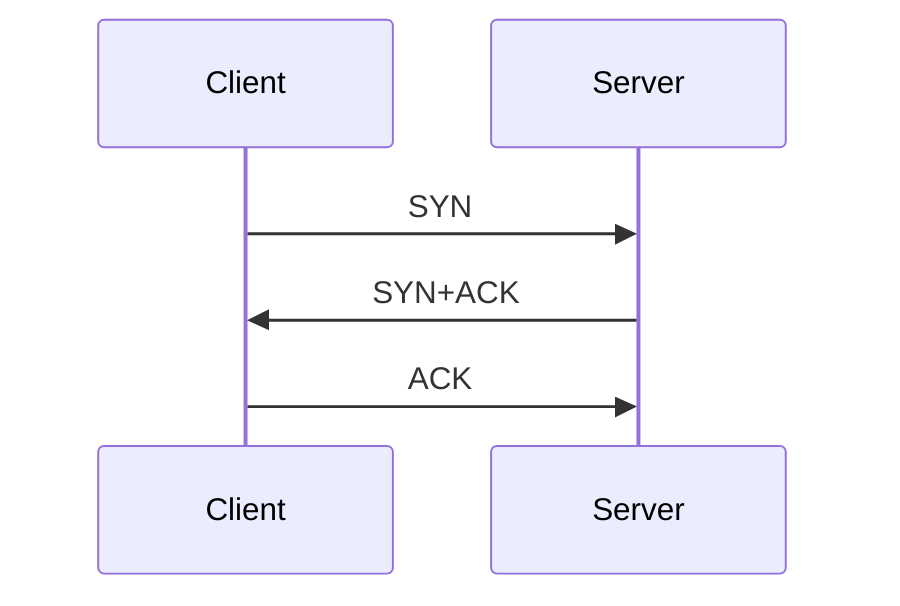
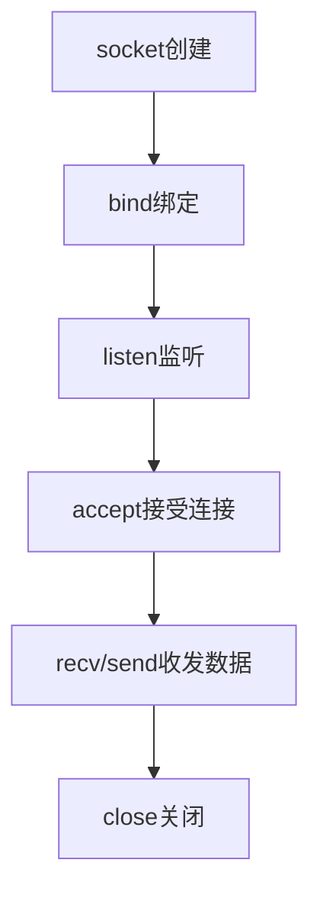

# 网络软件

## 概述

网絡软件是实现计算机之间通信和资源共享的软件系统,包括网络协议软件、网络通信软件、网络管理软件和网络安全软件等。

## 网络协议软件

!!! note "网络协议"
    网络协议是计算机网络中通信双方必须遵守的规则和约定。

### TCP/IP协议栈

<div style="background-color: #E3F2FD; padding: 15px; margin: 10px 0; border-radius: 5px;">
    <h4 style="margin-top: 0; color: #1976D2;">TCP/IP协议栈结构</h4>
    <table style="width: 100%; border-collapse: collapse;">
        <tr style="background-color: #1976D2; color: white;">
            <th style="padding: 10px; border: 1px solid #ddd;">层次</th>
            <th style="padding: 10px; border: 1px solid #ddd;">协议</th>
            <th style="padding: 10px; border: 1px solid #ddd;">功能</th>
        </tr>
        <tr>
            <td style="padding: 10px; border: 1px solid #ddd; text-align: center;">应用层</td>
            <td style="padding: 10px; border: 1px solid #ddd; text-align: center;">HTTP, FTP, SMTP, DNS</td>
            <td style="padding: 10px; border: 1px solid #ddd; text-align: center;">提供网络服务</td>
        </tr>
        <tr style="background-color: #f9f9f9;">
            <td style="padding: 10px; border: 1px solid #ddd; text-align: center;">传输层</td>
            <td style="padding: 10px; border: 1px solid #ddd; text-align: center;">TCP, UDP</td>
            <td style="padding: 10px; border: 1px solid #ddd; text-align: center;">端到端传输</td>
        </tr>
        <tr>
            <td style="padding: 10px; border: 1px solid #ddd; text-align: center;">网络层</td>
            <td style="padding: 10px; border: 1px solid #ddd; text-align: center;">IP, ICMP, ARP</td>
            <td style="padding: 10px; border: 1px solid #ddd; text-align: center;">路由选择</td>
        </tr>
        <tr style="background-color: #f9f9f9;">
            <td style="padding: 10px; border: 1px solid #ddd; text-align: center;">链路层</td>
            <td style="padding: 10px; border: 1px solid #ddd; text-align: center;">Ethernet, WiFi</td>
            <td style="padding: 10px; border: 1px solid #ddd; text-align: center;">物理传输</td>
        </tr>
    </table>
</div>

### 主要协议介绍

#### 1. HTTP协议

<div style="border-left: 4px solid #4CAF50; padding: 10px; margin: 10px 0; background-color: #E8F5E9;">
    <strong>HTTP (HyperText Transfer Protocol)</strong>
    <p style="margin: 5px 0;">超文本传输协议,用于Web浏览。</p>
</div>

**特点:**

- 无状态协议
- 基于TCP
- 请求-响应模式

**请求方法:**

- GET: 获取资源
- POST: 提交数据
- PUT: 更新资源
- DELETE: 删除资源

#### 2. TCP协议

<div style="border-left: 4px solid #2196F3; padding: 10px; margin: 10px 0; background-color: #E3F2FD;">
    <strong>TCP (Transmission Control Protocol)</strong>
    <p style="margin: 5px 0;">传输控制协议,提供可靠的传输服务。</p>
</div>

**特点:**

- 面向连接
- 可靠传输
- 流量控制
- 拥塞控制

**三次握手:**



#### 3. UDP协议

<div style="border-left: 4px solid #FF9800; padding: 10px; margin: 10px 0; background-color: #FFF3E0;">
    <strong>UDP (User Datagram Protocol)</strong>
    <p style="margin: 5px 0;">用户数据报协议,提供不可靠的传输服务。</p>
</div>

**特点:**

- 无连接
- 不可靠传输
- 速度快
- 适合实时应用

#### 4. IP协议

<div style="border-left: 4px solid #9C27B0; padding: 10px; margin: 10px 0; background-color: #F3E5F5;">
    <strong>IP (Internet Protocol)</strong>
    <p style="margin: 5px 0;">网际协议,负责数据包的路由选择。</p>
</div>

**功能:**

- 寻址
- 路由选择
- 分片与重组

## 网络通信软件

### 1. Socket编程

!!! tip "Socket编程"
    Socket是网络通信的端点,提供网络编程接口。

**Socket类型:**

- **流式Socket (SOCK_STREAM)**: TCP
- **数据报Socket (SOCK_DGRAM)**: UDP
- **原始Socket (SOCK_RAW)**: 直接访问IP

**编程流程:**



**示例代码:**

```python
# Python Socket示例
import socket

# 创建Socket
s = socket.socket(socket.AF_INET, socket.SOCK_STREAM)

# 连接服务器
s.connect(('www.example.com', 80))

# 发送数据
s.send(b'GET / HTTP/1.1\r\n\r\n')

# 接收数据
data = s.recv(1024)

# 关闭连接
s.close()
```

### 2. Web服务器

**常见Web服务器:**

- Apache: 开源、功能强大
- Nginx: 高性能、反向代理
- IIS: 微软产品
- Tomcat: Java应用服务器

## 网络管理软件

!!! info "网络管理"
    网络管理是对网络进行监控、控制和维护的过程。

### SNMP协议

<div style="background-color: #FCE4EC; padding: 10px; margin: 10px 0; border-left: 4px solid #E91E63;">
    <strong>SNMP (Simple Network Management Protocol)</strong>
    <p style="margin: 5px 0;">简单网络管理协议,用于网络设备管理。</p>
</div>

**组成部分:**

- 管理站: 网络管理中心
- 代理: 被管理设备
- MIB: 管理信息库
- SNMP协议: 通信协议

### 网络管理功能

1. **配置管理**: 网络设备配置
2. **性能管理**: 性能监控和分析
3. **故障管理**: 故障检测和恢复
4. **安全管理**: 安全策略管理
5. **计费管理**: 网络使用计费

## 网络安全软件

!!! warning "网络安全"
    网络安全是保护网络系统和数据不受攻击的措施。

### 1. 防火墙

<div style="border: 2px solid #F44336; padding: 10px; margin: 10px 0; border-radius: 5px;">
    <strong>防火墙</strong>
    <p style="margin: 5px 0;">防火墙是网络安全的屏障,控制网络访问。</p>
</div>

**类型:**

- **包过滤防火墙**: 基于IP地址和端口过滤
- **状态检测防火墙**: 检查连接状态
- **应用层防火墙**: 检查应用层数据

**功能:**

- 访问控制
- 地址转换(NAT)
- 日志记录
- 攻击防护

### 2. 入侵检测系统(IDS)

**功能:**

- 实时监控网络流量
- 检测异常行为
- 发出警报
- 记录日志

**类型:**

- 基于主机的IDS
- 基于网络的IDS
- 分布式IDS

### 3. 虚拟专用网络(VPN)

<div style="background-color: #E8F5E9; padding: 10px; margin: 10px 0; border-left: 4px solid #4CAF50;">
    <strong>VPN (Virtual Private Network)</strong>
    <p style="margin: 5px 0;">虚拟专用网络,在公网上建立安全的专用通道。</p>
</div>

**技术:**

- 隧道技术
- 加密技术
- 身份认证

**协议:**

- PPTP
- L2TP
- IPsec
- SSL VPN

### 4. 加密技术

**对称加密:**

- DES: 56位密钥
- AES: 128/192/256位密钥
- 3DES: 三重DES

**非对称加密:**

- RSA: 基于大数分解
- ECC: 椭圆曲线加密
- DSA: 数字签名算法

## 网络应用软件

### 1. 浏览器

- Chrome: Google开发
- Firefox: 开源浏览器
- Edge: 微软浏览器
- Safari: Apple浏览器

### 2. 电子邮件

**协议:**

- SMTP: 发送邮件
- POP3: 接收邮件
- IMAP: 接收邮件(支持服务器端管理)

### 3. 文件传输

- FTP: 文件传输协议
- SFTP: 安全文件传输
- HTTP下载

### 4. 即时通信

- 微信
- QQ
- Telegram
- WhatsApp

## 参考资料

- [计算机网络 谢希仁](https://baike.baidu.com/item/计算机网络)
