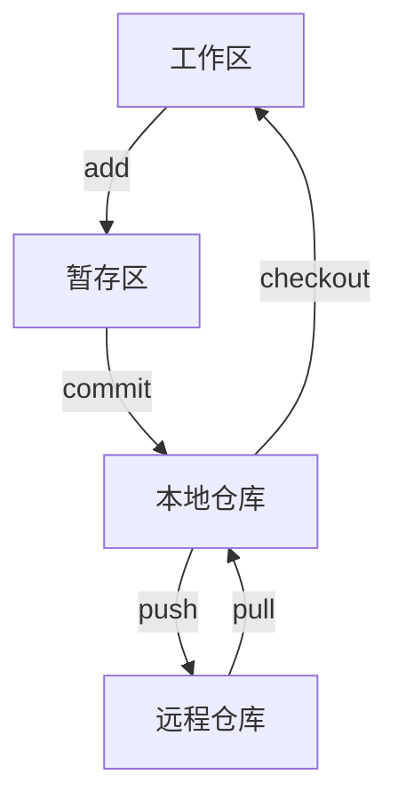

# 开发工具软件

## 概述

开发工具软件是辅助程序员进行软件开发的工具,包括集成开发环境、版本控制系统、项目管理工具等。这些工具大大提高了软件开发的效率和质量。

## 集成开发环境(IDE)

!!! note "IDE的作用"
    IDE集成了代码编辑、编译、调试等功能,提供一站式的开发环境。

### 1. Visual Studio

<div style="background-color: #E3F2FD; padding: 15px; margin: 10px 0; border-left: 4px solid #2196F3; border-radius: 5px;">
    <strong>Visual Studio</strong>
    <p style="margin: 5px 0;">微软开发的强大IDE,支持多种语言。</p>
</div>

**特点:**

- 支持C#、C++、VB.NET等
- 强大的调试功能
- 丰富的插件生态
- 智能代码提示

**适用场景:**

- Windows应用开发
- Web应用开发
- 游戏开发(Unity)
- 移动应用开发

### 2. Eclipse

<div style="background-color: #E8F5E9; padding: 15px; margin: 10px 0; border-left: 4px solid #4CAF50; border-radius: 5px;">
    <strong>Eclipse</strong>
    <p style="margin: 5px 0;">开源的Java开发环境。</p>
</div>

**特点:**

- 开源免费
- 插件丰富
- 跨平台
- 支持多种语言

**适用场景:**

- Java开发
- Android开发
- Web开发
- C/C++开发

### 3. IntelliJ IDEA

<div style="background-color: #FFF3E0; padding: 15px; margin: 10px 0; border-left: 4px solid #FF9800; border-radius: 5px;">
    <strong>IntelliJ IDEA</strong>
    <p style="margin: 5px 0;">JetBrains开发的Java IDE,功能强大。</p>
</div>

**特点:**

- 智能代码分析
- 强大的重构功能
- 内置版本控制
- 数据库工具

**版本:**

- Community: 免费版
- Ultimate: 付费版

### 4. VS Code

<div style="background-color: #F3E5F5; padding: 15px; margin: 10px 0; border-left: 4px solid #9C27B0; border-radius: 5px;">
    <strong>Visual Studio Code</strong>
    <p style="margin: 5px 0;">微软开发的轻量级编辑器。</p>
</div>

**特点:**

- 轻量快速
- 插件丰富
- 跨平台
- 支持多种语言

**常用插件:**

- Python: Python扩展
- ESLint: JavaScript代码检查
- GitLens: Git增强
- Docker: Docker支持

### 5. PyCharm

<div style="background-color: #FCE4EC; padding: 15px; margin: 10px 0; border-left: 4px solid #E91E63; border-radius: 5px;">
    <strong>PyCharm</strong>
    <p style="margin: 5px 0;">JetBrains开发的Python IDE。</p>
</div>

**特点:**

- 专业Python开发
- 科学计算支持
- Web开发支持
- 数据库工具

## 版本控制系统

!!! tip "版本控制的重要性"
    版本控制系统管理代码的变更历史,支持团队协作开发。

### 1. Git

<div style="border: 2px solid #F44336; padding: 15px; margin: 10px 0; border-radius: 5px;">
    <h4 style="margin-top: 0; color: #F44336;">Git - 分布式版本控制</h4>
    <p>Git是目前最流行的分布式版本控制系统。</p>
</div>

**特点:**

- 分布式架构
- 速度快
- 分支管理强大
- 支持离线工作

**基本概念:**



**常用命令:**

```bash
# 初始化仓库
git init

# 添加文件
git add .

# 提交更改
git commit -m "message"

# 查看状态
git status

# 查看日志
git log

# 创建分支
git branch feature

# 切换分支
git checkout feature

# 合并分支
git merge feature

# 推送到远程
git push origin main

# 从远程拉取
git pull origin main
```

**分支策略:**

- master/main: 主分支
- develop: 开发分支
- feature: 功能分支
- release: 发布分支
- hotfix: 修复分支

### 2. SVN

<div style="border: 2px solid #FF9800; padding: 15px; margin: 10px 0; border-radius: 5px;">
    <h4 style="margin-top: 0; color: #FF9800;">SVN - 集中式版本控制</h4>
    <p>SVN是集中式版本控制系统。</p>
</div>

**特点:**

- 集中式架构
- 管理简单
- 适合小团队
- 原子提交

**常用命令:**

```bash
# 检出代码
svn checkout url

# 更新代码
svn update

# 添加文件
svn add file

# 提交更改
svn commit -m "message"

# 查看状态
svn status
```

## 项目管理工具

### 1. Maven

!!! info "Maven"
    Maven是Java项目的构建和依赖管理工具。

**功能:**

- 项目构建
- 依赖管理
- 项目信息管理
- 标准化项目结构

**pom.xml示例:**

```xml
<project>
    <modelVersion>4.0.0</modelVersion>
    <groupId>com.example</groupId>
    <artifactId>my-app</artifactId>
    <version>1.0-SNAPSHOT</version>
    
    <dependencies>
        <dependency>
            <groupId>junit</groupId>
            <artifactId>junit</artifactId>
            <version>4.12</version>
            <scope>test</scope>
        </dependency>
    </dependencies>
</project>
```

**常用命令:**

```bash
mvn compile    # 编译
mvn test       # 测试
mvn package    # 打包
mvn install    # 安装到本地仓库
mvn clean      # 清理
```

### 2. Gradle

<div style="background-color: #E8F5E9; padding: 10px; margin: 10px 0; border-left: 4px solid #4CAF50;">
    <strong>Gradle</strong>
    <p style="margin: 5px 0;">基于Groovy的构建工具,更灵活。</p>
</div>

**特点:**

- 基于Groovy DSL
- 构建脚本简洁
- 性能优秀
- Android官方构建工具

**build.gradle示例:**

```groovy
plugins {
    id 'java'
}

repositories {
    mavenCentral()
}

dependencies {
    testImplementation 'junit:junit:4.12'
}
```

### 3. npm

<div style="background-color: #FFF3E0; padding: 10px; margin: 10px 0; border-left: 4px solid #FF9800;">
    <strong>npm (Node Package Manager)</strong>
    <p style="margin: 5px 0;">JavaScript包管理工具。</p>
</div>

**常用命令:**

```bash
npm init          # 初始化项目
npm install       # 安装依赖
npm install pkg   # 安装指定包
npm update        # 更新依赖
npm run build     # 运行构建脚本
```

## 代码质量工具

### 1. 代码检查工具

**ESLint (JavaScript):**

```json
{
    "extends": "eslint:recommended",
    "rules": {
        "no-unused-vars": "error",
        "semi": ["error", "always"]
    }
}
```

**Pylint (Python):**

```bash
pylint myfile.py
```

**SonarQube:**

- 代码质量平台
- 支持多种语言
- 持续集成集成

### 2. 代码格式化工具

**Prettier:**

- JavaScript代码格式化
- 支持多种语言
- 统一代码风格

**Black (Python):**

- Python代码格式化
- 不妥协的代码风格

## 调试工具

### 1. 浏览器开发者工具

<div style="background-color: #E3F2FD; padding: 10px; margin: 10px 0; border-left: 4px solid #2196F3;">
    <strong>浏览器DevTools</strong>
    <ul style="margin: 5px 0;">
        <li>Elements: 查看和编辑DOM</li>
        <li>Console: JavaScript控制台</li>
        <li>Network: 网络请求监控</li>
        <li>Sources: 源代码调试</li>
        <li>Performance: 性能分析</li>
    </ul>
</div>

### 2. 性能分析工具

- Chrome DevTools Performance
- Firefox Profiler
- Visual Studio Profiler
- JProfiler (Java)

## 参考资料

- [Git官方文档](https://git-scm.com/doc)
- [Maven官方文档](https://maven.apache.org/)
