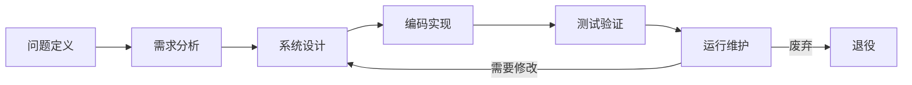
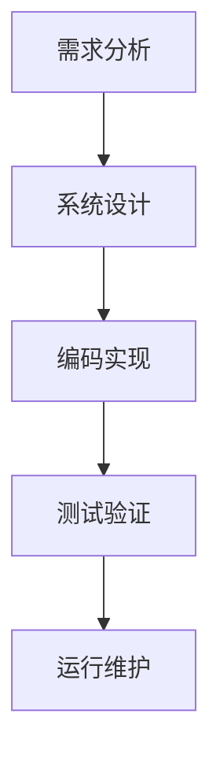

# 软件工程基础

## 概述

软件工程是应用计算机科学、数学和管理科学等原理,以工程化的原则和方法来解决软件问题的学科。软件工程的目标是生产高质量的软件。

## 软件生命周期

!!! note "软件生命周期"
    软件从提出到废弃的整个过程。

### 1. 问题定义

    <strong>问题定义阶段</strong>
    
确定要解决的问题是什么。

**任务:**

- 明确问题范围
- 确定系统目标
- 分析可行性

### 2. 需求分析

    <strong>需求分析阶段</strong>
    
确定系统必须做什么。

**任务:**

- 功能需求分析
- 性能需求分析
- 约束条件分析
- 编写需求规格说明书

**需求类型:**

- 功能需求: 系统必须提供的功能
- 性能需求: 响应时间、吞吐量等
- 约束需求: 技术限制、成本限制

### 3. 系统设计

    <strong>系统设计阶段</strong>
    
确定系统如何实现需求。

**设计层次:**

1. **概要设计**: 系统总体结构
   - 模块划分
   - 接口定义
   - 数据结构设计

2. **详细设计**: 模块内部设计
   - 算法设计
   - 数据结构细化
   - 接口细化

### 4. 编码实现

    <strong>编码实现阶段</strong>
    
将设计转换为程序代码。

**任务:**

- 选择编程语言
- 编写程序代码
- 代码审查
- 单元测试

**编码规范:**

- 命名规范
- 注释规范
- 格式规范
- 文件组织规范

### 5. 测试验证

    <strong>测试验证阶段</strong>
    
发现并纠正程序错误。

**测试类型:**

1. **单元测试**: 测试单个模块
2. **集成测试**: 测试模块组合
3. **系统测试**: 测试整个系统
4. **验收测试**: 用户验收测试

### 6. 运行维护

    <strong>运行维护阶段</strong>
    
软件交付使用后的维护。

**维护类型:**

- **改正性维护**: 修复发现的错误
- **适应性维护**: 适应环境变化
- **完善性维护**: 扩充功能
- **预防性维护**: 提高可维护性

## 软件开发模型

### 1. 瀑布模型

!!! tip "瀑布模型"
    传统的线性顺序模型。

**特点:**

- 阶段清晰
- 文档驱动
- 适合需求明确的项目

**缺点:**

- 缺乏灵活性
- 风险后置

### 2. 增量模型

    <strong>增量模型</strong>
    
分批逐步完成系统。

**特点:**

- 逐步增加功能
- 早期交付部分功能
- 降低开发风险

### 3. 螺旋模型

    <strong>螺旋模型</strong>
    
结合瀑布模型和原型模型,强调风险分析。

**特点:**

- 风险驱动
- 迭代开发
- 适合大型项目

### 4. 敏捷开发

!!! success "敏捷开发"
    强调快速响应变化的开发方法。

**核心价值观:**

- 个体和交互胜过流程和工具
- 可工作的软件胜过详尽的文档
- 客户合作胜过合同谈判
- 响应变化胜过遵循计划

**敏捷方法:**

- Scrum: 迭代增量开发
- XP (极限编程): 快速反馈
- Kanban: 可视化工作流

## 软件质量

### 软件质量属性

    <table style="width: 100%; border-collapse: collapse; margin: 10px 0;">
        <tr style="background-color: #4CAF50; color: white;">
            <th style="padding: 10px; border: 1px solid #ddd;">质量属性</th>
            <th style="padding: 10px; border: 1px solid #ddd;">说明</th>
        </tr>
        <tr>
            <td style="padding: 10px; border: 1px solid #ddd;">功能性</td>
            <td style="padding: 10px; border: 1px solid #ddd;">满足用户需求的能力</td>
        </tr>
        <tr style="background-color: #f9f9f9;">
            <td style="padding: 10px; border: 1px solid #ddd;">可靠性</td>
            <td style="padding: 10px; border: 1px solid #ddd;">在规定条件下正常运行的能力</td>
        </tr>
        <tr>
            <td style="padding: 10px; border: 1px solid #ddd;">易用性</td>
            <td style="padding: 10px; border: 1px solid #ddd;">用户使用的方便程度</td>
        </tr>
        <tr style="background-color: #f9f9f9;">
            <td style="padding: 10px; border: 1px solid #ddd;">效率</td>
            <td style="padding: 10px; border: 1px solid #ddd;">资源利用率</td>
        </tr>
        <tr>
            <td style="padding: 10px; border: 1px solid #ddd;">可维护性</td>
            <td style="padding: 10px; border: 1px solid #ddd;">修改和维护的难易程度</td>
        </tr>
        <tr style="background-color: #f9f9f9;">
            <td style="padding: 10px; border: 1px solid #ddd;">可移植性</td>
            <td style="padding: 10px; border: 1px solid #ddd;">在不同环境下的运行能力</td>
        </tr>
    </table>

### 软件质量保证

!!! warning "质量保证活动"
    确保软件质量的一系列活动。

**活动:**

- 需求评审
- 设计评审
- 代码审查
- 测试验证
- 质量度量

## 软件项目管理

### 1. 项目计划

- 工作量估算
- 进度安排
- 资源分配
- 风险管理

### 2. 项目监控

- 进度跟踪
- 成本控制
- 质量监控
- 风险监控

### 3. 配置管理

    <strong>配置管理</strong>
    
管理软件的变更。

**活动:**

- 版本控制
- 变更控制
- 配置审计
- 状态记录

## 参考资料

- [软件工程 百度百科](https://baike.baidu.com/item/软件工程)
