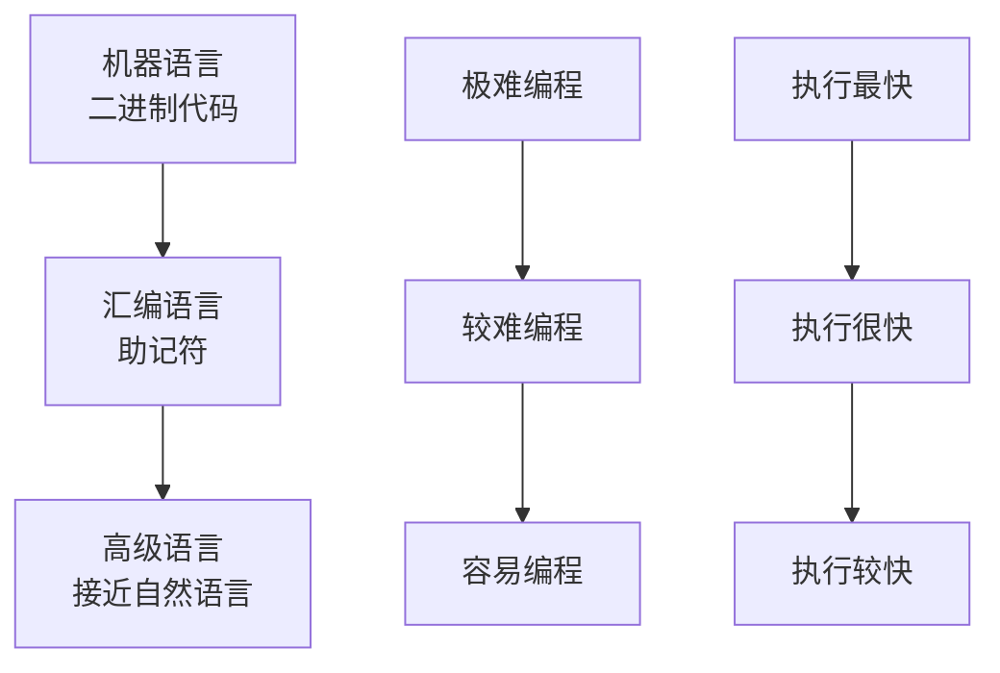

# 机器语言与汇编语言

## 概述

机器语言和汇编语言是计算机编程语言的最初形式,它们与硬件紧密相关,执行效率高但可读性差。理解这两种语言对于深入理解计算机系统的工作原理至关重要。

## 机器语言

### 定义

机器语言是计算机能直接识别和执行的语言,由二进制代码组成。

!!! warning "机器语言的特点"
    机器语言是最底层的编程语言,具有以下特点:

- **由0和1组成**: 所有指令和数据都用二进制表示
- **计算机直接执行**: 不需要翻译
- **执行效率最高**: 直接控制硬件
- **可读性差**: 难以理解和维护
- **与硬件相关**: 不同机器的机器语言不同
- **可移植性差**: 程序不能在不同机器上运行

### 指令格式

机器指令通常由两部分组成:

```
操作码 | 地址码
```

**操作码(OP)**: 指明指令要执行的操作

**地址码(Ad)**: 指明操作数或操作数的地址

### 指令类型

#### 1. 数据传送指令

```
0000 0001 00000010  // LOAD: 将地址2的内容装入寄存器
0001 0010 00000011  // STORE: 将寄存器内容存入地址3
```

#### 2. 算术运算指令

```
0010 0001 00000100  // ADD: 将地址4的内容加到寄存器
0011 0001 00000101  // SUB: 从寄存器减去地址5的内容
```

#### 3. 逻辑运算指令

```
0100 0001 00000110  // AND: 与运算
0101 0001 00000111  // OR: 或运算
```

#### 4. 控制转移指令

```
0110 00001000       // JMP: 无条件转移到地址8
0111 00001001       // JZ: 零标志为1时转移到地址9
```

### 机器语言示例

!!! example "计算 A = B + C 的机器语言程序"

假设:
- B存储在地址10
- C存储在地址11
- A存储在地址12

```
0000 0001 00001010  // LOAD 10: 将B装入寄存器
0010 0001 00001011  // ADD 11: 将C加到寄存器
0001 0010 00001100  // STORE 12: 将结果存入A
1000                // HALT: 停机
```

### 优缺点

**优点:**

- 执行速度最快
- 能充分发挥硬件功能
- 程序效率高

**缺点:**

- 编程困难
- 可读性差
- 容易出错
- 难以维护
- 不可移植

## 汇编语言

### 定义

汇编语言使用助记符来表示机器指令,是机器语言的符号化表示。

!!! note "汇编语言的特点"
    汇编语言是机器语言的改进,具有以下特点:

- **使用助记符**: 用英文缩写代替二进制代码
- **需要汇编器**: 必须翻译成机器语言才能执行
- **执行效率高**: 接近机器语言的效率
- **可读性较好**: 比机器语言容易理解
- **与硬件相关**: 仍依赖于具体机器
- **可移植性差**: 程序不能在不同机器上运行

### 助记符

汇编语言使用助记符来表示操作:

| 机器码 | 助记符 | 功能 |
|--------|--------|------|
| 0000 | LOAD | 装入数据 |
| 0001 | STORE | 存储数据 |
| 0010 | ADD | 加法 |
| 0011 | SUB | 减法 |
| 0100 | AND | 与运算 |
| 0101 | OR | 或运算 |
| 0110 | JMP | 无条件转移 |
| 0111 | JZ | 零转移 |
| 1000 | HALT | 停机 |

### 汇编语言示例

!!! example "计算 A = B + C 的汇编语言程序"

```assembly
LOAD B      ; 将B装入累加器
ADD C       ; 将C加到累加器
STORE A     ; 将结果存入A
HALT        ; 停机

; 数据定义
B: .WORD 10
C: .WORD 20
A: .WORD 0
```

### 汇编过程


**汇编器的工作:**

1. **第一遍扫描**: 建立符号表
   - 识别标号和变量名
   - 记录它们的地址
   
2. **第二遍扫描**: 生成目标代码
   - 将助记符翻译成机器码
   - 将符号地址翻译成实际地址
   - 生成目标程序

### 汇编语言指令

#### 1. 数据传送指令

```assembly
MOV AX, BX      ; 将BX的内容传送到AX
MOV AX, 100     ; 将立即数100传送到AX
MOV AX, [BX]    ; 将BX指向的内存单元内容传送到AX
```

#### 2. 算术运算指令

```assembly
ADD AX, BX      ; AX = AX + BX
SUB AX, BX      ; AX = AX - BX
MUL BX          ; AX = AX * BX
DIV BX          ; AX = AX / BX
INC AX          ; AX = AX + 1
DEC AX          ; AX = AX - 1
```

#### 3. 逻辑运算指令

```assembly
AND AX, BX      ; AX = AX AND BX
OR AX, BX       ; AX = AX OR BX
XOR AX, BX      ; AX = AX XOR BX
NOT AX          ; AX = NOT AX
```

#### 4. 移位指令

```assembly
SHL AX, 1       ; AX左移1位
SHR AX, 1       ; AX右移1位
ROL AX, 1       ; AX循环左移1位
ROR AX, 1       ; AX循环右移1位
```

#### 5. 控制转移指令

```assembly
JMP label       ; 无条件转移
JZ label        ; 零标志为1时转移
JNZ label       ; 零标志为0时转移
CALL sub        ; 调用子程序
RET             ; 从子程序返回
```

### 伪指令

伪指令不产生机器代码,用于控制汇编过程。

```assembly
.DATA           ; 数据段开始
.CODE           ; 代码段开始
.WORD 100       ; 定义字数据
.BYTE 10        ; 定义字节数据
ORG 1000H       ; 设置起始地址
END             ; 源程序结束
```

### 汇编语言的应用

!!! tip "汇编语言的应用场景"
    虽然高级语言已经普及,但汇编语言在以下领域仍有重要应用:

1. **系统程序开发**
   - 操作系统内核
   - 设备驱动程序
   - 引导程序

2. **嵌入式系统**
   - 单片机编程
   - 实时控制系统
   - 资源受限系统

3. **性能优化**
   - 关键代码优化
   - 算法优化
   - 底层库开发

4. **逆向工程**
   - 程序分析
   - 漏洞挖掘
   - 病毒分析

### 优缺点

**优点:**

- 执行效率高
- 能直接控制硬件
- 代码紧凑
- 适合系统编程

**缺点:**

- 编程复杂
- 可读性较差
- 维护困难
- 不可移植
- 开发效率低

## 机器语言与汇编语言的比较

| 特性 | 机器语言 | 汇编语言 |
|------|----------|----------|
| 表示形式 | 二进制代码 | 助记符 |
| 可读性 | 极差 | 较差 |
| 编程难度 | 极高 | 高 |
| 执行效率 | 最高 | 很高 |
| 硬件相关性 | 极强 | 强 |
| 可移植性 | 无 | 差 |
| 需要翻译 | 否 | 是 |

## 从汇编到高级语言的演变



## 参考资料

- [机器语言 百度百科](https://baike.baidu.com/item/机器语言/2019225?fr=ge_ala)
- [汇编语言 百度百科](https://baike.baidu.com/item/汇编语言/61826?fr=ge_ala)
