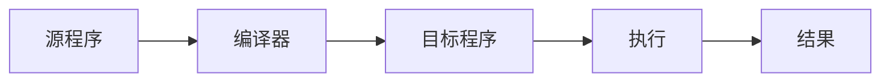
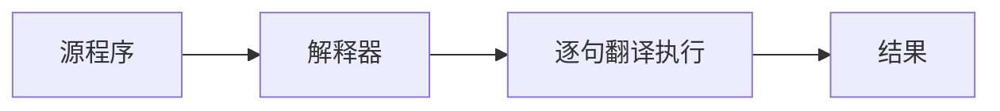
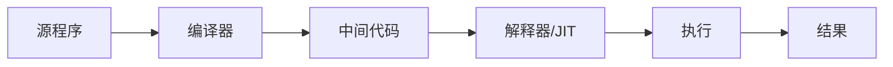
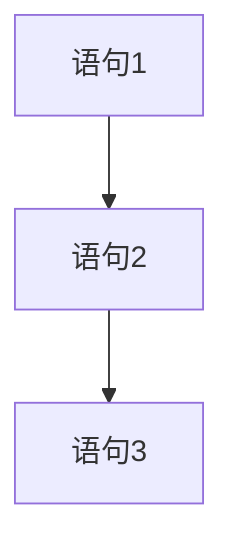
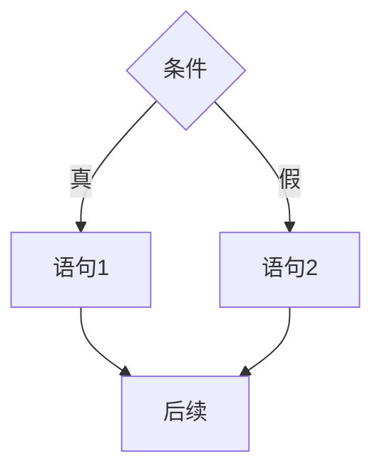
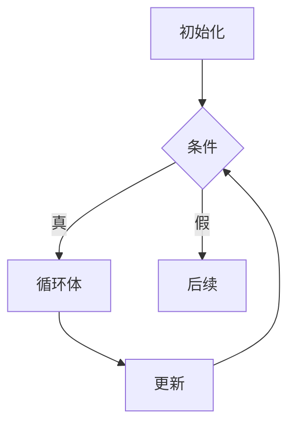

# 高级语言特性

## 概述

高级语言是接近人类自然语言的编程语言,具有较强的抽象能力,不依赖于具体硬件。高级语言的出现极大地提高了程序设计的效率和程序的可移植性。

## 高级语言的特点

!!! success "高级语言的优势"
    高级语言相比低级语言具有显著优势:

- **接近人类思维**: 使用接近自然语言的语法
- **抽象程度高**: 隐藏底层实现细节
- **可读性强**: 程序易于理解和维护
- **可移植性好**: 不依赖具体硬件
- **开发效率高**: 编程效率大幅提升
- **类型安全**: 提供类型检查机制

## 高级语言的分类

### 1. 按执行方式分类

#### 编译型语言

!!! note "编译型语言"
    源程序在执行前被完整翻译成目标程序。

**工作流程:**



**特点:**

- 编译一次,执行多次
- 执行效率高
- 错误在编译时发现
- 需要编译时间

**代表语言:** C, C++, Go, Rust, Fortran

#### 解释型语言

!!! note "解释型语言"
    源程序被逐句翻译并立即执行。

**工作流程:**



**特点:**

- 每次执行都需要解释
- 执行效率较低
- 便于调试和交互
- 跨平台性好

**代表语言:** Python, JavaScript, Ruby, PHP

#### 混合型语言

!!! note "混合型语言"
    结合编译和解释的特点。

**工作流程:**



**特点:**

- 编译成中间代码
- 中间代码解释执行
- JIT编译提高性能
- 兼顾效率和移植性

**代表语言:** Java, C#

### 2. 按编程范式分类

#### 过程式语言

!!! tip "过程式语言"
    以过程或函数为中心,强调算法和步骤。

**特点:**

- 程序由过程/函数组成
- 数据和操作分离
- 自顶向下设计
- 适合科学计算

**代表语言:** C, Pascal, Fortran, BASIC

**示例:**

```c
// C语言示例
int add(int a, int b) {
    return a + b;
}

int main() {
    int result = add(3, 5);
    printf("Result: %d\n", result);
    return 0;
}
```

#### 面向对象语言

!!! tip "面向对象语言"
    以对象为中心,封装数据和操作。

**特点:**

- 封装: 隐藏实现细节
- 继承: 代码复用
- 多态: 同一接口不同实现
- 适合大型软件开发

**代表语言:** Java, C++, Python, Smalltalk

**示例:**

```java
// Java示例
public class Calculator {
    private int value;
    
    public Calculator(int value) {
        this.value = value;
    }
    
    public int add(int other) {
        return this.value + other;
    }
}

public class Main {
    public static void main(String[] args) {
        Calculator calc = new Calculator(3);
        int result = calc.add(5);
        System.out.println("Result: " + result);
    }
}
```

#### 函数式语言

!!! tip "函数式语言"
    以函数为中心,强调无副作用的计算。

**特点:**

- 函数是一等公民
- 避免状态变化
- 引用透明性
- 适合并发编程

**代表语言:** Haskell, Lisp, Erlang, Scala, F#

**示例:**

```haskell
-- Haskell示例
add :: Int -> Int -> Int
add a b = a + b

main :: IO ()
main = do
    let result = add 3 5
    print result
```

#### 逻辑式语言

!!! tip "逻辑式语言"
    基于逻辑推理,声明式编程。

**特点:**

- 声明事实和规则
- 自动推理求解
- 适合人工智能
- 声明式编程

**代表语言:** Prolog

**示例:**

```prolog
% Prolog示例
parent(tom, mary).
parent(tom, john).
parent(mary, ann).

grandparent(X, Z) :- parent(X, Y), parent(Y, Z).
```

## 高级语言的要素

### 1. 数据类型

!!! info "数据类型系统"
    数据类型定义了数据的取值范围和允许的操作。

**基本类型:**

- 整型: int, short, long
- 浮点型: float, double
- 字符型: char
- 布尔型: bool

**复合类型:**

- 数组: 相同类型元素的集合
- 结构体: 不同类型元素的集合
- 联合体: 共享内存的不同类型
- 枚举: 命名常量的集合

**抽象类型:**

- 类: 数据和操作的封装
- 接口: 行为的抽象
- 泛型: 类型参数化

### 2. 运算符

**算术运算符:**

```
+  加法
-  减法
*  乘法
/  除法
%  取模
```

**关系运算符:**

```
==  等于
!=  不等于
<   小于
>   大于
<=  小于等于
>=  大于等于
```

**逻辑运算符:**

```
&&  逻辑与
||  逻辑或
!   逻辑非
```

**位运算符:**

```
&   按位与
|   按位或
^   按位异或
~   按位取反
<<  左移
>>  右移
```

### 3. 控制结构

!!! example "程序控制结构"
    任何程序都可以由三种基本结构组成。

#### 顺序结构



```c
int a = 10;
int b = 20;
int c = a + b;
```

#### 选择结构



```c
if (a > b) {
    max = a;
} else {
    max = b;
}
```

#### 循环结构



```c
for (int i = 0; i < 10; i++) {
    sum += i;
}
```

### 4. 函数/过程

!!! note "函数的作用"
    函数是代码复用的基本单位,实现模块化编程。

**函数的组成:**

- 函数名: 标识函数
- 参数列表: 输入数据
- 返回类型: 输出数据类型
- 函数体: 实现逻辑

**参数传递方式:**

1. **值传递**: 传递值的副本
2. **引用传递**: 传递地址
3. **指针传递**: 传递指针

```c
// 值传递
void swap(int a, int b) {
    int temp = a;
    a = b;
    b = temp;
}

// 引用传递(C++)
void swap(int &a, int &b) {
    int temp = a;
    a = b;
    b = temp;
}

// 指针传递
void swap(int *a, int *b) {
    int temp = *a;
    *a = *b;
    *b = temp;
}
```

### 5. 作用域与生命周期

**作用域:**

- 局部变量: 函数内部有效
- 全局变量: 整个程序有效
- 块作用域: 代码块内有效

**生命周期:**

- 自动变量: 函数调用时创建,返回时销毁
- 静态变量: 程序开始时创建,结束时销毁
- 动态变量: 手动创建和销毁

## 高级语言的发展趋势

### 1. 多范式融合

- 支持多种编程范式
- 如: Python支持面向对象和函数式

### 2. 类型系统增强

- 静态类型检查
- 类型推断
- 泛型编程

### 3. 并发支持

- 多线程编程
- 异步编程
- 协程

### 4. 安全性增强

- 内存安全
- 类型安全
- 空指针检查

### 5. 性能优化

- JIT编译
- AOT编译
- 优化器改进

## 参考资料

- [高级语言 百度百科](https://baike.baidu.com/item/高级语言/299113?fr=ge_ala)
- [编程语言发展历史 CSDN博客](https://blog.csdn.net/wlh2220133699/article/details/131232326)
