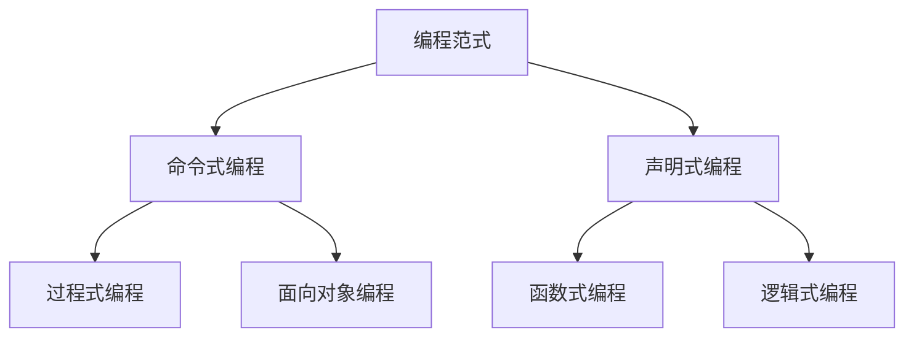

# 编程范式

## 概述

编程范式(Programming Paradigm)是编程的基本风格和方法论,它决定了程序的组织方式和思维方式。不同的编程范式适合解决不同类型的问题。

## 主要编程范式



## 命令式编程

!!! note "命令式编程"
    命令式编程关注计算机执行的步骤,通过语句改变程序状态。

### 特点

<div style="background-color: #E3F2FD; padding: 15px; margin: 10px 0; border-left: 4px solid #2196F3; border-radius: 5px;">
    <strong>命令式编程特点</strong>
    <ul style="margin: 5px 0;">
        <li>关注"如何做"</li>
        <li>通过语句改变状态</li>
        <li>顺序执行</li>
        <li>使用变量存储状态</li>
    </ul>
</div>

### 过程式编程

!!! tip "过程式编程"
    过程式编程将程序分解为过程(函数)。

**特点:**

- 自顶向下设计
- 过程/函数为中心
- 数据和操作分离
- 适合科学计算

**示例(C语言):**

```c
// 计算阶乘
int factorial(int n) {
    int result = 1;
    for (int i = 1; i <= n; i++) {
        result *= i;
    }
    return result;
}

int main() {
    int n = 5;
    int result = factorial(n);
    printf("%d! = %d\n", n, result);
    return 0;
}
```

**优点:**

- 结构清晰
- 易于理解
- 适合小规模程序

**缺点:**

- 数据和操作分离
- 代码复用性差
- 维护困难

### 面向对象编程

!!! success "面向对象编程(OOP)"
    面向对象编程以对象为中心,封装数据和操作。

<div style="background-color: #E8F5E9; padding: 15px; margin: 10px 0; border-left: 4px solid #4CAF50; border-radius: 5px;">
    <strong>OOP三大特性</strong>
</div>

#### 1. 封装(Encapsulation)

<div style="border: 2px solid #4CAF50; padding: 10px; margin: 10px 0; border-radius: 5px;">
    <strong>封装</strong>
    <p style="margin: 5px 0;">隐藏实现细节,只暴露必要的接口。</p>
</div>

**示例(Java):**

```java
public class BankAccount {
    private double balance;  // 私有属性
    
    public BankAccount(double initialBalance) {
        this.balance = initialBalance;
    }
    
    public void deposit(double amount) {  // 公有方法
        if (amount > 0) {
            balance += amount;
        }
    }
    
    public double getBalance() {
        return balance;
    }
}
```

#### 2. 继承(Inheritance)

<div style="border: 2px solid #2196F3; padding: 10px; margin: 10px 0; border-radius: 5px;">
    <strong>继承</strong>
    <p style="margin: 5px 0;">子类继承父类的属性和方法,实现代码复用。</p>
</div>

**示例(Java):**

```java
public class Animal {
    protected String name;
    
    public void eat() {
        System.out.println(name + " is eating");
    }
}

public class Dog extends Animal {
    public Dog(String name) {
        this.name = name;
    }
    
    public void bark() {
        System.out.println(name + " is barking");
    }
}
```

#### 3. 多态(Polymorphism)

<div style="border: 2px solid #FF9800; padding: 10px; margin: 10px 0; border-radius: 5px;">
    <strong>多态</strong>
    <p style="margin: 5px 0;">同一接口,不同实现。</p>
</div>

**示例(Java):**

```java
public interface Shape {
    double area();
}

public class Circle implements Shape {
    private double radius;
    
    public double area() {
        return Math.PI * radius * radius;
    }
}

public class Rectangle implements Shape {
    private double width, height;
    
    public double area() {
        return width * height;
    }
}
```

**OOP优点:**

- 代码复用
- 易于维护
- 适合大型项目
- 模块化设计

**OOP缺点:**

- 设计复杂
- 性能开销
- 过度设计风险

## 声明式编程

!!! note "声明式编程"
    声明式编程关注"做什么",而不是"如何做"。

### 特点

<div style="background-color: #FFF3E0; padding: 15px; margin: 10px 0; border-left: 4px solid #FF9800; border-radius: 5px;">
    <strong>声明式编程特点</strong>
    <ul style="margin: 5px 0;">
        <li>关注"做什么"</li>
        <li>描述目标而非过程</li>
        <li>避免状态变化</li>
        <li>更抽象</li>
    </ul>
</div>

### 函数式编程

!!! tip "函数式编程(FP)"
    函数式编程以函数为中心,强调无副作用的计算。

<div style="background-color: #F3E5F5; padding: 15px; margin: 10px 0; border-left: 4px solid #9C27B0; border-radius: 5px;">
    <strong>函数式编程特点</strong>
</div>

#### 1. 纯函数

<div style="border: 2px solid #9C27B0; padding: 10px; margin: 10px 0; border-radius: 5px;">
    <strong>纯函数</strong>
    <p style="margin: 5px 0;">相同输入总是产生相同输出,无副作用。</p>
</div>

**示例(JavaScript):**

```javascript
// 纯函数
function add(a, b) {
    return a + b;
}

// 非纯函数(有副作用)
let total = 0;
function addToTotal(value) {
    total += value;  // 修改外部状态
    return total;
}
```

#### 2. 不可变性

<div style="border: 2px solid #E91E63; padding: 10px; margin: 10px 0; border-radius: 5px;">
    <strong>不可变性</strong>
    <p style="margin: 5px 0;">数据一旦创建就不能修改。</p>
</div>

**示例(JavaScript):**

```javascript
// 可变方式
let arr = [1, 2, 3];
arr.push(4);  // 修改原数组

// 不可变方式
let arr = [1, 2, 3];
let newArr = [...arr, 4];  // 创建新数组
```

#### 3. 高阶函数

<div style="border: 2px solid #00BCD4; padding: 10px; margin: 10px 0; border-radius: 5px;">
    <strong>高阶函数</strong>
    <p style="margin: 5px 0;">接受函数作为参数或返回函数。</p>
</div>

**示例(JavaScript):**

```javascript
// map: 映射
const numbers = [1, 2, 3, 4, 5];
const doubled = numbers.map(x => x * 2);

// filter: 过滤
const evens = numbers.filter(x => x % 2 === 0);

// reduce: 归约
const sum = numbers.reduce((acc, x) => acc + x, 0);
```

**FP优点:**

- 易于测试
- 易于并发
- 代码简洁
- 可预测性强

**FP缺点:**

- 学习曲线陡
- 性能可能较低
- 不适合所有场景

### 逻辑式编程

!!! info "逻辑式编程"
    基于逻辑推理的编程范式。

**特点:**

- 声明事实和规则
- 自动推理求解
- 适合人工智能

**示例(Prolog):**

```prolog
% 事实
parent(tom, mary).
parent(tom, john).
parent(mary, ann).

% 规则
grandparent(X, Z) :- parent(X, Y), parent(Y, Z).

% 查询
?- grandparent(tom, ann).
% 结果: true
```

## 多范式编程

!!! success "多范式编程"
    现代编程语言通常支持多种编程范式。

**示例语言:**

- **Python**: 支持面向对象、函数式、过程式
- **JavaScript**: 支持函数式、面向对象
- **Scala**: 支持函数式、面向对象
- **Rust**: 支持函数式、面向对象

**示例(Python):**

```python
# 面向对象
class Calculator:
    def add(self, a, b):
        return a + b

# 函数式
numbers = [1, 2, 3, 4, 5]
squared = list(map(lambda x: x**2, numbers))

# 过程式
def factorial(n):
    result = 1
    for i in range(1, n+1):
        result *= i
    return result
```

## 参考资料

- [编程范式 百度百科](https://baike.baidu.com/item/编程范式)
