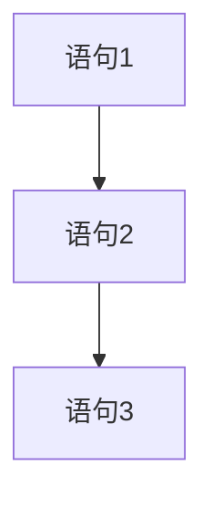
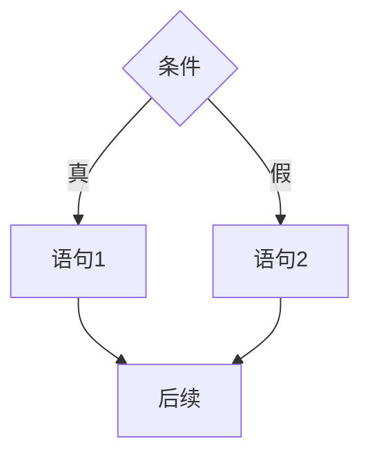
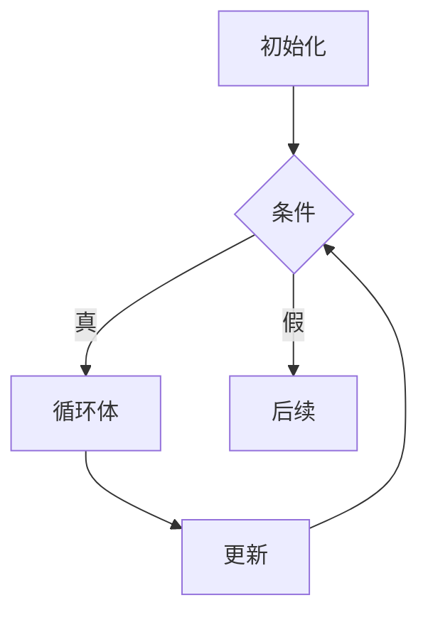

# 程序设计方法

## 概述

程序设计方法是指编写程序时所采用的方法和技巧。良好的程序设计方法可以提高程序的质量、可读性和可维护性。

## 结构化程序设计

!!! note "结构化程序设计"
    结构化程序设计是一种程序设计方法,强调使用顺序、选择、循环三种基本结构。

### 基本结构

<div style="background-color: #E3F2FD; padding: 15px; margin: 10px 0; border-left: 4px solid #2196F3; border-radius: 5px;">
    <strong>三种基本结构</strong>
</div>

#### 1. 顺序结构



**特点:**

- 按顺序执行
- 每条语句执行一次

#### 2. 选择结构



**特点:**

- 根据条件选择执行路径
- 只执行一条路径

#### 3. 循环结构



**特点:**

- 重复执行循环体
- 直到条件不满足

### 结构化程序设计原则

!!! tip "设计原则"
    结构化程序设计遵循以下原则:

1. **自顶向下**: 从整体到局部逐步细化
2. **逐步求精**: 将复杂问题分解为简单问题
3. **模块化**: 将程序划分为独立模块
4. **限制goto**: 避免使用goto语句

### 优点

<div style="background-color: #E8F5E9; padding: 10px; margin: 10px 0; border-left: 4px solid #4CAF50;">
    <strong>结构化程序设计优点</strong>
    <ul style="margin: 5px 0;">
        <li>结构清晰</li>
        <li>易于理解</li>
        <li>易于验证</li>
        <li>易于维护</li>
    </ul>
</div>

## 模块化程序设计

### 模块的概念

!!! info "模块"
    模块是具有独立功能的程序单元,具有明确的接口。

### 模块化设计原则

<div style="border: 2px solid #4CAF50; padding: 10px; margin: 10px 0; border-radius: 5px;">
    <strong>模块化设计原则</strong>
</div>

#### 1. 信息隐藏

<div style="background-color: #FFF3E0; padding: 10px; margin: 10px 0; border-left: 4px solid #FF9800;">
    <strong>信息隐藏原则</strong>
    <p style="margin: 5px 0;">模块内部实现细节对外不可见。</p>
</div>

**示例:**

```c
// 模块接口(stack.h)
void push(int value);
int pop(void);
int isEmpty(void);

// 模块实现(stack.c)
#include "stack.h"

static int stack[100];  // 隐藏的实现细节
static int top = 0;

void push(int value) {
    stack[top++] = value;
}

int pop(void) {
    return stack[--top];
}

int isEmpty(void) {
    return top == 0;
}
```

#### 2. 高内聚

<div style="background-color: #F3E5F5; padding: 10px; margin: 10px 0; border-left: 4px solid #9C27B0;">
    <strong>高内聚原则</strong>
    <p style="margin: 5px 0;">模块内部元素紧密相关。</p>
</div>

**内聚类型:**

- 功能内聚: 最高内聚,模块完成单一功能
- 顺序内聚: 模块内元素顺序执行
- 通信内聚: 模块内元素操作相同数据
- 过程内聚: 模块内元素按过程组织
- 时间内聚: 模块内元素同时执行
- 逻辑内聚: 模块内元素逻辑相关
- 偶然内聚: 最低内聚,元素无关联

#### 3. 低耦合

<div style="background-color: #FCE4EC; padding: 10px; margin: 10px 0; border-left: 4px solid #E91E63;">
    <strong>低耦合原则</strong>
    <p style="margin: 5px 0;">模块之间依赖关系尽可能少。</p>
</div>

**耦合类型:**

- 内容耦合: 最高耦合,一个模块直接访问另一个模块内部
- 公共耦合: 模块访问公共数据
- 外部耦合: 模块访问外部数据
- 控制耦合: 一个模块控制另一个模块
- 标记耦合: 模块间传递数据结构
- 数据耦合: 模块间传递数据
- 无耦合: 最低耦合,模块完全独立

## 递归程序设计

### 递归的概念

!!! tip "递归"
    递归是函数直接或间接调用自身的过程。

### 递归的要素

<div style="border: 2px solid #2196F3; padding: 10px; margin: 10px 0; border-radius: 5px;">
    <strong>递归的两个要素</strong>
    <ul style="margin: 5px 0;">
        <li>基准情况: 递归终止条件</li>
        <li>递归步骤: 问题规模缩小</li>
    </ul>
</div>

### 递归示例

#### 1. 阶乘

```python
def factorial(n):
    # 基准情况
    if n == 0 or n == 1:
        return 1
    # 递归步骤
    return n * factorial(n - 1)
```

#### 2. 斐波那契数列

```python
def fibonacci(n):
    # 基准情况
    if n <= 1:
        return n
    # 递归步骤
    return fibonacci(n-1) + fibonacci(n-2)
```

#### 3. 汉诺塔

```python
def hanoi(n, source, target, auxiliary):
    if n == 1:
        print(f"Move disk 1 from {source} to {target}")
        return
    
    hanoi(n-1, source, auxiliary, target)
    print(f"Move disk {n} from {source} to {target}")
    hanoi(n-1, auxiliary, target, source)
```

### 递归的优缺点

**优点:**

- 代码简洁
- 易于理解
- 适合分治问题

**缺点:**

- 空间开销大
- 可能栈溢出
- 效率可能较低

## 迭代程序设计

### 迭代的概念

!!! note "迭代"
    迭代是使用循环结构重复执行代码的过程。

### 迭代示例

#### 1. 阶乘(迭代)

```python
def factorial(n):
    result = 1
    for i in range(1, n + 1):
        result *= i
    return result
```

#### 2. 斐波那契数列(迭代)

```python
def fibonacci(n):
    if n <= 1:
        return n
    
    a, b = 0, 1
    for _ in range(2, n + 1):
        a, b = b, a + b
    return b
```

### 递归与迭代的比较

<div style="overflow-x: auto;">
    <table style="width: 100%; border-collapse: collapse; margin: 10px 0;">
        <tr style="background-color: #4CAF50; color: white;">
            <th style="padding: 10px; border: 1px solid #ddd;">特性</th>
            <th style="padding: 10px; border: 1px solid #ddd;">递归</th>
            <th style="padding: 10px; border: 1px solid #ddd;">迭代</th>
        </tr>
        <tr>
            <td style="padding: 10px; border: 1px solid #ddd;">空间复杂度</td>
            <td style="padding: 10px; border: 1px solid #ddd;">高(调用栈)</td>
            <td style="padding: 10px; border: 1px solid #ddd;">低</td>
        </tr>
        <tr style="background-color: #f9f9f9;">
            <td style="padding: 10px; border: 1px solid #ddd;">时间复杂度</td>
            <td style="padding: 10px; border: 1px solid #ddd;">可能较高</td>
            <td style="padding: 10px; border: 1px solid #ddd;">通常较低</td>
        </tr>
        <tr>
            <td style="padding: 10px; border: 1px solid #ddd;">代码可读性</td>
            <td style="padding: 10px; border: 1px solid #ddd;">好</td>
            <td style="padding: 10px; border: 1px solid #ddd;">可能较差</td>
        </tr>
        <tr style="background-color: #f9f9f9;">
            <td style="padding: 10px; border: 1px solid #ddd;">适用场景</td>
            <td style="padding: 10px; border: 1px solid #ddd;">分治、树遍历</td>
            <td style="padding: 10px; border: 1px solid #ddd;">简单重复</td>
        </tr>
    </table>
</div>

## 程序设计风格

### 良好的程序设计风格

!!! success "程序设计风格"
    良好的程序设计风格提高程序的可读性和可维护性。

#### 1. 命名规范

<div style="background-color: #E8F5E9; padding: 10px; margin: 10px 0; border-left: 4px solid #4CAF50;">
    <strong>命名规范</strong>
    <ul style="margin: 5px 0;">
        <li>使用有意义的名称</li>
        <li>遵循命名约定</li>
        <li>避免使用缩写</li>
    </ul>
</div>

**示例:**

```python
# 好的命名
def calculate_average(numbers):
    total = sum(numbers)
    count = len(numbers)
    return total / count

# 不好的命名
def calc(nums):
    t = sum(nums)
    c = len(nums)
    return t / c
```

#### 2. 注释规范

<div style="background-color: #FFF3E0; padding: 10px; margin: 10px 0; border-left: 4px solid #FF9800;">
    <strong>注释规范</strong>
    <ul style="margin: 5px 0;">
        <li>解释为什么,而不是做什么</li>
        <li>保持注释与代码同步</li>
        <li>使用文档注释</li>
    </ul>
</div>

**示例:**

```python
def binary_search(arr, target):
    """
    二分查找算法
    
    参数:
        arr: 已排序的数组
        target: 要查找的目标值
    
    返回:
        目标值的索引,如果不存在则返回-1
    """
    left, right = 0, len(arr) - 1
    
    while left <= right:
        mid = (left + right) // 2
        
        if arr[mid] == target:
            return mid
        elif arr[mid] < target:
            left = mid + 1
        else:
            right = mid - 1
    
    return -1
```

#### 3. 代码格式

- 使用一致的缩进
- 合理使用空行
- 控制每行长度

## 参考资料

- [程序设计方法 百度百科](https://baike.baidu.com/item/程序设计方法)
