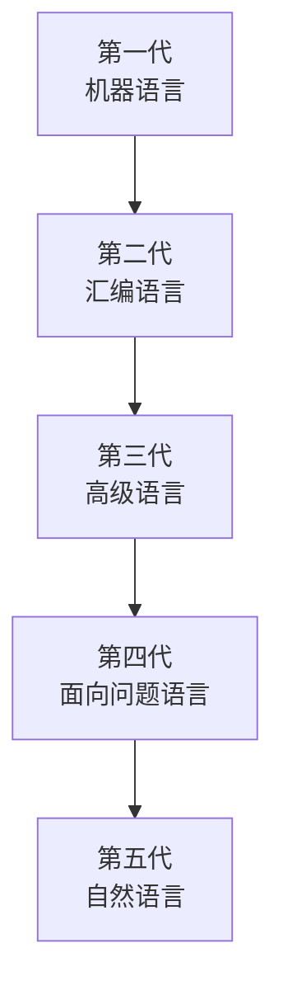

# 编程语言发展趋势

## 概述

编程语言随着计算机技术的发展而不断演进。从机器语言到高级语言,从过程式到面向对象,编程语言的发展反映了人们对编程效率和程序质量的不懈追求。

## 编程语言的发展历程



## 现代编程语言的发展趋势

### 1. 多范式融合

!!! note "多范式融合"
    现代编程语言支持多种编程范式。

<div style="background-color: #E3F2FD; padding: 15px; margin: 10px 0; border-left: 4px solid #2196F3; border-radius: 5px;">
    <strong>多范式语言示例</strong>
    <ul style="margin: 5px 0;">
        <li>Python: 面向对象 + 函数式 + 过程式</li>
        <li>Scala: 面向对象 + 函数式</li>
        <li>Rust: 面向对象 + 函数式</li>
        <li>JavaScript: 面向对象 + 函数式</li>
    </ul>
</div>

**优势:**

- 灵活性高
- 适应不同场景
- 提高表达能力

### 2. 类型系统增强

!!! tip "类型系统发展"
    类型系统越来越强大,提供更好的类型安全。

#### 静态类型 vs 动态类型

<div style="overflow-x: auto;">
    <table style="width: 100%; border-collapse: collapse; margin: 10px 0;">
        <tr style="background-color: #4CAF50; color: white;">
            <th style="padding: 10px; border: 1px solid #ddd;">类型</th>
            <th style="padding: 10px; border: 1px solid #ddd;">特点</th>
            <th style="padding: 10px; border: 1px solid #ddd;">代表语言</th>
        </tr>
        <tr>
            <td style="padding: 10px; border: 1px solid #ddd;">静态类型</td>
            <td style="padding: 10px; border: 1px solid #ddd;">编译时类型检查</td>
            <td style="padding: 10px; border: 1px solid #ddd;">Java, C++, Rust</td>
        </tr>
        <tr style="background-color: #f9f9f9;">
            <td style="padding: 10px; border: 1px solid #ddd;">动态类型</td>
            <td style="padding: 10px; border: 1px solid #ddd;">运行时类型检查</td>
            <td style="padding: 10px; border: 1px solid #ddd;">Python, JavaScript</td>
        </tr>
        <tr>
            <td style="padding: 10px; border: 1px solid #ddd;">渐进类型</td>
            <td style="padding: 10px; border: 1px solid #ddd;">可选的类型注解</td>
            <td style="padding: 10px; border: 1px solid #ddd;">TypeScript, Python</td>
        </tr>
    </table>
</div>

#### 类型推断

<div style="background-color: #E8F5E9; padding: 10px; margin: 10px 0; border-left: 4px solid #4CAF50;">
    <strong>类型推断</strong>
    <p style="margin: 5px 0;">编译器自动推断变量类型,减少类型注解。</p>
</div>

**示例(Kotlin):**

```kotlin
// 类型推断
val name = "Kotlin"  // 推断为String
val age = 25         // 推断为Int
val list = listOf(1, 2, 3)  // 推断为List<Int>
```

### 3. 并发支持增强

!!! success "并发编程"
    现代语言提供更好的并发编程支持。

#### 协程(Coroutine)

<div style="border: 2px solid #4CAF50; padding: 10px; margin: 10px 0; border-radius: 5px;">
    <strong>协程</strong>
    <p style="margin: 5px 0;">轻量级线程,支持异步编程。</p>
</div>

**示例(Kotlin):**

```kotlin
import kotlinx.coroutines.*

suspend fun fetchData(): String {
    delay(1000)  // 非阻塞延迟
    return "Data"
}

fun main() = runBlocking {
    launch {
        val data = fetchData()
        println(data)
    }
}
```

**示例(Python):**

```python
import asyncio

async def fetch_data():
    await asyncio.sleep(1)  # 非阻塞延迟
    return "Data"

async def main():
    data = await fetch_data()
    print(data)

asyncio.run(main())
```

#### Actor模型

<div style="border: 2px solid #2196F3; padding: 10px; margin: 10px 0; border-radius: 5px;">
    <strong>Actor模型</strong>
    <p style="margin: 5px 0;">基于消息传递的并发模型。</p>
</div>

**代表语言:** Erlang, Elixir, Akka(Scala)

### 4. 内存安全

!!! warning "内存安全"
    现代语言越来越重视内存安全。

#### 所有权系统(Rust)

<div style="background-color: #FCE4EC; padding: 10px; margin: 10px 0; border-left: 4px solid #E91E63;">
    <strong>Rust的所有权系统</strong>
    <p style="margin: 5px 0;">编译时保证内存安全,无需垃圾回收。</p>
</div>

**规则:**

1. 每个值有且只有一个所有者
2. 当所有者离开作用域,值被丢弃
3. 可以借用值(引用)

**示例:**

```rust
fn main() {
    let s1 = String::from("hello");
    let s2 = s1;  // s1的所有权转移到s2
    
    // println!("{}", s1);  // 错误: s1不再有效
    println!("{}", s2);     // 正确
}
```

#### 自动垃圾回收

<div style="background-color: #FFF3E0; padding: 10px; margin: 10px 0; border-left: 4px solid #FF9800;">
    <strong>垃圾回收</strong>
    <p style="margin: 5px 0;">自动管理内存,减少内存泄漏。</p>
</div>

**代表语言:** Java, Python, Go, JavaScript

### 5. 元编程支持

!!! info "元编程"
    程序操作程序的能力。

#### 宏(Macro)

<div style="border: 2px solid #9C27B0; padding: 10px; margin: 10px 0; border-radius: 5px;">
    <strong>宏</strong>
    <p style="margin: 5px 0;">编译时代码生成。</p>
</div>

**示例(Rust):**

```rust
macro_rules! say_hello {
    () => {
        println!("Hello!");
    };
}

fn main() {
    say_hello!();  // 展开为 println!("Hello!");
}
```

#### 反射(Reflection)

<div style="border: 2px solid #FF9800; padding: 10px; margin: 10px 0; border-radius: 5px;">
    <strong>反射</strong>
    <p style="margin: 5px 0;">运行时检查类型信息。</p>
</div>

**示例(Java):**

```java
Class<?> clazz = String.class;
Method[] methods = clazz.getMethods();
for (Method method : methods) {
    System.out.println(method.getName());
}
```

### 6. 函数式特性

!!! tip "函数式特性"
    现代语言越来越多地采用函数式特性。

#### Lambda表达式

**示例(Java):**

```java
// Java 8之前
Runnable r1 = new Runnable() {
    @Override
    public void run() {
        System.out.println("Hello");
    }
};

// Java 8 Lambda
Runnable r2 = () -> System.out.println("Hello");
```

#### 模式匹配

**示例(Rust):**

```rust
match value {
    1 => println!("One"),
    2 | 3 => println!("Two or Three"),
    4..=10 => println!("Four to Ten"),
    _ => println!("Other"),
}
```

## 新兴编程语言

### 1. Rust

<div style="background-color: #E8F5E9; padding: 15px; margin: 10px 0; border-left: 4px solid #4CAF50; border-radius: 5px;">
    <strong>Rust</strong>
    <p style="margin: 5px 0;">系统编程语言,注重安全和性能。</p>
    <ul style="margin: 5px 0;">
        <li>内存安全</li>
        <li>无垃圾回收</li>
        <li>零成本抽象</li>
    </ul>
</div>

### 2. Go

<div style="background-color: #E3F2FD; padding: 15px; margin: 10px 0; border-left: 4px solid #2196F3; border-radius: 5px;">
    <strong>Go</strong>
    <p style="margin: 5px 0;">Google开发,注重简洁和并发。</p>
    <ul style="margin: 5px 0;">
        <li>编译速度快</li>
        <li>并发支持好</li>
        <li>语法简洁</li>
    </ul>
</div>

### 3. Kotlin

<div style="background-color: #FFF3E0; padding: 15px; margin: 10px 0; border-left: 4px solid #FF9800; border-radius: 5px;">
    <strong>Kotlin</strong>
    <p style="margin: 5px 0;">JetBrains开发,现代JVM语言。</p>
    <ul style="margin: 5px 0;">
        <li>与Java兼容</li>
        <li>空安全</li>
        <li>协程支持</li>
    </ul>
</div>

### 4. Swift

<div style="background-color: #F3E5F5; padding: 15px; margin: 10px 0; border-left: 4px solid #9C27B0; border-radius: 5px;">
    <strong>Swift</strong>
    <p style="margin: 5px 0;">Apple开发,现代iOS开发语言。</p>
    <ul style="margin: 5px 0;">
        <li>类型安全</li>
        <li>现代语法</li>
        <li>高性能</li>
    </ul>
</div>

## 未来发展趋势

### 1. 更强的类型系统

- 依赖类型
- 线性类型
- 效果系统

### 2. 更好的并发支持

- 结构化并发
- 数据并行
- 分布式计算

### 3. 更智能的工具

- AI辅助编程
- 自动代码生成
- 智能重构

### 4. 跨平台开发

- WebAssembly
- 跨平台框架
- 统一开发体验

## 参考资料

- [编程语言发展历史 CSDN博客](https://blog.csdn.net/wlh2220133699/article/details/131232326)
