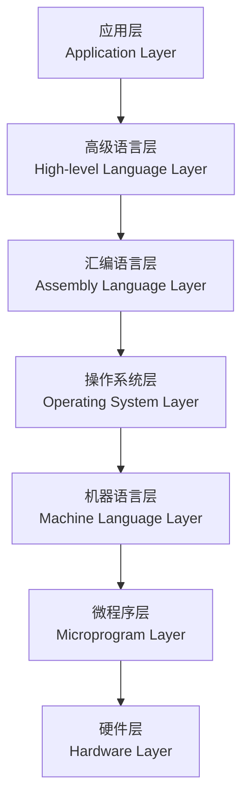

# 计算机系统层次结构概述

## 概述

计算机系统是一个复杂的层次化结构,从底层的硬件到顶层的应用软件,每一层都建立在下一层之上,为上一层提供服务。这种层次化设计使得计算机系统具有良好的可维护性和可扩展性。

## 层次结构模型

!!! note "计算机系统层次结构"
    计算机系统通常被划分为多个层次,每层都有明确的功能和接口。

## 各层功能说明

### 1. 硬件层

    <strong>硬件层(Hardware Layer)</strong>
    
计算机系统的物理基础,包括所有硬件设备。

**主要组成:**

- CPU(中央处理器)
- 存储器(内存、硬盘)
- 输入输出设备
- 总线系统

**特点:**

- 物理实体
- 执行机器指令
- 提供硬件接口

### 2. 微程序层

    <strong>微程序层(Microprogram Layer)</strong>
    
将机器指令分解为微指令序列。

**功能:**

- 解释执行机器指令
- 控制硬件操作
- 实现指令集

**特点:**

- 固件形式
- 指令解释器
- 硬件与机器语言的桥梁

### 3. 机器语言层

    <strong>机器语言层(Machine Language Layer)</strong>
    
直接由硬件执行的二进制指令。

**特点:**

- 二进制编码
- 直接执行
- 与硬件相关

### 4. 操作系统层

    <strong>操作系统层(Operating System Layer)</strong>
    
管理系统资源,提供系统调用接口。

**功能:**

- 资源管理
- 进程调度
- 文件管理
- 设备管理

### 5. 汇编语言层

    <strong>汇编语言层(Assembly Language Layer)</strong>
    
使用助记符表示机器指令。

**特点:**

- 助记符形式
- 与机器语言一一对应
- 需要汇编器翻译

### 6. 高级语言层

    <strong>高级语言层(High-level Language Layer)</strong>
    
接近自然语言的编程语言。

**特点:**

- 易于理解
- 与硬件无关
- 需要编译器或解释器

### 7. 应用层

    <strong>应用层(Application Layer)</strong>
    
面向用户的应用程序。

**特点:**

- 用户界面
- 业务逻辑
- 解决实际问题

## 层次结构的特点

!!! tip "层次结构特点"
    计算机系统的层次结构具有以下特点:

### 1. 透明性

    <strong>透明性(Transparency)</strong>
    
上层不需要了解下层的实现细节。

**示例:**

- 高级语言程序员不需要了解机器指令
- 应用程序不需要了解硬件细节

### 2. 抽象性

    <strong>抽象性(Abstraction)</strong>
    
每层都提供抽象的接口。

**示例:**

- 操作系统提供系统调用接口
- 高级语言提供编程接口

### 3. 独立性

    <strong>独立性(Independence)</strong>
    
各层相对独立,可以单独修改。

**示例:**

- 更换硬件不影响操作系统
- 更换操作系统不影响应用程序

## 层次结构的优势

!!! success "层次结构的优势"
    层次化设计带来诸多好处:

    <table style="width: 100%; border-collapse: collapse; margin: 10px 0;">
        <tr style="background-color: #4CAF50; color: white;">
            <th style="padding: 10px; border: 1px solid #ddd;">优势</th>
            <th style="padding: 10px; border: 1px solid #ddd;">说明</th>
        </tr>
        <tr>
            <td style="padding: 10px; border: 1px solid #ddd;">简化设计</td>
            <td style="padding: 10px; border: 1px solid #ddd;">每层专注于特定功能</td>
        </tr>
        <tr style="background-color: #f9f9f9;">
            <td style="padding: 10px; border: 1px solid #ddd;">易于维护</td>
            <td style="padding: 10px; border: 1px solid #ddd;">修改一层不影响其他层</td>
        </tr>
        <tr>
            <td style="padding: 10px; border: 1px solid #ddd;">可移植性</td>
            <td style="padding: 10px; border: 1px solid #ddd;">上层可以移植到不同平台</td>
        </tr>
        <tr style="background-color: #f9f9f9;">
            <td style="padding: 10px; border: 1px solid #ddd;">可扩展性</td>
            <td style="padding: 10px; border: 1px solid #ddd;">易于添加新功能</td>
        </tr>
    </table>

## 参考资料

- [计算机系统层次结构 百度百科](https://baike.baidu.com/item/计算机系统层次结构)
