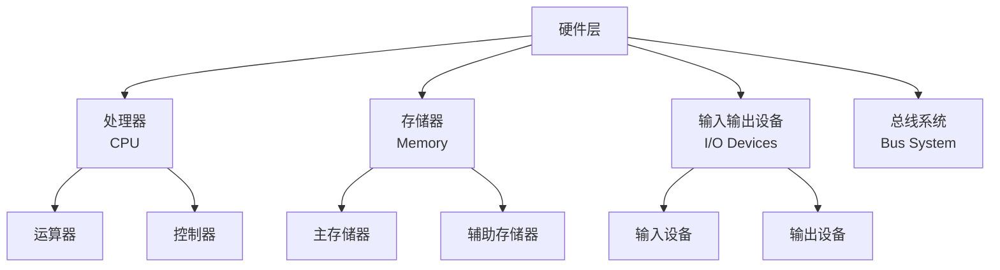
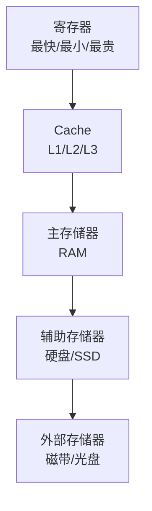

# 硬件层详解

## 概述

硬件层是计算机系统的最底层,是整个计算机系统的物理基础。它由各种电子元器件和机械设备组成,负责执行各种物理操作。

## 硬件层的组成

!!! note "硬件层组成"
    硬件层主要包括处理器、存储器、输入输出设备和总线系统。



## 中央处理器(CPU)

### CPU的功能

<div style="background-color: #E3F2FD; padding: 15px; margin: 10px 0; border-left: 4px solid #2196F3; border-radius: 5px;">
    <strong>CPU的主要功能</strong>
    <ul style="margin: 5px 0;">
        <li>指令控制: 控制程序的执行顺序</li>
        <li>操作控制: 产生操作控制信号</li>
        <li>时间控制: 对各种操作进行定时</li>
        <li>数据加工: 对数据进行算术和逻辑运算</li>
    </ul>
</div>

### CPU的组成

#### 1. 运算器

<div style="background-color: #E8F5E9; padding: 10px; margin: 10px 0; border-left: 4px solid #4CAF50;">
    <strong>运算器(Arithmetic Logic Unit, ALU)</strong>
    <p style="margin: 5px 0;">执行算术和逻辑运算。</p>
</div>

**组成:**

- 算术逻辑单元(ALU)
- 累加器(ACC)
- 通用寄存器
- 状态寄存器

**功能:**

- 算术运算: 加、减、乘、除
- 逻辑运算: 与、或、非、异或
- 移位操作: 左移、右移
- 比较操作: 等于、大于、小于

#### 2. 控制器

<div style="background-color: #FFF3E0; padding: 10px; margin: 10px 0; border-left: 4px solid #FF9800;">
    <strong>控制器(Control Unit, CU)</strong>
    <p style="margin: 5px 0;">指挥和协调计算机各部件工作。</p>
</div>

**组成:**

- 程序计数器(PC)
- 指令寄存器(IR)
- 指令译码器
- 时序发生器
- 操作控制器

**功能:**

- 取指令
- 分析指令
- 执行指令
- 控制数据流向

### CPU的性能指标

<div style="overflow-x: auto;">
    <table style="width: 100%; border-collapse: collapse; margin: 10px 0;">
        <tr style="background-color: #4CAF50; color: white;">
            <th style="padding: 10px; border: 1px solid #ddd;">指标</th>
            <th style="padding: 10px; border: 1px solid #ddd;">说明</th>
            <th style="padding: 10px; border: 1px solid #ddd;">单位</th>
        </tr>
        <tr>
            <td style="padding: 10px; border: 1px solid #ddd;">主频</td>
            <td style="padding: 10px; border: 1px solid #ddd;">CPU的时钟频率</td>
            <td style="padding: 10px; border: 1px solid #ddd;">Hz(MHz, GHz)</td>
        </tr>
        <tr style="background-color: #f9f9f9;">
            <td style="padding: 10px; border: 1px solid #ddd;">字长</td>
            <td style="padding: 10px; border: 1px solid #ddd;">CPU一次处理的二进制位数</td>
            <td style="padding: 10px; border: 1px solid #ddd;">位(bit)</td>
        </tr>
        <tr>
            <td style="padding: 10px; border: 1px solid #ddd;">缓存</td>
            <td style="padding: 10px; border: 1px solid #ddd;">CPU内部的缓存容量</td>
            <td style="padding: 10px; border: 1px solid #ddd;">字节(Byte)</td>
        </tr>
        <tr style="background-color: #f9f9f9;">
            <td style="padding: 10px; border: 1px solid #ddd;">核心数</td>
            <td style="padding: 10px; border: 1px solid #ddd;">CPU的核心数量</td>
            <td style="padding: 10px; border: 1px solid #ddd;">个</td>
        </tr>
    </table>
</div>

## 存储器

### 存储器的层次结构

!!! tip "存储器层次结构"
    存储器按照速度、容量和价格形成层次结构。



### 主存储器

<div style="background-color: #F3E5F5; padding: 15px; margin: 10px 0; border-left: 4px solid #9C27B0; border-radius: 5px;">
    <strong>主存储器(Main Memory)</strong>
    <p style="margin: 5px 0;">CPU能直接访问的存储器。</p>
</div>

**类型:**

- **RAM(随机存取存储器)**:
  - SRAM(静态RAM): 速度快,用作Cache
  - DRAM(动态RAM): 容量大,用作主存

- **ROM(只读存储器)**:
  - PROM: 可编程ROM
  - EPROM: 可擦除PROM
  - EEPROM: 电可擦除PROM

**性能指标:**

- 存储容量
- 存取时间
- 存储周期
- 带宽

### 辅助存储器

<div style="background-color: #FCE4EC; padding: 15px; margin: 10px 0; border-left: 4px solid #E91E63; border-radius: 5px;">
    <strong>辅助存储器(Secondary Storage)</strong>
    <p style="margin: 5px 0;">用于长期存储数据的设备。</p>
</div>

**类型:**

- 硬盘驱动器(HDD)
- 固态硬盘(SSD)
- 光盘(CD/DVD/Blu-ray)
- U盘

## 输入输出设备

### 输入设备

!!! info "输入设备"
    将外部信息输入到计算机的设备。

**常见输入设备:**

- 键盘
- 鼠标
- 扫描仪
- 麦克风
- 摄像头
- 触摸屏

### 输出设备

!!! info "输出设备"
    将计算机处理结果输出到外部的设备。

**常见输出设备:**

- 显示器
- 打印机
- 音箱
- 投影仪

### 输入输出控制方式

<div style="border: 2px solid #4CAF50; padding: 10px; margin: 10px 0; border-radius: 5px;">
    <strong>I/O控制方式</strong>
</div>

#### 1. 程序查询方式

<div style="background-color: #E3F2FD; padding: 10px; margin: 10px 0; border-left: 4px solid #2196F3;">
    <strong>程序查询方式</strong>
    <p style="margin: 5px 0;">CPU不断查询I/O设备状态。</p>
</div>

**特点:**

- 简单
- CPU效率低
- 适合低速设备

#### 2. 程序中断方式

<div style="background-color: #E8F5E9; padding: 10px; margin: 10px 0; border-left: 4px solid #4CAF50;">
    <strong>程序中断方式</strong>
    <p style="margin: 5px 0;">I/O设备准备好后向CPU发中断请求。</p>
</div>

**特点:**

- CPU效率较高
- 实时性好
- 适合中速设备

#### 3. DMA方式

<div style="background-color: #FFF3E0; padding: 10px; margin: 10px 0; border-left: 4px solid #FF9800;">
    <strong>DMA方式</strong>
    <p style="margin: 5px 0;">直接存储器访问,数据直接在内存和I/O设备间传输。</p>
</div>

**特点:**

- CPU效率高
- 适合高速设备
- 需要DMA控制器

## 总线系统

### 总线的概念

!!! note "总线"
    总线是连接计算机各部件的公共通信线路。

### 总线的分类

<div style="overflow-x: auto;">
    <table style="width: 100%; border-collapse: collapse; margin: 10px 0;">
        <tr style="background-color: #4CAF50; color: white;">
            <th style="padding: 10px; border: 1px solid #ddd;">总线类型</th>
            <th style="padding: 10px; border: 1px solid #ddd;">功能</th>
            <th style="padding: 10px; border: 1px solid #ddd;">示例</th>
        </tr>
        <tr>
            <td style="padding: 10px; border: 1px solid #ddd;">数据总线</td>
            <td style="padding: 10px; border: 1px solid #ddd;">传输数据</td>
            <td style="padding: 10px; border: 1px solid #ddd;">双向总线</td>
        </tr>
        <tr style="background-color: #f9f9f9;">
            <td style="padding: 10px; border: 1px solid #ddd;">地址总线</td>
            <td style="padding: 10px; border: 1px solid #ddd;">传输地址</td>
            <td style="padding: 10px; border: 1px solid #ddd;">单向总线</td>
        </tr>
        <tr>
            <td style="padding: 10px; border: 1px solid #ddd;">控制总线</td>
            <td style="padding: 10px; border: 1px solid #ddd;">传输控制信号</td>
            <td style="padding: 10px; border: 1px solid #ddd;">双向总线</td>
        </tr>
    </table>
</div>

### 总线的性能指标

- 总线宽度: 数据总线的位数
- 总线频率: 总线的工作频率
- 总线带宽: 单位时间传输的数据量

**计算公式:**

```
总线带宽 = 总线宽度 × 总线频率 / 8
```

## 参考资料

- [计算机硬件 百度百科](https://baike.baidu.com/item/计算机硬件)
