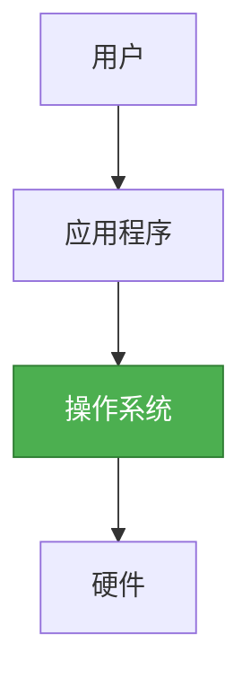
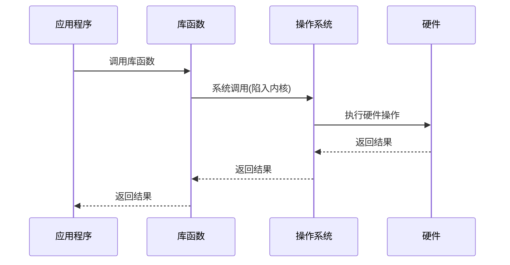

# 操作系统层详解

## 概述

操作系统层位于硬件层之上,是计算机系统中最重要的系统软件。它管理计算机的硬件和软件资源,为用户和应用程序提供服务接口。

## 操作系统的地位

!!! note "操作系统的地位"
    操作系统是硬件和软件之间的桥梁。

## 操作系统的功能

### 1. 处理机管理

    <strong>处理机管理</strong>
    
管理CPU资源,合理分配CPU时间。

**主要功能:**

- 进程控制: 创建、撤销、挂起、恢复进程
- 进程同步: 协调进程执行顺序
- 进程通信: 进程间信息交换
- 进程调度: 分配CPU时间

**关键概念:**

- **进程**: 程序的一次执行过程
- **线程**: 进程中的一个执行单元
- **进程状态**: 就绪、运行、阻塞

### 2. 存储器管理

    <strong>存储器管理</strong>
    
管理内存资源,为程序分配内存空间。

**主要功能:**

- 内存分配与回收
- 地址映射: 逻辑地址到物理地址
- 内存保护: 防止进程相互干扰
- 内存扩充: 虚拟存储技术

**内存分配方式:**

- 连续分配: 单一连续、固定分区、动态分区
- 非连续分配: 分页、分段、段页式

### 3. 设备管理

    <strong>设备管理</strong>
    
管理外部设备,控制设备与CPU、内存的数据交换。

**主要功能:**

- 设备分配与回收
- 设备驱动
- 设备独立性
- 缓冲管理

**I/O控制方式:**

- 程序查询方式
- 中断方式
- DMA方式
- 通道方式

### 4. 文件管理

    <strong>文件管理</strong>
    
管理文件资源,提供文件存储和访问功能。

**主要功能:**

- 文件存储空间管理
- 目录管理
- 文件读写管理
- 文件保护与共享

**文件系统类型:**

- FAT: File Allocation Table
- NTFS: New Technology File System
- EXT: Extended File System
- HFS: Hierarchical File System

## 操作系统的特征

!!! tip "操作系统特征"
    操作系统具有以下基本特征:

### 1. 并发性

    <strong>并发性(Concurrency)</strong>
    
多个程序同时执行。

**说明:**

- 宏观上: 多个程序同时执行
- 微观上: 多个程序交替执行(单CPU)

### 2. 共享性

    <strong>共享性(Sharing)</strong>
    
系统资源被多个进程共同使用。

**类型:**

- 互斥共享: 资源一次只能被一个进程使用
- 同时共享: 资源可被多个进程同时使用

### 3. 虚拟性

    <strong>虚拟性(Virtual)</strong>
    
将物理实体变为多个逻辑实体。

**示例:**

- 虚拟内存: 将物理内存扩充为更大的逻辑内存
- 虚拟设备: 将一个物理设备变为多个逻辑设备

### 4. 异步性

    <strong>异步性(Asynchronism)</strong>
    
进程执行速度不确定。

**说明:**

- 进程执行顺序不确定
- 进程执行速度不确定
- 需要同步机制保证正确性

## 操作系统的类型

    <table style="width: 100%; border-collapse: collapse; margin: 10px 0;">
        <tr style="background-color: #4CAF50; color: white;">
            <th style="padding: 10px; border: 1px solid #ddd;">类型</th>
            <th style="padding: 10px; border: 1px solid #ddd;">特点</th>
            <th style="padding: 10px; border: 1px solid #ddd;">应用场景</th>
        </tr>
        <tr>
            <td style="padding: 10px; border: 1px solid #ddd;">批处理系统</td>
            <td style="padding: 10px; border: 1px solid #ddd;">成批处理作业</td>
            <td style="padding: 10px; border: 1px solid #ddd;">科学计算</td>
        </tr>
        <tr style="background-color: #f9f9f9;">
            <td style="padding: 10px; border: 1px solid #ddd;">分时系统</td>
            <td style="padding: 10px; border: 1px solid #ddd;">时间片轮转</td>
            <td style="padding: 10px; border: 1px solid #ddd;">多用户系统</td>
        </tr>
        <tr>
            <td style="padding: 10px; border: 1px solid #ddd;">实时系统</td>
            <td style="padding: 10px; border: 1px solid #ddd;">实时响应</td>
            <td style="padding: 10px; border: 1px solid #ddd;">工业控制</td>
        </tr>
        <tr style="background-color: #f9f9f9;">
            <td style="padding: 10px; border: 1px solid #ddd;">分布式系统</td>
            <td style="padding: 10px; border: 1px solid #ddd;">多机协同</td>
            <td style="padding: 10px; border: 1px solid #ddd;">云计算</td>
        </tr>
        <tr>
            <td style="padding: 10px; border: 1px solid #ddd;">嵌入式系统</td>
            <td style="padding: 10px; border: 1px solid #ddd;">资源受限</td>
            <td style="padding: 10px; border: 1px solid #ddd;">智能设备</td>
        </tr>
    </table>

## 系统调用

!!! info "系统调用"
    系统调用是操作系统提供给应用程序的接口。

### 系统调用的类型

    <strong>常见系统调用类型</strong>

#### 1. 进程控制

- fork(): 创建进程
- exec(): 执行程序
- exit(): 终止进程
- wait(): 等待进程

#### 2. 文件操作

- open(): 打开文件
- close(): 关闭文件
- read(): 读文件
- write(): 写文件

#### 3. 设备管理

- ioctl(): 设备控制
- read(): 读设备
- write(): 写设备

#### 4. 内存管理

- malloc(): 分配内存
- free(): 释放内存
- mmap(): 内存映射

### 系统调用的过程

## 参考资料

- [操作系统 百度百科](https://baike.baidu.com/item/操作系统)
