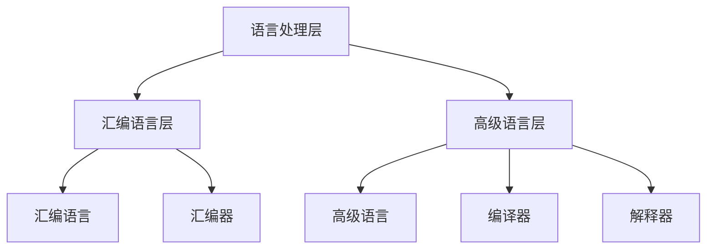
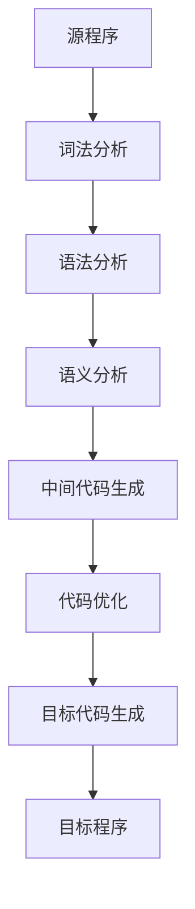
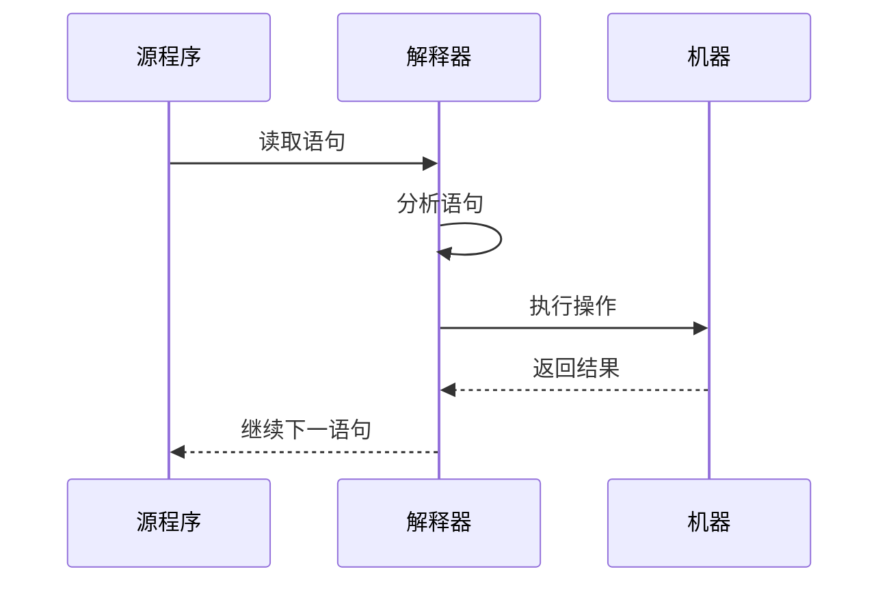

# 语言处理层详解

## 概述

语言处理层包括汇编语言层和高级语言层,负责将程序员编写的源程序转换为机器能够执行的目标程序。这一层是人与机器之间的重要桥梁。

## 语言处理层的组成

!!! note "语言处理层组成"
    语言处理层包括汇编语言层和高级语言层。



## 汇编语言层

### 汇编语言的特点

<div style="background-color: #E3F2FD; padding: 15px; margin: 10px 0; border-left: 4px solid #2196F3; border-radius: 5px;">
    <strong>汇编语言特点</strong>
    <ul style="margin: 5px 0;">
        <li>使用助记符代替二进制代码</li>
        <li>与机器语言一一对应</li>
        <li>与硬件相关</li>
        <li>执行效率高</li>
    </ul>
</div>

### 汇编语言的组成

#### 1. 指令语句

<div style="background-color: #E8F5E9; padding: 10px; margin: 10px 0; border-left: 4px solid #4CAF50;">
    <strong>指令语句</strong>
    <p style="margin: 5px 0;">对应机器指令,执行特定操作。</p>
</div>

**示例(x86汇编):**

```assembly
MOV AX, 10      ; 将10移入AX寄存器
ADD AX, BX      ; 将BX加到AX
MOV [SI], AX    ; 将AX存入内存
```

#### 2. 伪指令语句

<div style="background-color: #FFF3E0; padding: 10px; margin: 10px 0; border-left: 4px solid #FF9800;">
    <strong>伪指令语句</strong>
    <p style="margin: 5px 0;">不产生机器指令,用于汇编控制。</p>
</div>

**示例:**

```assembly
DATA SEGMENT    ; 定义数据段
    msg DB 'Hello$'
DATA ENDS

CODE SEGMENT    ; 定义代码段
    ; ... 代码 ...
CODE ENDS
```

#### 3. 宏指令语句

<div style="background-color: #F3E5F5; padding: 10px; margin: 10px 0; border-left: 4px solid #9C27B0;">
    <strong>宏指令语句</strong>
    <p style="margin: 5px 0;">定义和使用宏,简化代码编写。</p>
</div>

**示例:**

```assembly
; 定义宏
MYMACRO MACRO param1, param2
    MOV AX, param1
    ADD AX, param2
ENDM

; 使用宏
MYMACRO 10, 20
```

### 汇编器

!!! tip "汇编器"
    汇编器将汇编语言源程序翻译成机器语言目标程序。

**汇编过程:**


**汇编器的功能:**

- 将助记符翻译成机器码
- 处理伪指令
- 展开宏指令
- 生成目标文件

## 高级语言层

### 高级语言的特点

<div style="background-color: #FCE4EC; padding: 15px; margin: 10px 0; border-left: 4px solid #E91E63; border-radius: 5px;">
    <strong>高级语言特点</strong>
    <ul style="margin: 5px 0;">
        <li>接近自然语言</li>
        <li>与硬件无关</li>
        <li>易于学习和使用</li>
        <li>可移植性好</li>
    </ul>
</div>

### 高级语言的分类

<div style="overflow-x: auto;">
    <table style="width: 100%; border-collapse: collapse; margin: 10px 0;">
        <tr style="background-color: #4CAF50; color: white;">
            <th style="padding: 10px; border: 1px solid #ddd;">分类</th>
            <th style="padding: 10px; border: 1px solid #ddd;">特点</th>
            <th style="padding: 10px; border: 1px solid #ddd;">代表语言</th>
        </tr>
        <tr>
            <td style="padding: 10px; border: 1px solid #ddd;">过程式语言</td>
            <td style="padding: 10px; border: 1px solid #ddd;">以过程为中心</td>
            <td style="padding: 10px; border: 1px solid #ddd;">C, Pascal, Fortran</td>
        </tr>
        <tr style="background-color: #f9f9f9;">
            <td style="padding: 10px; border: 1px solid #ddd;">面向对象语言</td>
            <td style="padding: 10px; border: 1px solid #ddd;">以对象为中心</td>
            <td style="padding: 10px; border: 1px solid #ddd;">Java, C++, Python</td>
        </tr>
        <tr>
            <td style="padding: 10px; border: 1px solid #ddd;">函数式语言</td>
            <td style="padding: 10px; border: 1px solid #ddd;">以函数为中心</td>
            <td style="padding: 10px; border: 1px solid #ddd;">Haskell, Lisp, Erlang</td>
        </tr>
        <tr style="background-color: #f9f9f9;">
            <td style="padding: 10px; border: 1px solid #ddd;">逻辑式语言</td>
            <td style="padding: 10px; border: 1px solid #ddd;">基于逻辑推理</td>
            <td style="padding: 10px; border: 1px solid #ddd;">Prolog</td>
        </tr>
        <tr>
            <td style="padding: 10px; border: 1px solid #ddd;">脚本语言</td>
            <td style="padding: 10px; border: 1px solid #ddd;">解释执行</td>
            <td style="padding: 10px; border: 1px solid #ddd;">JavaScript, Python, Ruby</td>
        </tr>
    </table>
</div>

### 编译器

!!! success "编译器"
    编译器将高级语言源程序翻译成目标程序。

#### 编译过程



#### 编译器的组成

<div style="border: 2px solid #4CAF50; padding: 10px; margin: 10px 0; border-radius: 5px;">
    <strong>编译器的主要组成部分</strong>
</div>

**1. 词法分析器(Lexical Analyzer)**

- 功能: 将源程序分解为单词流
- 输入: 字符流
- 输出: 单词流

**2. 语法分析器(Syntax Analyzer)**

- 功能: 分析单词流是否构成合法语法
- 输入: 单词流
- 输出: 语法树

**3. 语义分析器(Semantic Analyzer)**

- 功能: 检查语义正确性
- 输入: 语法树
- 输出: 带语义信息的语法树

**4. 中间代码生成器**

- 功能: 生成中间代码
- 输入: 语义树
- 输出: 中间代码

**5. 代码优化器**

- 功能: 优化中间代码
- 输入: 中间代码
- 输出: 优化后的中间代码

**6. 目标代码生成器**

- 功能: 生成目标代码
- 输入: 优化后的中间代码
- 输出: 目标代码

### 解释器

!!! tip "解释器"
    解释器直接执行源程序,不生成目标程序。

#### 解释执行过程



#### 编译与解释的比较

<div style="overflow-x: auto;">
    <table style="width: 100%; border-collapse: collapse; margin: 10px 0;">
        <tr style="background-color: #4CAF50; color: white;">
            <th style="padding: 10px; border: 1px solid #ddd;">特性</th>
            <th style="padding: 10px; border: 1px solid #ddd;">编译</th>
            <th style="padding: 10px; border: 1px solid #ddd;">解释</th>
        </tr>
        <tr>
            <td style="padding: 10px; border: 1px solid #ddd;">执行方式</td>
            <td style="padding: 10px; border: 1px solid #ddd;">先编译后执行</td>
            <td style="padding: 10px; border: 1px solid #ddd;">边解释边执行</td>
        </tr>
        <tr style="background-color: #f9f9f9;">
            <td style="padding: 10px; border: 1px solid #ddd;">执行速度</td>
            <td style="padding: 10px; border: 1px solid #ddd;">快</td>
            <td style="padding: 10px; border: 1px solid #ddd;">慢</td>
        </tr>
        <tr>
            <td style="padding: 10px; border: 1px solid #ddd;">开发效率</td>
            <td style="padding: 10px; border: 1px solid #ddd;">低</td>
            <td style="padding: 10px; border: 1px solid #ddd;">高</td>
        </tr>
        <tr style="background-color: #f9f9f9;">
            <td style="padding: 10px; border: 1px solid #ddd;">错误检测</td>
            <td style="padding: 10px; border: 1px solid #ddd;">编译时</td>
            <td style="padding: 10px; border: 1px solid #ddd;">运行时</td>
        </tr>
        <tr>
            <td style="padding: 10px; border: 1px solid #ddd;">可移植性</td>
            <td style="padding: 10px; border: 1px solid #ddd;">差</td>
            <td style="padding: 10px; border: 1px solid #ddd;">好</td>
        </tr>
    </table>
</div>

## 参考资料

- [编译原理 百度百科](https://baike.baidu.com/item/编译原理)
