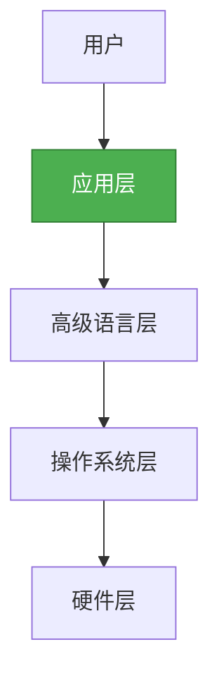
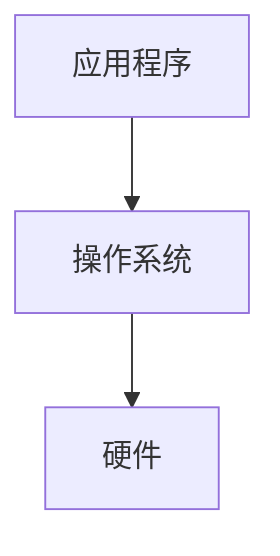
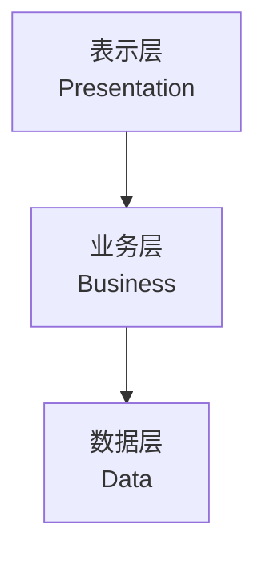
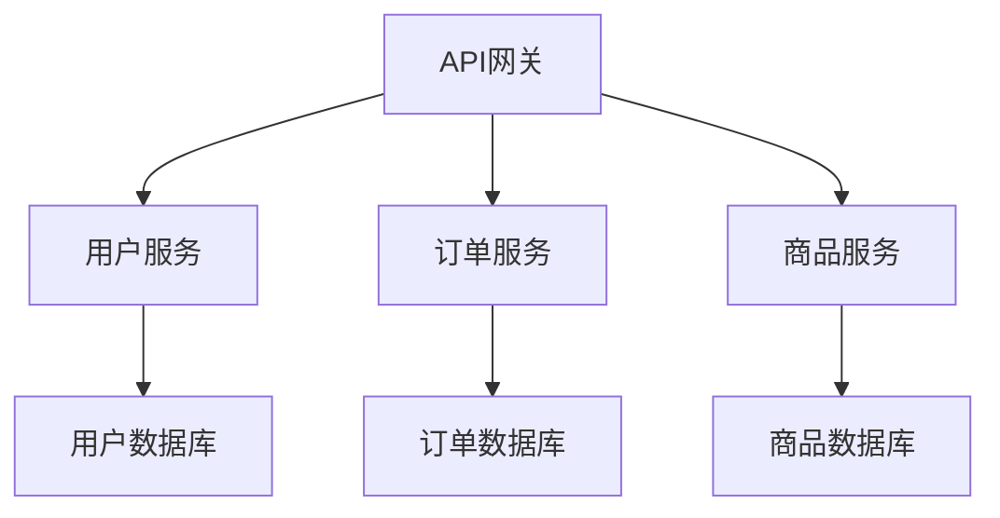
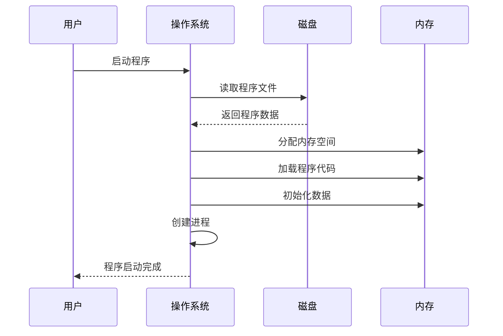

# 应用层详解

## 概述

应用层是计算机系统层次结构的最高层,直接面向用户,提供各种应用服务。应用程序通过调用下层提供的服务,实现特定的业务功能。

## 应用层的地位

!!! note "应用层的地位"
    应用层是用户与计算机系统交互的接口。

## 应用程序的分类

### 1. 系统应用程序

    <strong>系统应用程序</strong>
    
为系统管理和维护提供支持的应用程序。

**常见系统应用程序:**

- **系统管理工具**:
  - 任务管理器
  - 设备管理器
  - 磁盘管理工具
  - 系统监控工具

- **系统维护工具**:
  - 磁盘清理工具
  - 磁盘碎片整理
  - 系统备份工具
  - 杀毒软件

- **系统配置工具**:
  - 控制面板
  - 注册表编辑器
  - 系统配置工具

### 2. 支撑应用程序

    <strong>支撑应用程序</strong>
    
为其他应用程序提供支持的工具软件。

**常见支撑应用程序:**

- **开发工具**:
  - 集成开发环境(IDE)
  - 编译器
  - 调试器
  - 版本控制系统

- **数据库管理工具**:
  - 数据库管理系统
  - 数据库客户端
  - 数据库设计工具

- **网络工具**:
  - 浏览器
  - 邮件客户端
  - FTP客户端
  - 远程桌面

### 3. 用户应用程序

    <strong>用户应用程序</strong>
    
直接为用户提供服务的应用程序。

**常见用户应用程序:**

- **办公软件**:
  - 文字处理软件
  - 电子表格软件
  - 演示文稿软件
  - 数据库管理软件

- **图形图像软件**:
  - 图像编辑软件
  - 矢量绘图软件
  - 视频编辑软件
  - 3D建模软件

- **多媒体软件**:
  - 音频播放器
  - 视频播放器
  - 多媒体制作工具

- **网络应用**:
  - 即时通讯软件
  - 社交网络应用
  - 在线办公应用

## 应用程序的结构

### 单层结构

!!! tip "单层结构"
    应用程序直接运行在操作系统之上。

**特点:**

- 结构简单
- 性能高
- 难以维护
- 难以扩展

### 两层结构(C/S结构)

!!! tip "两层结构"
    客户端-服务器结构。

**特点:**

- 分离关注点
- 可扩展性好
- 需要网络支持
- 客户端需要安装

### 三层结构

!!! success "三层结构"
    表示层-业务层-数据层分离。

**各层职责:**

    <table style="width: 100%; border-collapse: collapse; margin: 10px 0;">
        <tr style="background-color: #4CAF50; color: white;">
            <th style="padding: 10px; border: 1px solid #ddd;">层次</th>
            <th style="padding: 10px; border: 1px solid #ddd;">职责</th>
            <th style="padding: 10px; border: 1px solid #ddd;">技术示例</th>
        </tr>
        <tr>
            <td style="padding: 10px; border: 1px solid #ddd;">表示层</td>
            <td style="padding: 10px; border: 1px solid #ddd;">用户界面</td>
            <td style="padding: 10px; border: 1px solid #ddd;">HTML, CSS, JavaScript</td>
        </tr>
        <tr style="background-color: #f9f9f9;">
            <td style="padding: 10px; border: 1px solid #ddd;">业务层</td>
            <td style="padding: 10px; border: 1px solid #ddd;">业务逻辑</td>
            <td style="padding: 10px; border: 1px solid #ddd;">Java, Python, C#</td>
        </tr>
        <tr>
            <td style="padding: 10px; border: 1px solid #ddd;">数据层</td>
            <td style="padding: 10px; border: 1px solid #ddd;">数据存储</td>
            <td style="padding: 10px; border: 1px solid #ddd;">MySQL, Oracle, MongoDB</td>
        </tr>
    </table>

**优点:**

- 结构清晰
- 易于维护
- 易于扩展
- 可重用性高

### N层结构

!!! info "N层结构"
    进一步细化的多层结构。

**示例(微服务架构):**

## 应用程序的开发

### 开发流程

    <strong>应用程序开发流程</strong>

### 开发方法

#### 1. 瀑布模型

    <strong>瀑布模型</strong>
    
顺序执行各阶段,每阶段完成后进入下一阶段。

**特点:**

- 阶段清晰
- 文档完整
- 不易变更
- 适合需求明确的项目

#### 2. 敏捷开发

    <strong>敏捷开发</strong>
    
迭代开发,快速响应变化。

**特点:**

- 迭代开发
- 快速交付
- 拥抱变化
- 适合需求不明确的项目

#### 3. DevOps

    <strong>DevOps</strong>
    
开发运维一体化。

**特点:**

- 自动化
- 持续集成
- 持续部署
- 快速反馈

## 应用程序的运行

### 程序的加载

!!! note "程序加载"
    操作系统将程序从磁盘加载到内存。

**加载过程:**

### 程序的执行

    <strong>程序执行过程</strong>
    <ol style="margin: 5px 0;">
        <li>CPU从内存取指令</li>
        <li>解码指令</li>
        <li>执行指令</li>
        <li>存储结果</li>
        <li>重复以上步骤</li>
    </ol>

## 参考资料

- [应用程序 百度百科](https://baike.baidu.com/item/应用程序)
