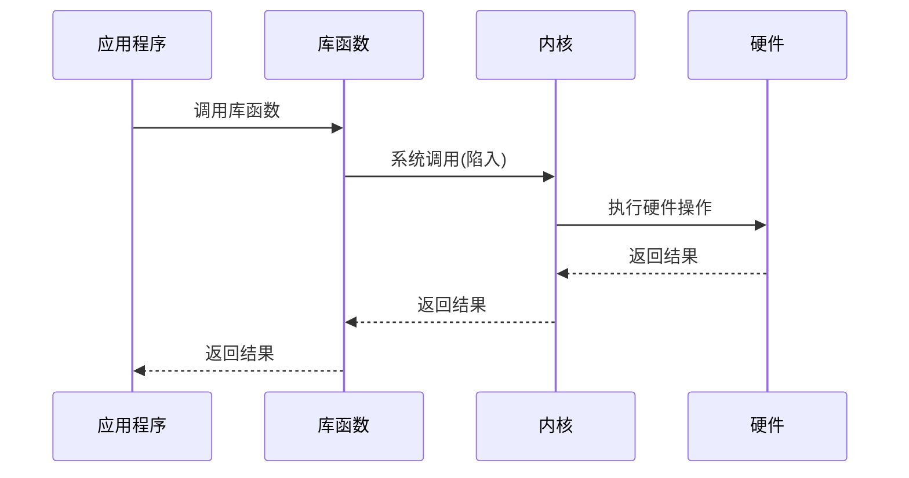

# 层次间的接口

## 概述

计算机系统各层次之间通过接口进行交互。接口定义了层与层之间的通信规则,使得各层可以独立设计和实现。

## 接口的概念

!!! note "接口"
    接口是两个实体之间进行交互的边界,定义了交互的规则和方式。

### 接口的作用

<div style="background-color: #E3F2FD; padding: 15px; margin: 10px 0; border-left: 4px solid #2196F3; border-radius: 5px;">
    <strong>接口的作用</strong>
    <ul style="margin: 5px 0;">
        <li>定义交互规则</li>
        <li>隐藏实现细节</li>
        <li>实现模块化</li>
        <li>支持可替换性</li>
    </ul>
</div>

## 各层间的接口

### 1. 硬件层与微程序层的接口

<div style="background-color: #E8F5E9; padding: 15px; margin: 10px 0; border-left: 4px solid #4CAF50; border-radius: 5px;">
    <strong>硬件层与微程序层接口</strong>
    <p style="margin: 5px 0;">微指令接口</p>
</div>

**接口内容:**

- 微指令格式
- 微操作控制信号
- 时序信号
- 状态信号

**示例:**

```
微指令格式:
| 微操作控制字段 | 下地址字段 |
|---------------|-----------|
|  ALU操作      |  下条地址  |
|  寄存器操作   |           |
|  存储器操作   |           |
```

### 2. 微程序层与机器语言层的接口

<div style="background-color: #FFF3E0; padding: 15px; margin: 10px 0; border-left: 4px solid #FF9800; border-radius: 5px;">
    <strong>微程序层与机器语言层接口</strong>
    <p style="margin: 5px 0;">机器指令接口</p>
</div>

**接口内容:**

- 指令格式
- 操作码定义
- 寻址方式
- 寄存器定义

**示例(x86指令):**

```
指令格式:
| 操作码 | ModR/M | SIB | 位移量 | 立即数 |
|--------|--------|-----|--------|--------|
| 1-3字节| 0-1字节|0-1字节|0-4字节|0-4字节|
```

### 3. 机器语言层与操作系统层的接口

<div style="background-color: #F3E5F5; padding: 15px; margin: 10px 0; border-left: 4px solid #9C27B0; border-radius: 5px;">
    <strong>机器语言层与操作系统层接口</strong>
    <p style="margin: 5px 0;">系统调用接口</p>
</div>

**接口内容:**

- 系统调用号
- 参数传递方式
- 返回值传递方式
- 错误码定义

**示例(Linux系统调用):**

```c
// 系统调用接口
ssize_t read(int fd, void *buf, size_t count);
ssize_t write(int fd, const void *buf, size_t count);
int open(const char *pathname, int flags, mode_t mode);
int close(int fd);
```

**系统调用过程:**



### 4. 操作系统层与汇编语言层的接口

<div style="background-color: #FCE4EC; padding: 15px; margin: 10px 0; border-left: 4px solid #E91E63; border-radius: 5px;">
    <strong>操作系统层与汇编语言层接口</strong>
    <p style="margin: 5px 0;">汇编语言编程接口</p>
</div>

**接口内容:**

- 系统调用指令(INT指令)
- 寄存器使用约定
- 栈帧结构
- 调用约定

**示例(x86汇编系统调用):**

```assembly
; Linux系统调用示例
mov eax, 4      ; 系统调用号: write
mov ebx, 1      ; 文件描述符: stdout
mov ecx, msg    ; 缓冲区地址
mov edx, len    ; 长度
int 0x80        ; 系统调用
```

### 5. 汇编语言层与高级语言层的接口

<div style="background-color: #E0F2F1; padding: 15px; margin: 10px 0; border-left: 4px solid #00BCD4; border-radius: 5px;">
    <strong>汇编语言层与高级语言层接口</strong>
    <p style="margin: 5px 0;">编译器接口</p>
</div>

**接口内容:**

- 源语言语法
- 目标代码格式
- 调用约定
- 数据表示

**调用约定示例:**

<div style="overflow-x: auto;">
    <table style="width: 100%; border-collapse: collapse; margin: 10px 0;">
        <tr style="background-color: #4CAF50; color: white;">
            <th style="padding: 10px; border: 1px solid #ddd;">调用约定</th>
            <th style="padding: 10px; border: 1px solid #ddd;">参数传递</th>
            <th style="padding: 10px; border: 1px solid #ddd;">返回值</th>
            <th style="padding: 10px; border: 1px solid #ddd;">栈清理</th>
        </tr>
        <tr>
            <td style="padding: 10px; border: 1px solid #ddd;">cdecl</td>
            <td style="padding: 10px; border: 1px solid #ddd;">栈</td>
            <td style="padding: 10px; border: 1px solid #ddd;">EAX</td>
            <td style="padding: 10px; border: 1px solid #ddd;">调用者</td>
        </tr>
        <tr style="background-color: #f9f9f9;">
            <td style="padding: 10px; border: 1px solid #ddd;">stdcall</td>
            <td style="padding: 10px; border: 1px solid #ddd;">栈</td>
            <td style="padding: 10px; border: 1px solid #ddd;">EAX</td>
            <td style="padding: 10px; border: 1px solid #ddd;">被调用者</td>
        </tr>
        <tr>
            <td style="padding: 10px; border: 1px solid #ddd;">fastcall</td>
            <td style="padding: 10px; border: 1px solid #ddd;">寄存器+栈</td>
            <td style="padding: 10px; border: 1px solid #ddd;">EAX</td>
            <td style="padding: 10px; border: 1px solid #ddd;">被调用者</td>
        </tr>
    </table>
</div>

### 6. 高级语言层与应用层的接口

<div style="background-color: #FFF9C4; padding: 15px; margin: 10px 0; border-left: 4px solid #FFC107; border-radius: 5px;">
    <strong>高级语言层与应用层接口</strong>
    <p style="margin: 5px 0;">应用程序编程接口(API)</p>
</div>

**接口内容:**

- 标准库函数
- 框架API
- 组件接口
- 服务接口

**示例(Java API):**

```java
// Java标准库API
import java.util.List;
import java.util.ArrayList;

public class Example {
    public static void main(String[] args) {
        List<String> list = new ArrayList<>();
        list.add("Hello");
        list.add("World");
        System.out.println(list);
    }
}
```

## 接口的设计原则

!!! tip "接口设计原则"
    良好的接口设计应遵循以下原则:

### 1. 单一职责原则

<div style="border: 2px solid #4CAF50; padding: 10px; margin: 10px 0; border-radius: 5px;">
    <strong>单一职责原则(SRP)</strong>
    <p style="margin: 5px 0;">一个接口只负责一项功能。</p>
</div>

### 2. 接口隔离原则

<div style="border: 2px solid #2196F3; padding: 10px; margin: 10px 0; border-radius: 5px;">
    <strong>接口隔离原则(ISP)</strong>
    <p style="margin: 5px 0;">不应强迫客户依赖它不使用的方法。</p>
</div>

### 3. 依赖倒置原则

<div style="border: 2px solid #FF9800; padding: 10px; margin: 10px 0; border-radius: 5px;">
    <strong>依赖倒置原则(DIP)</strong>
    <p style="margin: 5px 0;">高层模块不应依赖低层模块,两者都应依赖抽象。</p>
</div>

### 4. 开闭原则

<div style="border: 2px solid #9C27B0; padding: 10px; margin: 10px 0; border-radius: 5px;">
    <strong>开闭原则(OCP)</strong>
    <p style="margin: 5px 0;">接口应对扩展开放,对修改关闭。</p>
</div>

## 接口的实现方式

### 1. 函数调用

!!! info "函数调用"
    最基本的接口实现方式。

**示例:**

```c
// 接口定义
int add(int a, int b);

// 接口实现
int add(int a, int b) {
    return a + b;
}

// 接口使用
int result = add(3, 5);
```

### 2. 消息传递

!!! info "消息传递"
    通过消息进行通信的接口方式。

**示例:**

```python
# 消息队列接口
from queue import Queue

# 创建消息队列
msg_queue = Queue()

# 发送消息
msg_queue.put({"type": "data", "value": 42})

# 接收消息
msg = msg_queue.get()
```

### 3. 远程调用

!!! info "远程调用"
    跨进程或跨网络的接口调用。

**示例(RPC):**

```python
# RPC客户端
import xmlrpc.client

proxy = xmlrpc.client.ServerProxy("http://localhost:8000/")
result = proxy.add(3, 5)
```

## 参考资料

- [接口 百度百科](https://baike.baidu.com/item/接口)
