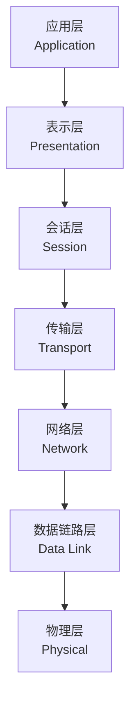
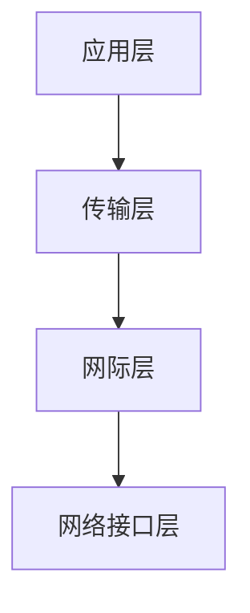
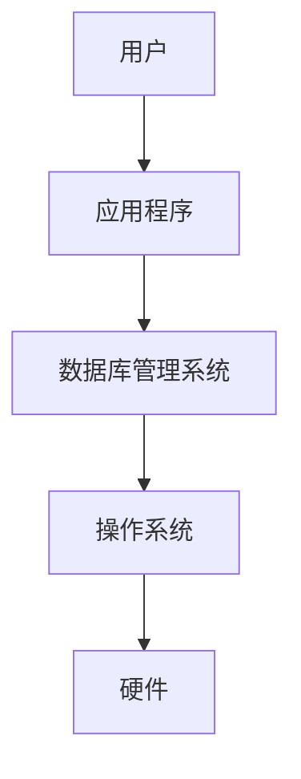
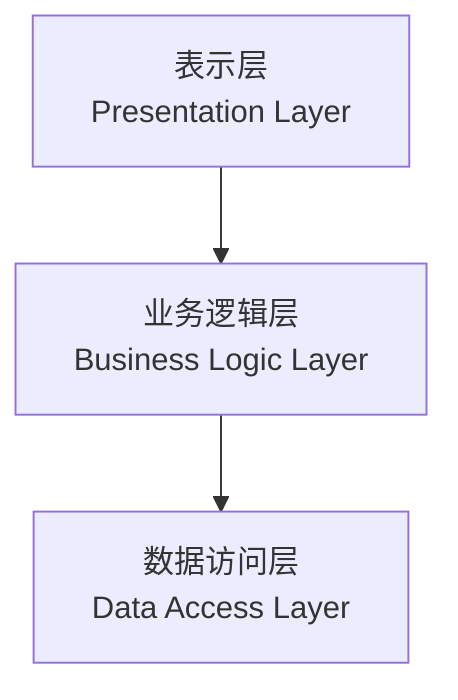
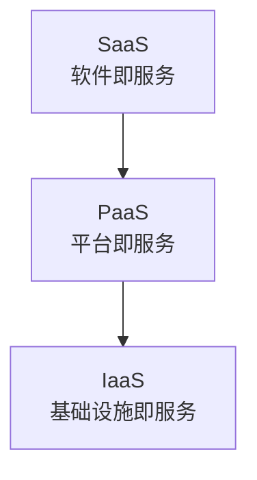
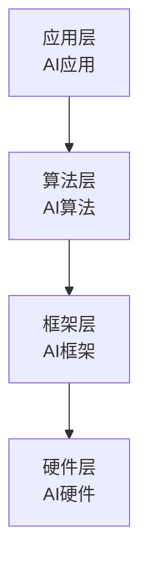

# 层次结构的优势与应用

## 概述

计算机系统的层次结构设计带来了诸多优势,使得计算机系统具有良好的可维护性、可扩展性和可移植性。这种设计思想也被广泛应用于其他领域。

## 层次结构的优势

### 1. 简化设计

!!! note "简化设计"
    层次结构将复杂系统分解为多个简单的层次。

<div style="background-color: #E3F2FD; padding: 15px; margin: 10px 0; border-left: 4px solid #2196F3; border-radius: 5px;">
    <strong>简化设计的体现</strong>
    <ul style="margin: 5px 0;">
        <li>每层专注于特定功能</li>
        <li>降低设计复杂度</li>
        <li>便于分工协作</li>
        <li>提高设计效率</li>
    </ul>
</div>

**示例:**

- 操作系统开发者不需要了解硬件细节
- 应用程序开发者不需要了解操作系统实现
- 每层开发者只需关注本层功能

### 2. 易于维护

!!! tip "易于维护"
    层次结构使得系统维护更加容易。

<div style="background-color: #E8F5E9; padding: 15px; margin: 10px 0; border-left: 4px solid #4CAF50; border-radius: 5px;">
    <strong>易于维护的体现</strong>
    <ul style="margin: 5px 0;">
        <li>修改一层不影响其他层</li>
        <li>问题定位容易</li>
        <li>局部修改风险小</li>
        <li>维护成本低</li>
    </ul>
</div>

**示例:**

- 更换硬盘不影响操作系统
- 升级操作系统不影响应用程序
- 修改应用程序不影响底层

### 3. 可移植性

!!! success "可移植性"
    层次结构提高了系统的可移植性。

<div style="background-color: #FFF3E0; padding: 15px; margin: 10px 0; border-left: 4px solid #FF9800; border-radius: 5px;">
    <strong>可移植性的体现</strong>
    <ul style="margin: 5px 0;">
        <li>上层可以移植到不同平台</li>
        <li>只需修改底层接口</li>
        <li>减少移植工作量</li>
        <li>提高代码复用</li>
    </ul>
</div>

**示例:**

- Java程序可以在不同操作系统上运行
- Python程序可以跨平台使用
- Web应用可以在不同浏览器中运行

### 4. 可扩展性

!!! info "可扩展性"
    层次结构便于系统扩展。

<div style="background-color: #F3E5F5; padding: 15px; margin: 10px 0; border-left: 4px solid #9C27B0; border-radius: 5px;">
    <strong>可扩展性的体现</strong>
    <ul style="margin: 5px 0;">
        <li>易于添加新功能</li>
        <li>易于添加新层次</li>
        <li>支持功能扩展</li>
        <li>支持性能扩展</li>
    </ul>
</div>

**示例:**

- 添加新的设备驱动程序
- 添加新的文件系统
- 添加新的应用程序

### 5. 透明性

!!! warning "透明性"
    上层不需要了解下层的实现细节。

<div style="background-color: #FCE4EC; padding: 15px; margin: 10px 0; border-left: 4px solid #E91E63; border-radius: 5px;">
    <strong>透明性的体现</strong>
    <ul style="margin: 5px 0;">
        <li>隐藏实现细节</li>
        <li>简化使用</li>
        <li>降低学习成本</li>
        <li>提高开发效率</li>
    </ul>
</div>

**示例:**

- 程序员不需要了解CPU如何执行指令
- 用户不需要了解文件如何存储
- 应用程序不需要了解网络协议细节

## 层次结构的应用

### 1. 网络协议栈

!!! note "网络协议栈"
    OSI七层模型和TCP/IP四层模型是层次结构的典型应用。

**OSI七层模型:**



**TCP/IP四层模型:**



### 2. 数据库系统

!!! tip "数据库系统层次结构"
    数据库系统也采用层次结构。



**各层功能:**

<div style="overflow-x: auto;">
    <table style="width: 100%; border-collapse: collapse; margin: 10px 0;">
        <tr style="background-color: #4CAF50; color: white;">
            <th style="padding: 10px; border: 1px solid #ddd;">层次</th>
            <th style="padding: 10px; border: 1px solid #ddd;">功能</th>
        </tr>
        <tr>
            <td style="padding: 10px; border: 1px solid #ddd;">用户</td>
            <td style="padding: 10px; border: 1px solid #ddd;">使用数据库</td>
        </tr>
        <tr style="background-color: #f9f9f9;">
            <td style="padding: 10px; border: 1px solid #ddd;">应用程序</td>
            <td style="padding: 10px; border: 1px solid #ddd;">业务逻辑</td>
        </tr>
        <tr>
            <td style="padding: 10px; border: 1px solid #ddd;">DBMS</td>
            <td style="padding: 10px; border: 1px solid #ddd;">数据管理</td>
        </tr>
        <tr style="background-color: #f9f9f9;">
            <td style="padding: 10px; border: 1px solid #ddd;">操作系统</td>
            <td style="padding: 10px; border: 1px solid #ddd;">文件管理</td>
        </tr>
        <tr>
            <td style="padding: 10px; border: 1px solid #ddd;">硬件</td>
            <td style="padding: 10px; border: 1px solid #ddd;">物理存储</td>
        </tr>
    </table>
</div>

### 3. 软件架构

!!! success "软件架构层次结构"
    现代软件架构广泛采用层次结构。

**三层架构:**



**优点:**

- 分离关注点
- 易于测试
- 易于维护
- 易于扩展

**示例(Java Web应用):**

```java
// 表示层(Controller)
@Controller
public class UserController {
    @Autowired
    private UserService userService;
    
    @GetMapping("/users/{id}")
    public User getUser(@PathVariable Long id) {
        return userService.getUser(id);
    }
}

// 业务逻辑层(Service)
@Service
public class UserService {
    @Autowired
    private UserRepository userRepository;
    
    public User getUser(Long id) {
        return userRepository.findById(id);
    }
}

// 数据访问层(Repository)
@Repository
public interface UserRepository {
    User findById(Long id);
}
```

### 4. 云计算架构

!!! info "云计算层次结构"
    云计算服务模型也是层次结构。



**各层说明:**

- **SaaS**: 提供完整的应用程序
- **PaaS**: 提供开发平台
- **IaaS**: 提供基础设施

### 5. 人工智能系统

!!! warning "AI系统层次结构"
    人工智能系统也采用层次结构。



**示例:**

- 应用层: 图像识别、语音识别、自然语言处理
- 算法层: 深度学习、机器学习算法
- 框架层: TensorFlow、PyTorch
- 硬件层: GPU、TPU、NPU

## 层次结构的设计原则

### 1. 单向依赖原则

<div style="border: 2px solid #4CAF50; padding: 10px; margin: 10px 0; border-radius: 5px;">
    <strong>单向依赖原则</strong>
    <p style="margin: 5px 0;">上层可以依赖下层,下层不能依赖上层。</p>
</div>

### 2. 接口稳定原则

<div style="border: 2px solid #2196F3; padding: 10px; margin: 10px 0; border-radius: 5px;">
    <strong>接口稳定原则</strong>
    <p style="margin: 5px 0;">层间接口应保持稳定,避免频繁修改。</p>
</div>

### 3. 功能内聚原则

<div style="border: 2px solid #FF9800; padding: 10px; margin: 10px 0; border-radius: 5px;">
    <strong>功能内聚原则</strong>
    <p style="margin: 5px 0;">每层应具有明确的功能,功能高度相关。</p>
</div>

### 4. 层次适中原则

<div style="border: 2px solid #9C27B0; padding: 10px; margin: 10px 0; border-radius: 5px;">
    <strong>层次适中原则</strong>
    <p style="margin: 5px 0;">层次不宜过多也不宜过少,应适中。</p>
</div>

## 参考资料

- [计算机系统层次结构 百度百科](https://baike.baidu.com/item/计算机系统层次结构)
