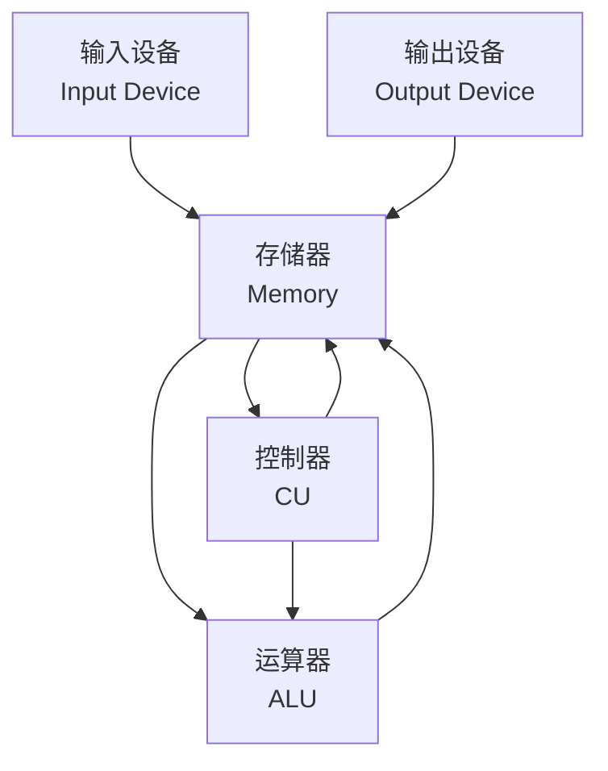

# 冯诺依曼计算机概述

## 概述

冯诺依曼计算机是由数学家约翰·冯·诺依曼(John von Neumann)在1945年提出的计算机体系结构。这一结构奠定了现代计算机的基础,至今仍是主流计算机的体系结构。

## 冯诺依曼体系结构的核心思想

!!! note "存储程序原理"
    冯诺依曼计算机的核心是"存储程序"原理。

    <strong>存储程序原理</strong>
    <ul style="margin: 5px 0;">
        <li>程序和数据以二进制形式统一存储在存储器中</li>
        <li>计算机能自动地逐条取出指令执行</li>
        <li>程序可以像数据一样被处理和修改</li>
    </ul>

## 冯诺依曼计算机的基本组成

### 五大组成部分

#### 1. 运算器

    <strong>运算器(Arithmetic Logic Unit, ALU)</strong>
    
执行算术运算和逻辑运算。

**功能:**

- 算术运算: 加、减、乘、除
- 逻辑运算: 与、或、非、异或
- 移位操作
- 比较操作

#### 2. 控制器

    <strong>控制器(Control Unit, CU)</strong>
    
指挥和协调计算机各部件工作。

**功能:**

- 取指令
- 分析指令
- 执行指令
- 控制数据流向

#### 3. 存储器

    <strong>存储器(Memory)</strong>
    
存储程序和数据。

**特点:**

- 存储程序和数据
- 按地址访问
- 读写操作

#### 4. 输入设备

    <strong>输入设备(Input Device)</strong>
    
将外部信息输入到计算机。

**常见设备:** 键盘、鼠标、扫描仪等

#### 5. 输出设备

    <strong>输出设备(Output Device)</strong>
    
将计算机处理结果输出到外部。

**常见设备:** 显示器、打印机、音箱等

## 冯诺依曼计算机的特点

!!! tip "冯诺依曼计算机特点"
    冯诺依曼计算机具有以下基本特点:

### 1. 存储程序

    <strong>存储程序</strong>
    
程序和数据存储在同一个存储器中。

### 2. 二进制表示

    <strong>二进制表示</strong>
    
指令和数据均以二进制形式表示。

### 3. 顺序执行

    <strong>顺序执行</strong>
    
指令按顺序执行,除非遇到转移指令。

### 4. 五大部件

    <strong>五大部件</strong>
    
由运算器、控制器、存储器、输入设备、输出设备组成。

## 冯诺依曼瓶颈

!!! warning "冯诺依曼瓶颈"
    冯诺依曼体系结构存在性能瓶颈。

    <strong>冯诺依曼瓶颈</strong>
    
CPU和存储器之间的数据传输速度限制了系统性能。

**原因:**

- CPU速度远快于存储器
- 数据传输成为瓶颈
- CPU经常等待数据

**解决方案:**

- Cache存储器
- 并行处理
- 流水线技术
- 哈佛结构

## 参考资料

- [冯诺依曼体系结构 百度百科](https://baike.baidu.com/item/冯诺依曼体系结构)
