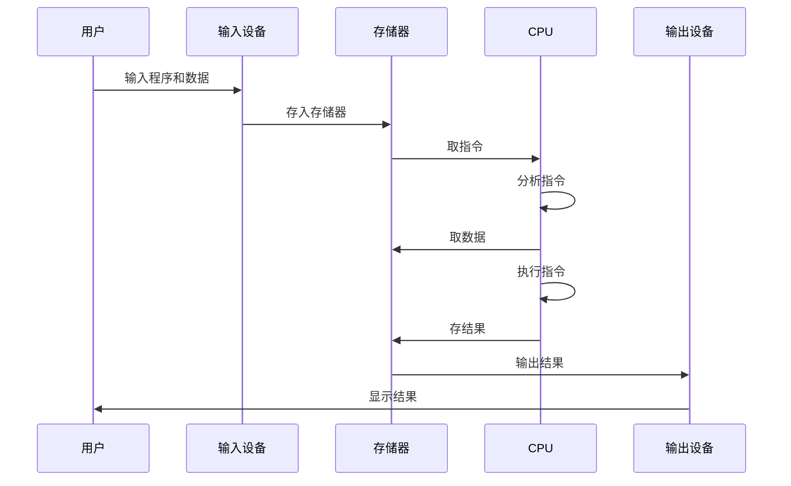

# 存储程序原理

## 概述

存储程序原理是冯诺依曼计算机的核心思想,它将程序和数据以二进制形式统一存储在存储器中,使计算机能够自动执行程序。

## 存储程序原理的内容

!!! note "存储程序原理"
    存储程序原理包含以下要点:

<div style="background-color: #E3F2FD; padding: 15px; margin: 10px 0; border-left: 4px solid #2196F3; border-radius: 5px;">
    <strong>存储程序原理要点</strong>
    <ol style="margin: 5px 0;">
        <li>程序以指令形式存放在存储器中</li>
        <li>数据也存放在存储器中</li>
        <li>程序和数据以二进制形式存储</li>
        <li>计算机能自动逐条取出指令执行</li>
        <li>程序可以像数据一样被处理</li>
    </ol>
</div>

## 存储程序的工作过程



## 存储程序原理的意义

### 1. 实现自动计算

!!! tip "自动计算"
    计算机能够自动执行程序,无需人工干预。

**优势:**

- 提高计算效率
- 减少人工干预
- 实现复杂计算

### 2. 程序可修改

!!! success "程序可修改"
    程序像数据一样可以被修改。

**应用:**

- 动态修改程序
- 自修改程序
- 动态代码生成

### 3. 通用性

!!! info "通用性"
    同一台计算机可以执行不同的程序。

**体现:**

- 一机多用
- 软件可更换
- 功能可扩展

## 存储程序原理的实现

### 指令的存储

<div style="background-color: #E8F5E9; padding: 15px; margin: 10px 0; border-left: 4px solid #4CAF50; border-radius: 5px;">
    <strong>指令存储格式</strong>
</div>

```
存储器地址 | 存储内容(指令)
0x0000    | MOV AX, 10
0x0001    | ADD AX, BX
0x0002    | MOV [SI], AX
0x0003    | JMP 0x0000
```

### 数据的存储

<div style="background-color: #FFF3E0; padding: 15px; margin: 10px 0; border-left: 4px solid #FF9800; border-radius: 5px;">
    <strong>数据存储格式</strong>
</div>

```
存储器地址 | 存储内容(数据)
0x1000    | 10
0x1001    | 20
0x1002    | 30
0x1003    | 40
```

## 参考资料

- [存储程序原理 百度百科](https://baike.baidu.com/item/存储程序原理)
