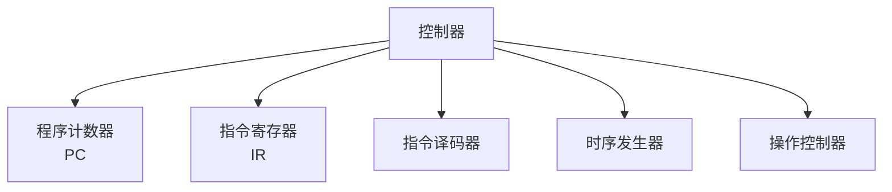
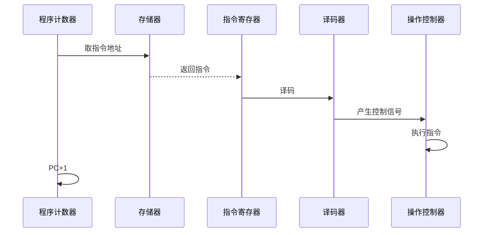

# 冯诺依曼计算机的控制器

## 概述

控制器是冯诺依曼计算机的指挥中心,负责从存储器中取出指令、分析指令、执行指令,并控制计算机各部件协调工作。

## 控制器的功能

!!! note "控制器功能"
    控制器的主要功能包括:

    <strong>控制器功能</strong>
    <ul style="margin: 5px 0;">
        <li>取指令: 从存储器取出指令</li>
        <li>分析指令: 解释指令含义</li>
        <li>执行指令: 产生控制信号</li>
        <li>控制数据流向</li>
        <li>处理异常和中断</li>
    </ul>

## 控制器的组成

### 1. 程序计数器(PC)

    <strong>程序计数器(Program Counter, PC)</strong>
    
存放当前指令的地址,自动加1指向下一指令。

**功能:**

- 存放指令地址
- 自动增量
- 支持跳转指令

### 2. 指令寄存器(IR)

    <strong>指令寄存器(Instruction Register, IR)</strong>
    
存放当前正在执行的指令。

**功能:**

- 存放指令
- 提供给译码器
- 保持指令稳定

### 3. 指令译码器

    <strong>指令译码器</strong>
    
对指令进行译码,识别指令类型。

**功能:**

- 识别操作码
- 确定指令类型
- 产生控制信号

### 4. 时序发生器

    <strong>时序发生器</strong>
    
产生时序控制信号。

**功能:**

- 产生时钟信号
- 产生节拍信号
- 控制时序

### 5. 操作控制器

    <strong>操作控制器</strong>
    
根据指令产生操作控制信号。

**功能:**

- 产生控制信号
- 控制数据通路
- 协调各部件

## 控制器的工作过程

!!! tip "控制器工作过程"
    控制器按以下步骤工作:

### 1. 取指周期

    <strong>取指周期(Fetch Cycle)</strong>
    <ol style="margin: 5px 0;">
        <li>PC → MAR (送指令地址)</li>
        <li>M(MAR) → MDR (读指令)</li>
        <li>MDR → IR (存指令)</li>
        <li>PC + 1 → PC (更新PC)</li>
    </ol>

### 2. 译码周期

    <strong>译码周期(Decode Cycle)</strong>
    
对IR中的指令进行译码,识别指令类型。

### 3. 执行周期

    <strong>执行周期(Execute Cycle)</strong>
    
根据译码结果执行相应操作。

## 控制器的实现方式

### 1. 硬布线控制器

!!! info "硬布线控制器"
    使用组合逻辑电路实现控制。

**特点:**

- 速度快
- 设计复杂
- 不易修改
- 适合RISC

### 2. 微程序控制器

!!! info "微程序控制器"
    使用微程序实现控制。

**特点:**

- 设计灵活
- 易于修改
- 速度较慢
- 适合CISC

## 参考资料

- [控制器 百度百科](https://baike.baidu.com/item/控制器)
