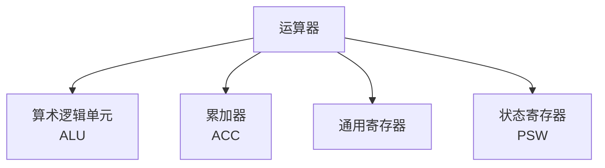

# 冯诺依曼计算机的运算器

## 概述

运算器是冯诺依曼计算机的执行单元,负责执行各种算术运算和逻辑运算。

## 运算器的功能

!!! note "运算器功能"
    运算器的主要功能包括:

    <strong>运算器功能</strong>
    <ul style="margin: 5px 0;">
        <li>算术运算: 加、减、乘、除</li>
        <li>逻辑运算: 与、或、非、异或</li>
        <li>移位操作: 左移、右移</li>
        <li>比较操作: 等于、大于、小于</li>
    </ul>

## 运算器的组成

### 1. 算术逻辑单元(ALU)

    <strong>算术逻辑单元(Arithmetic Logic Unit, ALU)</strong>
    
执行算术和逻辑运算的核心部件。

**功能:**

- 算术运算
- 逻辑运算
- 移位操作
- 比较操作

### 2. 累加器(ACC)

    <strong>累加器(Accumulator, ACC)</strong>
    
存放运算结果和操作数。

**功能:**

- 存放操作数
- 存放运算结果
- 参与运算

### 3. 通用寄存器

    <strong>通用寄存器</strong>
    
存放操作数和中间结果。

**常见寄存器:**

- AX, BX, CX, DX (x86)
- R0, R1, R2, ... (RISC)

### 4. 状态寄存器(PSW)

    <strong>状态寄存器(Program Status Word, PSW)</strong>
    
存放运算结果的状态标志。

**常见标志位:**

- ZF: 零标志
- SF: 符号标志
- CF: 进位标志
- OF: 溢出标志

## 运算器的运算类型

### 1. 算术运算

!!! tip "算术运算"
    执行基本的算术运算。

    <table style="width: 100%; border-collapse: collapse; margin: 10px 0;">
        <tr style="background-color: #4CAF50; color: white;">
            <th style="padding: 10px; border: 1px solid #ddd;">运算</th>
            <th style="padding: 10px; border: 1px solid #ddd;">说明</th>
            <th style="padding: 10px; border: 1px solid #ddd;">示例</th>
        </tr>
        <tr>
            <td style="padding: 10px; border: 1px solid #ddd;">加法</td>
            <td style="padding: 10px; border: 1px solid #ddd;">两数相加</td>
            <td style="padding: 10px; border: 1px solid #ddd;">ADD AX, BX</td>
        </tr>
        <tr style="background-color: #f9f9f9;">
            <td style="padding: 10px; border: 1px solid #ddd;">减法</td>
            <td style="padding: 10px; border: 1px solid #ddd;">两数相减</td>
            <td style="padding: 10px; border: 1px solid #ddd;">SUB AX, BX</td>
        </tr>
        <tr>
            <td style="padding: 10px; border: 1px solid #ddd;">乘法</td>
            <td style="padding: 10px; border: 1px solid #ddd;">两数相乘</td>
            <td style="padding: 10px; border: 1px solid #ddd;">MUL AX, BX</td>
        </tr>
        <tr style="background-color: #f9f9f9;">
            <td style="padding: 10px; border: 1px solid #ddd;">除法</td>
            <td style="padding: 10px; border: 1px solid #ddd;">两数相除</td>
            <td style="padding: 10px; border: 1px solid #ddd;">DIV AX, BX</td>
        </tr>
    </table>

### 2. 逻辑运算

!!! tip "逻辑运算"
    执行逻辑运算。

**运算类型:**

- AND: 逻辑与
- OR: 逻辑或
- NOT: 逻辑非
- XOR: 逻辑异或

### 3. 移位操作

!!! tip "移位操作"
    对数据进行移位操作。

**移位类型:**

- SHL: 左移
- SHR: 逻辑右移
- SAR: 算术右移
- ROL: 循环左移
- ROR: 循环右移

## 参考资料

- [运算器 百度百科](https://baike.baidu.com/item/运算器)
