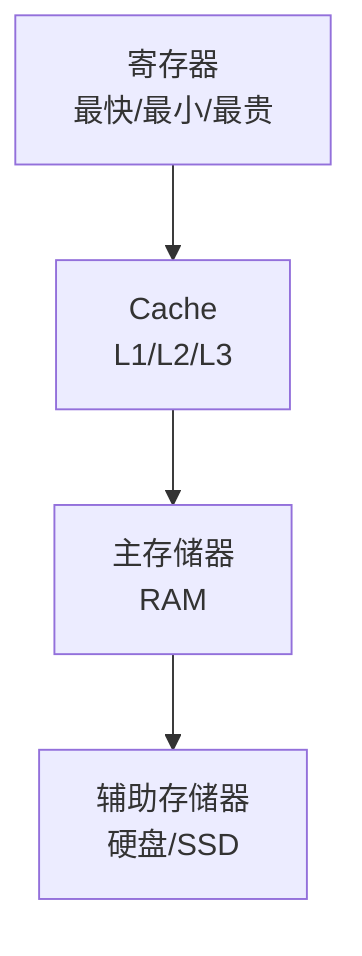

# 冯诺依曼计算机的存储器

## 概述

存储器是冯诺依曼计算机的重要组成部分,用于存储程序和数据。根据冯诺依曼结构,程序和数据统一存储在同一个存储器中。

## 存储器的功能

!!! note "存储器功能"
    存储器的主要功能包括:

<div style="background-color: #E3F2FD; padding: 15px; margin: 10px 0; border-left: 4px solid #2196F3; border-radius: 5px;">
    <strong>存储器功能</strong>
    <ul style="margin: 5px 0;">
        <li>存储程序</li>
        <li>存储数据</li>
        <li>按地址访问</li>
        <li>读写操作</li>
    </ul>
</div>

## 存储器的组成

### 存储单元

<div style="background-color: #E8F5E9; padding: 15px; margin: 10px 0; border-left: 4px solid #4CAF50; border-radius: 5px;">
    <strong>存储单元</strong>
    <p style="margin: 5px 0;">存储器的基本单位,每个存储单元有一个地址。</p>
</div>

**存储单元结构:**

```
地址    | 内容
0x0000 | 10101010
0x0001 | 11001100
0x0002 | 11110000
0x0003 | 00001111
```

### 存储字

<div style="background-color: #FFF3E0; padding: 15px; margin: 10px 0; border-left: 4px solid #FF9800; border-radius: 5px;">
    <strong>存储字</strong>
    <p style="margin: 5px 0;">一个存储单元中存放的二进制信息。</p>
</div>

**存储字长:**

- 8位: 字节
- 16位: 字
- 32位: 双字
- 64位: 四字

## 存储器的性能指标

!!! tip "存储器性能指标"
    存储器的主要性能指标:

<div style="overflow-x: auto;">
    <table style="width: 100%; border-collapse: collapse; margin: 10px 0;">
        <tr style="background-color: #4CAF50; color: white;">
            <th style="padding: 10px; border: 1px solid #ddd;">指标</th>
            <th style="padding: 10px; border: 1px solid #ddd;">说明</th>
            <th style="padding: 10px; border: 1px solid #ddd;">单位</th>
        </tr>
        <tr>
            <td style="padding: 10px; border: 1px solid #ddd;">存储容量</td>
            <td style="padding: 10px; border: 1px solid #ddd;">存储单元总数</td>
            <td style="padding: 10px; border: 1px solid #ddd;">字节(Byte)</td>
        </tr>
        <tr style="background-color: #f9f9f9;">
            <td style="padding: 10px; border: 1px solid #ddd;">存取时间</td>
            <td style="padding: 10px; border: 1px solid #ddd;">从启动到完成的时间</td>
            <td style="padding: 10px; border: 1px solid #ddd;">纳秒(ns)</td>
        </tr>
        <tr>
            <td style="padding: 10px; border: 1px solid #ddd;">存储周期</td>
            <td style="padding: 10px; border: 1px solid #ddd;">连续两次访问的最小间隔</td>
            <td style="padding: 10px; border: 1px solid #ddd;">纳秒(ns)</td>
        </tr>
        <tr style="background-color: #f9f9f9;">
            <td style="padding: 10px; border: 1px solid #ddd;">存储器带宽</td>
            <td style="padding: 10px; border: 1px solid #ddd;">单位时间传输的数据量</td>
            <td style="padding: 10px; border: 1px solid #ddd;">字节/秒</td>
        </tr>
    </table>
</div>

## 存储器的分类

### 按存储介质分类

#### 1. 半导体存储器

<div style="background-color: #F3E5F5; padding: 10px; margin: 10px 0; border-left: 4px solid #9C27B0;">
    <strong>半导体存储器</strong>
    <p style="margin: 5px 0;">使用半导体器件作为存储介质。</p>
</div>

**类型:**

- RAM: 随机存取存储器
- ROM: 只读存储器

#### 2. 磁表面存储器

<div style="background-color: #FCE4EC; padding: 10px; margin: 10px 0; border-left: 4px solid #E91E63;">
    <strong>磁表面存储器</strong>
    <p style="margin: 5px 0;">使用磁性材料作为存储介质。</p>
</div>

**类型:**

- 硬盘
- 磁带

### 按存取方式分类

#### 1. 随机存取存储器(RAM)

!!! info "RAM"
    可以随机读写任意存储单元。

**类型:**

- SRAM: 静态RAM,速度快,用作Cache
- DRAM: 动态RAM,容量大,用作主存

#### 2. 只读存储器(ROM)

!!! info "ROM"
    只能读出不能写入。

**类型:**

- MROM: 掩膜ROM
- PROM: 可编程ROM
- EPROM: 可擦除PROM
- EEPROM: 电可擦除PROM

## 存储器的层次结构

!!! success "存储器层次结构"
    为了解决速度、容量、价格的矛盾,采用层次结构。



**层次结构原理:**

- 速度由快到慢
- 容量由小到大
- 价格由贵到便宜
- CPU访问频率由高到低

## 参考资料

- [存储器 百度百科](https://baike.baidu.com/item/存储器)
