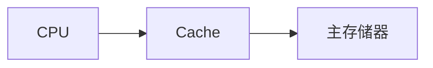
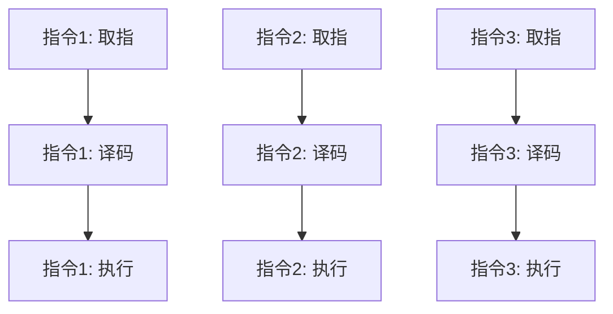
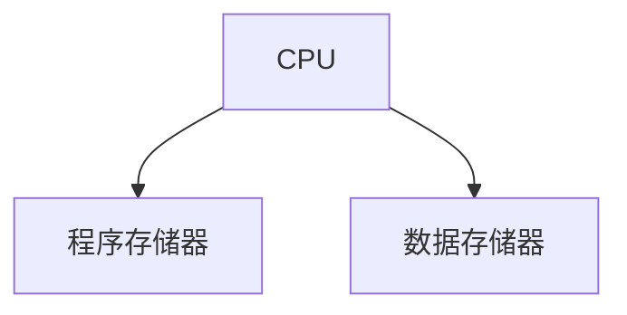

# 冯诺依曼体系结构的发展

## 概述

冯诺依曼体系结构自1945年提出以来,一直是主流计算机的体系结构。但随着技术的发展,也出现了一些改进和变体。

## 冯诺依曼体系结构的局限

!!! warning "冯诺依曼瓶颈"
    冯诺依曼体系结构存在性能瓶颈。

    <strong>冯诺依曼瓶颈</strong>
    <ul style="margin: 5px 0;">
        <li>CPU和存储器速度不匹配</li>
        <li>数据传输成为瓶颈</li>
        <li>CPU经常等待数据</li>
        <li>限制了系统性能</li>
    </ul>

## 冯诺依曼体系结构的改进

### 1. Cache存储器

!!! tip "Cache存储器"
    在CPU和主存之间增加高速缓存。

**优点:**

- 提高访问速度
- 减少CPU等待
- 提高系统性能

### 2. 虚拟存储器

!!! tip "虚拟存储器"
    扩充逻辑地址空间。

**优点:**

- 扩大地址空间
- 实现内存保护
- 支持多道程序

### 3. 流水线技术

!!! tip "流水线技术"
    多条指令重叠执行。

**优点:**

- 提高指令吞吐率
- 提高CPU利用率
- 提高性能

### 4. 并行处理

!!! success "并行处理"
    多个处理器并行工作。

**类型:**

- SIMD: 单指令多数据
- MIMD: 多指令多数据
- 多核处理器
- 多处理器系统

## 哈佛结构

!!! note "哈佛结构"
    程序和数据分开存储的体系结构。

**特点:**

- 程序和数据分开
- 可以同时访问
- 提高执行效率

**应用:**

- DSP处理器
- 嵌入式系统
- 某些微控制器

## 现代计算机体系结构

### 1. 多核处理器

    <strong>多核处理器</strong>
    
在一个芯片上集成多个处理器核心。

**优点:**

- 提高并行处理能力
- 降低功耗
- 提高性能

### 2. GPU计算

    <strong>GPU计算</strong>
    
使用GPU进行通用计算。

**应用:**

- 深度学习
- 科学计算
- 图像处理

### 3. 量子计算

    <strong>量子计算</strong>
    
基于量子力学原理的计算。

**特点:**

- 量子比特
- 量子叠加
- 量子纠缠

## 冯诺依曼体系结构的未来

!!! info "未来发展趋势"
    冯诺依曼体系结构将继续发展。

**发展方向:**

- 异构计算
- 神经形态计算
- 存内计算
- 量子计算

## 参考资料

- [冯诺依曼体系结构 百度百科](https://baike.baidu.com/item/冯诺依曼体系结构)
