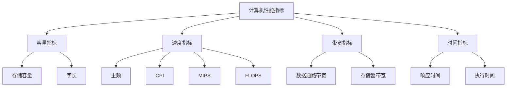

# 计算机性能指标概述

## 概述

计算机性能指标是衡量计算机系统性能的重要参数。通过这些指标,可以定量地评价计算机的处理能力、速度和效率。

## 主要性能指标

!!! note "主要性能指标"
    计算机的主要性能指标包括:

    <strong>主要性能指标</strong>
    <ul style="margin: 5px 0;">
        <li>容量指标: 存储容量</li>
        <li>速度指标: 主频、运算速度</li>
        <li>带宽指标: 数据传输率</li>
        <li>时间指标: 响应时间、执行时间</li>
    </ul>

## 性能指标分类

## 性能指标的关系

!!! tip "性能指标关系"
    各性能指标之间存在一定的关系。

### 基本关系

    <table style="width: 100%; border-collapse: collapse; margin: 10px 0;">
        <tr style="background-color: #4CAF50; color: white;">
            <th style="padding: 10px; border: 1px solid #ddd;">指标</th>
            <th style="padding: 10px; border: 1px solid #ddd;">计算公式</th>
            <th style="padding: 10px; border: 1px solid #ddd;">说明</th>
        </tr>
        <tr>
            <td style="padding: 10px; border: 1px solid #ddd;">总容量</td>
            <td style="padding: 10px; border: 1px solid #ddd;">存储单元数 × 存储字长</td>
            <td style="padding: 10px; border: 1px solid #ddd;">存储器的总容量</td>
        </tr>
        <tr style="background-color: #f9f9f9;">
            <td style="padding: 10px; border: 1px solid #ddd;">主频</td>
            <td style="padding: 10px; border: 1px solid #ddd;">1 / 时钟周期</td>
            <td style="padding: 10px; border: 1px solid #ddd;">CPU的时钟频率</td>
        </tr>
        <tr>
            <td style="padding: 10px; border: 1px solid #ddd;">IPS</td>
            <td style="padding: 10px; border: 1px solid #ddd;">主频 / CPI</td>
            <td style="padding: 10px; border: 1px solid #ddd;">每秒指令数</td>
        </tr>
        <tr style="background-color: #f9f9f9;">
            <td style="padding: 10px; border: 1px solid #ddd;">MIPS</td>
            <td style="padding: 10px; border: 1px solid #ddd;">指令数 / (执行时间 × 10^6)</td>
            <td style="padding: 10px; border: 1px solid #ddd;">每秒百万指令数</td>
        </tr>
    </table>

## 性能评价方法

### 1. 峰值性能

    <strong>峰值性能</strong>
    
理论上的最大性能。

**特点:**

- 理论值
- 理想情况
- 难以达到

### 2. 持续性能

    <strong>持续性能</strong>
    
实际运行时的平均性能。

**特点:**

- 实际值
- 平均性能
- 更有参考价值

### 3. 基准测试

    <strong>基准测试</strong>
    
使用标准程序测试性能。

**常见基准测试:**

- SPEC: 标准性能评价组织
- LINPACK: 线性代数包
- TPC: 事务处理性能委员会

## 参考资料

- [计算机性能指标 百度百科](https://baike.baidu.com/item/计算机性能指标)
