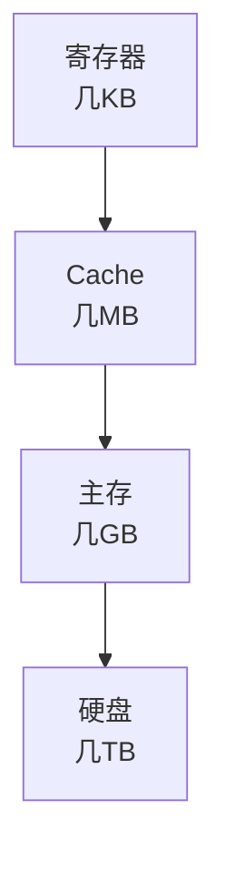

# 容量指标

## 概述

容量指标是衡量计算机存储能力的重要参数,包括存储容量、字长等。

## 存储容量

!!! note "存储容量"
    存储容量是指存储器能够存储的二进制信息总量。

### 计算公式

    <strong>存储容量计算</strong>
    
总容量 = 存储单元个数 × 存储字长

**示例:**

- 存储单元个数: 2^20 = 1M
- 存储字长: 8位
- 总容量: 1M × 8位 = 8Mb = 1MB

### 容量单位

    <table style="width: 100%; border-collapse: collapse; margin: 10px 0;">
        <tr style="background-color: #4CAF50; color: white;">
            <th style="padding: 10px; border: 1px solid #ddd;">单位</th>
            <th style="padding: 10px; border: 1px solid #ddd;">大小</th>
            <th style="padding: 10px; border: 1px solid #ddd;">说明</th>
        </tr>
        <tr>
            <td style="padding: 10px; border: 1px solid #ddd;">Bit</td>
            <td style="padding: 10px; border: 1px solid #ddd;">1位</td>
            <td style="padding: 10px; border: 1px solid #ddd;">最小单位</td>
        </tr>
        <tr style="background-color: #f9f9f9;">
            <td style="padding: 10px; border: 1px solid #ddd;">Byte</td>
            <td style="padding: 10px; border: 1px solid #ddd;">8位</td>
            <td style="padding: 10px; border: 1px solid #ddd;">基本单位</td>
        </tr>
        <tr>
            <td style="padding: 10px; border: 1px solid #ddd;">KB</td>
            <td style="padding: 10px; border: 1px solid #ddd;">1024 Byte</td>
            <td style="padding: 10px; border: 1px solid #ddd;">千字节</td>
        </tr>
        <tr style="background-color: #f9f9f9;">
            <td style="padding: 10px; border: 1px solid #ddd;">MB</td>
            <td style="padding: 10px; border: 1px solid #ddd;">1024 KB</td>
            <td style="padding: 10px; border: 1px solid #ddd;">兆字节</td>
        </tr>
        <tr>
            <td style="padding: 10px; border: 1px solid #ddd;">GB</td>
            <td style="padding: 10px; border: 1px solid #ddd;">1024 MB</td>
            <td style="padding: 10px; border: 1px solid #ddd;">吉字节</td>
        </tr>
        <tr style="background-color: #f9f9f9;">
            <td style="padding: 10px; border: 1px solid #ddd;">TB</td>
            <td style="padding: 10px; border: 1px solid #ddd;">1024 GB</td>
            <td style="padding: 10px; border: 1px solid #ddd;">太字节</td>
        </tr>
    </table>

## 字长

!!! tip "字长"
    字长是计算机一次能处理的二进制数据的位数。

### 字长的意义

    <strong>字长的意义</strong>
    <ul style="margin: 5px 0;">
        <li>决定计算精度</li>
        <li>影响运算速度</li>
        <li>决定内存容量上限</li>
        <li>影响系统性能</li>
    </ul>

### 常见字长

- 8位: 早期微机
- 16位: 8086处理器
- 32位: 80386, Pentium
- 64位: 现代处理器

## 地址线与容量

!!! info "地址线与容量"
    地址线数量决定了可寻址的存储单元数量。

### 关系

    <strong>地址线与容量关系</strong>
    
存储单元数 = 2^地址线数

**示例:**

- 20根地址线: 2^20 = 1M个存储单元
- 32根地址线: 2^32 = 4G个存储单元
- 64根地址线: 2^64 = 16E个存储单元

## 存储器层次结构容量

!!! success "存储器层次结构"
    不同层次的存储器容量不同。

**容量关系:**

- 寄存器 < Cache < 主存 < 硬盘
- 速度: 寄存器 > Cache > 主存 > 硬盘
- 价格: 寄存器 > Cache > 主存 > 硬盘

## 参考资料

- [存储容量 百度百科](https://baike.baidu.com/item/存储容量)
