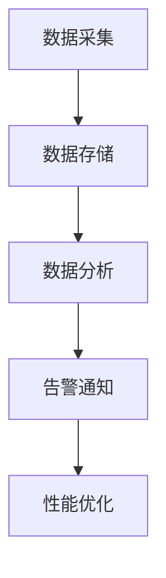

# 性能指标的综合应用

## 概述

在实际应用中,需要综合考虑多个性能指标,全面评价计算机系统的性能。

## 性能指标的综合评价

!!! note "综合评价"
    单一指标无法全面反映系统性能,需要综合考虑。

### 阿姆达尔定律

    <strong>阿姆达尔定律(Amdahl's Law)</strong>
    
系统加速比 = 1 / [(1 - 可改进比例) + 可改进比例/部件加速比]

**意义:**

- 说明性能提升的局限性
- 指导性能优化方向
- 强调瓶颈的重要性

**示例:**

- 可改进比例: 50%
- 部件加速比: 10倍
- 系统加速比: 1 / [(1 - 0.5) + 0.5/10] = 1 / 0.55 ≈ 1.82倍

## 性能指标的权衡

!!! tip "性能权衡"
    不同性能指标之间需要权衡。

### 速度与容量

    <strong>速度与容量的权衡</strong>
    <ul style="margin: 5px 0;">
        <li>Cache: 速度快,容量小</li>
        <li>主存: 速度中,容量中</li>
        <li>硬盘: 速度慢,容量大</li>
    </ul>

### 性能与功耗

    <strong>性能与功耗的权衡</strong>
    <ul style="margin: 5px 0;">
        <li>高性能: 高功耗</li>
        <li>低功耗: 性能受限</li>
        <li>需要平衡</li>
    </ul>

### 性能与成本

    <strong>性能与成本的权衡</strong>
    <ul style="margin: 5px 0;">
        <li>高性能: 高成本</li>
        <li>低成本: 性能受限</li>
        <li>追求性价比</li>
    </ul>

## 性能指标的应用场景

### 1. 桌面系统

!!! info "桌面系统"
    注重响应时间和用户体验。

**关键指标:**

- 响应时间
- 应用启动时间
- 图形性能

### 2. 服务器系统

!!! info "服务器系统"
    注重吞吐率和并发能力。

**关键指标:**

- 吞吐率
- 并发连接数
- 请求处理能力

### 3. 嵌入式系统

!!! info "嵌入式系统"
    注重功耗和实时性。

**关键指标:**

- 功耗
- 实时响应时间
- 资源利用率

### 4. 高性能计算

!!! info "高性能计算"
    注重计算能力和并行性能。

**关键指标:**

- FLOPS
- 并行效率
- 扩展性

## 性能指标的监控

!!! success "性能监控"
    持续监控系统性能指标。

### 监控系统

### 监控指标

    <table style="width: 100%; border-collapse: collapse; margin: 10px 0;">
        <tr style="background-color: #4CAF50; color: white;">
            <th style="padding: 10px; border: 1px solid #ddd;">类别</th>
            <th style="padding: 10px; border: 1px solid #ddd;">指标</th>
            <th style="padding: 10px; border: 1px solid #ddd;">说明</th>
        </tr>
        <tr>
            <td style="padding: 10px; border: 1px solid #ddd;">CPU</td>
            <td style="padding: 10px; border: 1px solid #ddd;">利用率、负载</td>
            <td style="padding: 10px; border: 1px solid #ddd;">CPU使用情况</td>
        </tr>
        <tr style="background-color: #f9f9f9;">
            <td style="padding: 10px; border: 1px solid #ddd;">内存</td>
            <td style="padding: 10px; border: 1px solid #ddd;">使用率、交换</td>
            <td style="padding: 10px; border: 1px solid #ddd;">内存使用情况</td>
        </tr>
        <tr>
            <td style="padding: 10px; border: 1px solid #ddd;">磁盘</td>
            <td style="padding: 10px; border: 1px solid #ddd;">I/O、使用率</td>
            <td style="padding: 10px; border: 1px solid #ddd;">磁盘使用情况</td>
        </tr>
        <tr style="background-color: #f9f9f9;">
            <td style="padding: 10px; border: 1px solid #ddd;">网络</td>
            <td style="padding: 10px; border: 1px solid #ddd;">带宽、延迟</td>
            <td style="padding: 10px; border: 1px solid #ddd;">网络使用情况</td>
        </tr>
    </table>

## 性能指标的优化策略

!!! warning "优化策略"
    根据性能指标制定优化策略。

### 1. 识别瓶颈

    <strong>识别瓶颈</strong>
    
找到限制系统性能的关键因素。

### 2. 优化瓶颈

    <strong>优化瓶颈</strong>
    
集中资源优化关键瓶颈。

### 3. 验证效果

    <strong>验证效果</strong>
    
测量优化后的性能提升。

### 4. 持续优化

    <strong>持续优化</strong>
    
迭代优化,持续改进。

## 参考资料

- [计算机性能评价 百度百科](https://baike.baidu.com/item/计算机性能评价)
