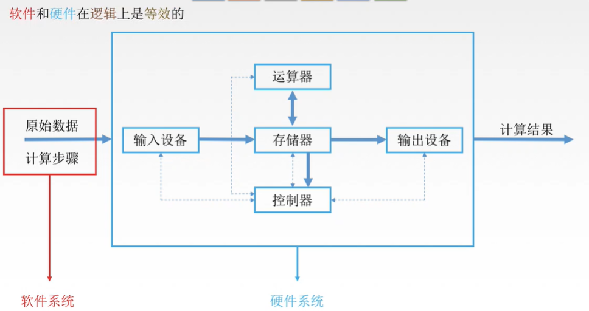
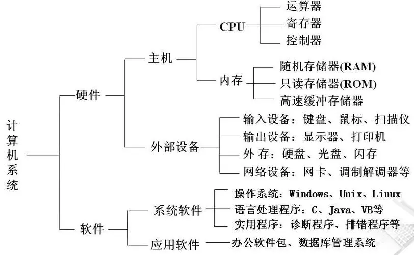

# 000-导读

计算机系统主要由硬件和软件两大部分组成。硬件包括中央处理器（CPU）、内存、输入输出设备等；软件包括操作系统、应用程序等。这些部件相互协作，共同实现计算机的各种功能。

计算机硬件是构成计算机系统各功能部件的集合。是由电子、机械和光电元件组成的各种计算机部件和设备的总称，是计算机完成各项工作的物质基础。计算机硬件是看得见、摸得着的，实实在在存在的物理实体。

计算机软件是指与计算机系统操作有关的各种程序以及任何与之相关的文档和数据的集合。其中程序是用程序设计语言描述的适合计算机执行的语句指令序列。

## 链接

原始数据——输入设备（人与机器沟通的桥梁）——运算器（处理数据）——输出设备——计算结果

计算机硬件由五个基本部分组成：运算器、控制器、存储器、输入设备和输出设备。

- 控制器：协调各个部件相关的问题
- 存储器：存放程序 数据
- CPU=运算器+控制器
    - 运算器
        - MQ
        - ACC
        - 核心ALU（算术逻辑单元）
        - X（其他的）
        - PSW
    - 控制器
        - CU 分析指令 给出控制信号
        - IR
        - PC
- 主机=CPU+主存储器
- I/O设备=输入设备+输出设备
- 外设=辅助存储器+I/O设备

- [计算机系统 百度百科 (baidu.com)](https://baike.baidu.com/item/计算机系统/7210959?fr=ge_ala)