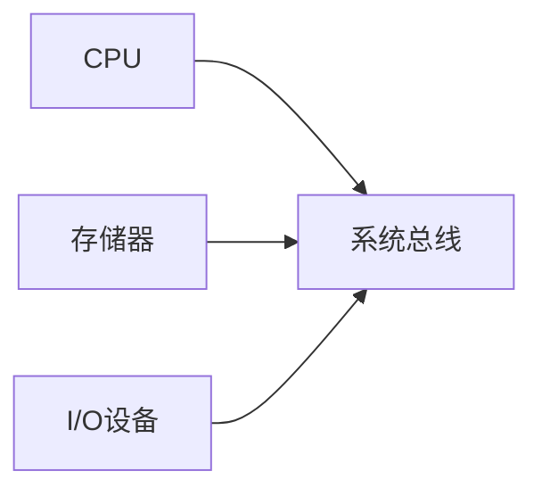
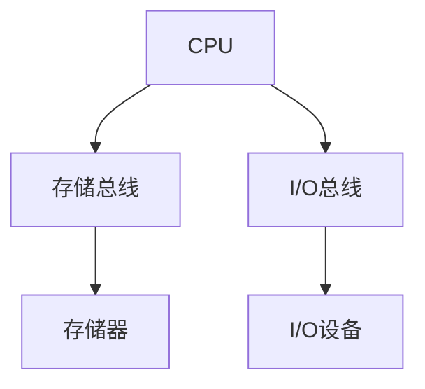
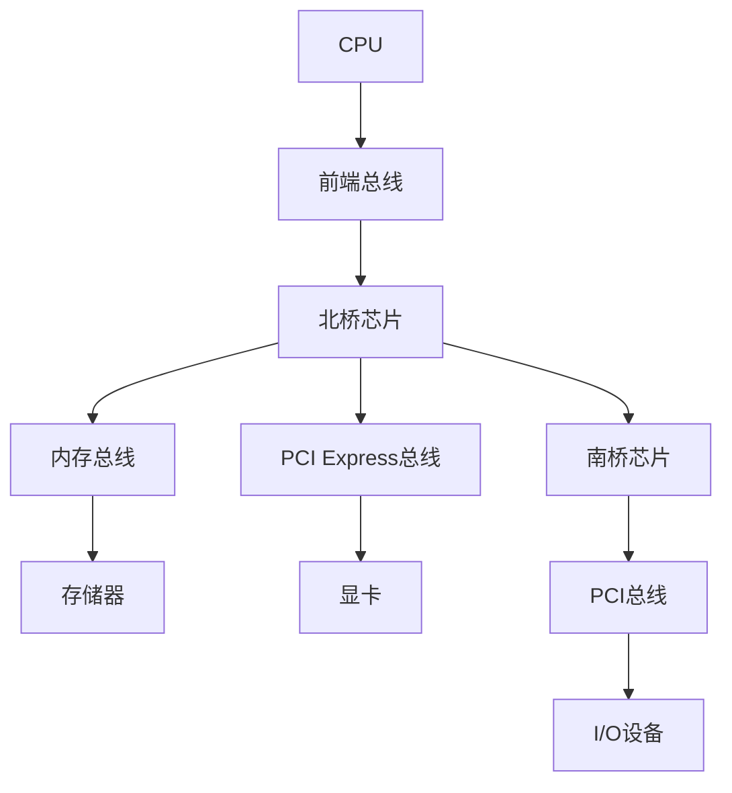

# 总线系统

## 概述

总线(Bus)是连接计算机各部件的公共通信线路,是计算机系统中传输信息的公共通路。

!!! note "总线定义"
    总线是连接计算机各部件的一组公共通信线路,用于在各部件之间传输信息。

## 总线的分类

### 1. 按功能分类

    <strong>数据总线(Data Bus)</strong>
    
用于传输数据信息,双向总线。

**特点:**

- 双向传输
- 宽度决定数据传输能力
- 与字长相关

    <strong>地址总线(Address Bus)</strong>
    
用于传输地址信息,单向总线。

**特点:**

- 单向传输
- 宽度决定寻址能力
- 地址线数 = log₂(存储单元数)

    <strong>控制总线(Control Bus)</strong>
    
用于传输控制信号和状态信号。

**常见控制信号:**

- 读/写信号
- 中断请求
- 总线请求
- 时钟信号

### 2. 按位置分类

!!! tip "按位置分类"
    总线按所在位置可分为:

#### 片内总线

    <strong>片内总线</strong>
    
芯片内部的总线,连接芯片内部各部件。

**示例:**

- CPU内部总线
- 寄存器之间的连接

#### 系统总线

    <strong>系统总线</strong>
    
连接CPU、存储器、I/O接口的总线。

**示例:**

- PCI总线
- PCI Express总线

#### 通信总线

    <strong>通信总线</strong>
    
连接计算机系统之间的总线。

**示例:**

- USB总线
- RS-232总线
- CAN总线

## 总线的性能指标

!!! info "总线性能指标"
    总线的主要性能指标包括:

    <table style="width: 100%; border-collapse: collapse; margin: 10px 0;">
        <tr style="background-color: #4CAF50; color: white;">
            <th style="padding: 10px; border: 1px solid #ddd;">指标</th>
            <th style="padding: 10px; border: 1px solid #ddd;">说明</th>
            <th style="padding: 10px; border: 1px solid #ddd;">单位</th>
        </tr>
        <tr>
            <td style="padding: 10px; border: 1px solid #ddd;">总线宽度</td>
            <td style="padding: 10px; border: 1px solid #ddd;">数据总线的位数</td>
            <td style="padding: 10px; border: 1px solid #ddd;">位(bit)</td>
        </tr>
        <tr style="background-color: #f9f9f9;">
            <td style="padding: 10px; border: 1px solid #ddd;">总线频率</td>
            <td style="padding: 10px; border: 1px solid #ddd;">总线的工作频率</td>
            <td style="padding: 10px; border: 1px solid #ddd;">Hz(MHz, GHz)</td>
        </tr>
        <tr>
            <td style="padding: 10px; border: 1px solid #ddd;">总线带宽</td>
            <td style="padding: 10px; border: 1px solid #ddd;">单位时间传输的数据量</td>
            <td style="padding: 10px; border: 1px solid #ddd;">字节/秒</td>
        </tr>
    </table>

### 总线带宽计算

    <strong>总线带宽计算公式</strong>
    
总线带宽 = 总线宽度 × 总线频率 / 8

**示例:**

- 总线宽度: 64位
- 总线频率: 100MHz
- 总线带宽: 64 × 100MHz / 8 = 800MB/s

## 总线结构

### 1. 单总线结构

!!! note "单总线结构"
    所有部件连接在同一条总线上。

**优点:**

- 结构简单
- 成本低

**缺点:**

- 性能受限
- 总线竞争

### 2. 双总线结构

!!! tip "双总线结构"
    使用两条总线分离存储器和I/O。

**优点:**

- 性能较好
- 减少竞争

**缺点:**

- 结构复杂
- 成本较高

### 3. 多总线结构

!!! success "多总线结构"
    使用多条总线提高性能。

**优点:**

- 性能高
- 扩展性好

**缺点:**

- 结构复杂
- 成本高

## 总线控制

### 1. 总线仲裁

    <strong>总线仲裁</strong>
    
决定哪个设备获得总线控制权。

**仲裁方式:**

- 集中式仲裁: 由总线控制器仲裁
- 分布式仲裁: 各设备自行仲裁

### 2. 总线定时

    <strong>总线定时</strong>
    
控制总线操作的时序。

**定时方式:**

- 同步定时: 使用时钟信号
- 异步定时: 使用握手信号

## 常见总线标准

!!! warning "常见总线标准"
    现代计算机使用的总线标准。

### 1. PCI总线

- 32位/64位
- 33MHz/66MHz
- 带宽: 133MB/s - 533MB/s

### 2. PCI Express总线

- 串行传输
- 多通道(x1, x4, x8, x16)
- 高带宽: 最高32GB/s

### 3. USB总线

- 通用串行总线
- 支持热插拔
- 多种速度: 1.5Mbps - 40Gbps

## 参考资料

- [总线 百度百科](https://baike.baidu.com/item/总线)
