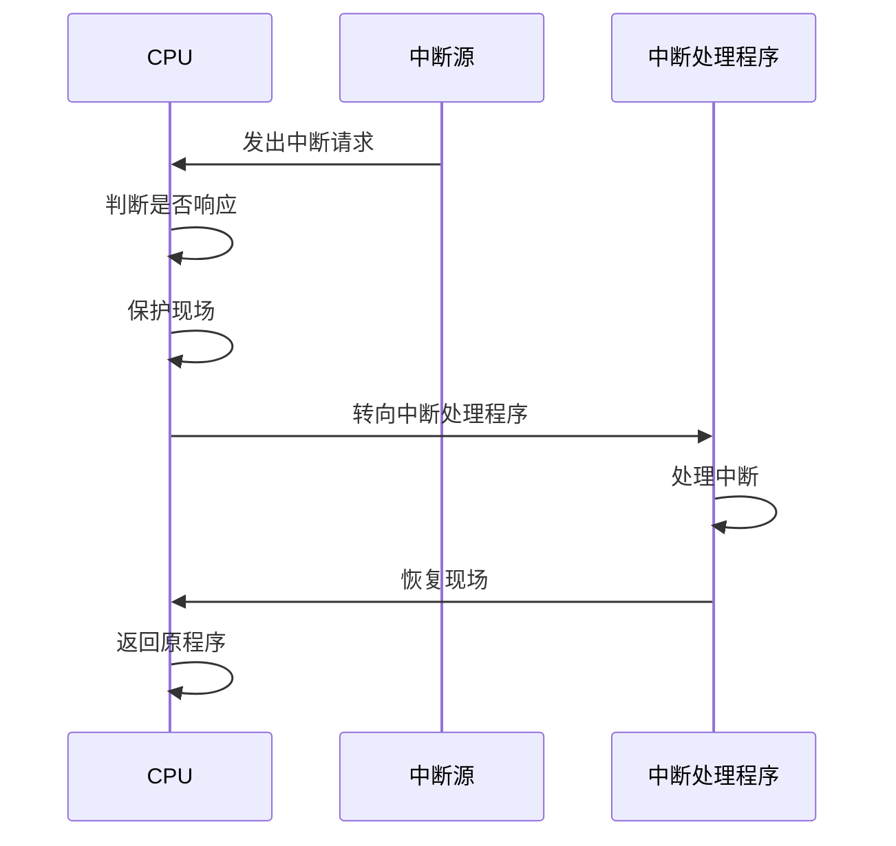
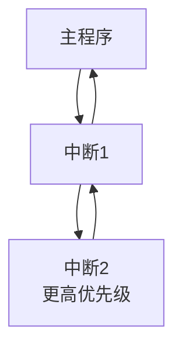

# 中断系统

## 概述

中断是计算机系统中的重要机制,用于处理突发事件和实现I/O操作。

!!! note "中断定义"
    中断是指CPU暂停当前程序的执行,转去处理紧急事件,处理完后再返回原程序继续执行的过程。

## 中断的作用

    <strong>中断的主要作用</strong>
    <ul style="margin: 5px 0;">
        <li>实现CPU与I/O设备并行工作</li>
        <li>处理硬件故障和软件错误</li>
        <li>实现人机交互</li>
        <li>支持多道程序设计</li>
        <li>实现实时处理</li>
    </ul>

## 中断的类型

### 1. 按中断源分类

    <strong>硬中断(外部中断)</strong>
    
由外部设备产生的中断。

**类型:**

- I/O中断: I/O设备完成操作
- 时钟中断: 定时器到期
- 外部信号中断: 外部硬件信号

    <strong>软中断(内部中断)</strong>
    
由程序执行产生的中断。

**类型:**

- 程序中断: 除零、溢出
- 陷阱中断: 系统调用
- 异常中断: 非法指令

### 2. 按可屏蔽性分类

!!! tip "可屏蔽中断"
    可以被CPU禁止的中断。

- 可通过中断屏蔽字控制
- 用于非紧急事件

!!! warning "不可屏蔽中断(NMI)"
    不能被CPU禁止的中断。

- 用于紧急事件
- 如电源故障、内存校验错误

## 中断处理过程

### 1. 中断请求

    <strong>中断请求</strong>
    
中断源向CPU发出中断请求信号。

### 2. 中断判优

    <strong>中断判优</strong>
    
当多个中断同时发生时,选择优先级最高的中断。

**判优方式:**

- 硬件判优: 使用中断控制器
- 软件判优: 软件查询

### 3. 中断响应

    <strong>中断响应</strong>
    
CPU响应中断,进入中断处理。

**响应条件:**

- CPU开中断
- 当前指令执行完
- 无更高优先级中断

### 4. 保护现场

    <strong>保护现场</strong>
    
保存当前程序的执行状态。

**保存内容:**

- 程序计数器(PC)
- 状态寄存器(PSW)
- 通用寄存器

### 5. 中断处理

    <strong>中断处理</strong>
    
执行中断处理程序。

### 6. 恢复现场

    <strong>恢复现场</strong>
    
恢复原程序的执行状态。

## 中断优先级

!!! info "中断优先级"
    不同中断具有不同的优先级。

    <table style="width: 100%; border-collapse: collapse; margin: 10px 0;">
        <tr style="background-color: #4CAF50; color: white;">
            <th style="padding: 10px; border: 1px solid #ddd;">优先级</th>
            <th style="padding: 10px; border: 1px solid #ddd;">中断类型</th>
            <th style="padding: 10px; border: 1px solid #ddd;">说明</th>
        </tr>
        <tr>
            <td style="padding: 10px; border: 1px solid #ddd;">最高</td>
            <td style="padding: 10px; border: 1px solid #ddd;">不可屏蔽中断</td>
            <td style="padding: 10px; border: 1px solid #ddd;">电源故障等</td>
        </tr>
        <tr style="background-color: #f9f9f9;">
            <td style="padding: 10px; border: 1px solid #ddd;">高</td>
            <td style="padding: 10px; border: 1px solid #ddd;">异常中断</td>
            <td style="padding: 10px; border: 1px solid #ddd;">程序错误</td>
        </tr>
        <tr>
            <td style="padding: 10px; border: 1px solid #ddd;">中</td>
            <td style="padding: 10px; border: 1px solid #ddd;">I/O中断</td>
            <td style="padding: 10px; border: 1px solid #ddd;">设备中断</td>
        </tr>
        <tr style="background-color: #f9f9f9;">
            <td style="padding: 10px; border: 1px solid #ddd;">低</td>
            <td style="padding: 10px; border: 1px solid #ddd;">软中断</td>
            <td style="padding: 10px; border: 1px solid #ddd;">系统调用</td>
        </tr>
    </table>

## 中断嵌套

!!! success "中断嵌套"
    在处理中断时,可以响应更高优先级的中断。

**条件:**

- 新中断优先级更高
- 当前中断处理开中断

## 中断向量

    <strong>中断向量</strong>
    
中断处理程序的入口地址。

**中断向量表:**

- 存放所有中断处理程序的入口地址
- 每个中断对应一个向量
- 通过中断号索引

## 参考资料

- [中断 百度百科](https://baike.baidu.com/item/中断)
