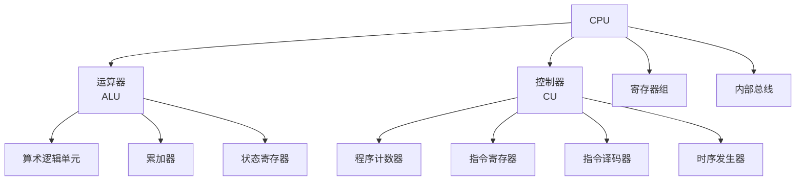

# CPU结构

## 概述

CPU(中央处理器)是计算机的核心部件,负责执行指令和处理数据。

!!! note "CPU定义"
    CPU(Central Processing Unit)是计算机的运算核心和控制核心,负责解释计算机指令和处理计算机软件中的数据。

## CPU的基本组成

## 运算器

### 运算器的组成

    <strong>运算器组成</strong>
    <ul style="margin: 5px 0;">
        <li>算术逻辑单元(ALU): 执行运算</li>
        <li>累加器(ACC): 存放操作数和结果</li>
        <li>通用寄存器: 存放操作数</li>
        <li>状态寄存器(PSW): 存放状态标志</li>
    </ul>

### 运算器的功能

- 算术运算: 加、减、乘、除
- 逻辑运算: 与、或、非、异或
- 移位操作: 左移、右移
- 比较操作: 等于、大于、小于

## 控制器

### 控制器的组成

    <strong>控制器组成</strong>
    <ul style="margin: 5px 0;">
        <li>程序计数器(PC): 存放指令地址</li>
        <li>指令寄存器(IR): 存放当前指令</li>
        <li>指令译码器: 解释指令</li>
        <li>时序发生器: 产生时序信号</li>
        <li>操作控制器: 产生控制信号</li>
    </ul>

### 控制器的功能

- 取指令
- 分析指令
- 执行指令
- 控制数据流向

## 寄存器组

!!! tip "寄存器组"
    CPU内部的快速存储单元。

### 寄存器的分类

    <table style="width: 100%; border-collapse: collapse; margin: 10px 0;">
        <tr style="background-color: #4CAF50; color: white;">
            <th style="padding: 10px; border: 1px solid #ddd;">类型</th>
            <th style="padding: 10px; border: 1px solid #ddd;">说明</th>
            <th style="padding: 10px; border: 1px solid #ddd;">示例</th>
        </tr>
        <tr>
            <td style="padding: 10px; border: 1px solid #ddd;">通用寄存器</td>
            <td style="padding: 10px; border: 1px solid #ddd;">存放数据和地址</td>
            <td style="padding: 10px; border: 1px solid #ddd;">AX, BX, CX, DX</td>
        </tr>
        <tr style="background-color: #f9f9f9;">
            <td style="padding: 10px; border: 1px solid #ddd;">专用寄存器</td>
            <td style="padding: 10px; border: 1px solid #ddd;">特定用途</td>
            <td style="padding: 10px; border: 1px solid #ddd;">PC, IR, SP</td>
        </tr>
        <tr>
            <td style="padding: 10px; border: 1px solid #ddd;">状态寄存器</td>
            <td style="padding: 10px; border: 1px solid #ddd;">存放状态标志</td>
            <td style="padding: 10px; border: 1px solid #ddd;">PSW, FLAGS</td>
        </tr>
    </table>

### 常见寄存器

#### 1. 程序计数器(PC)

    <strong>程序计数器(Program Counter)</strong>
    
存放下一条指令的地址。

#### 2. 指令寄存器(IR)

    <strong>指令寄存器(Instruction Register)</strong>
    
存放当前正在执行的指令。

#### 3. 状态寄存器(PSW)

    <strong>状态寄存器(Program Status Word)</strong>
    
存放运算结果的状态标志。

**常见标志位:**

- ZF: 零标志(结果为零)
- SF: 符号标志(结果为负)
- CF: 进位标志(有进位)
- OF: 溢出标志(有溢出)

## CPU的工作过程

!!! info "CPU工作过程"
    CPU按以下循环工作:

### 1. 取指令

    <strong>取指令(Fetch)</strong>
    <ol style="margin: 5px 0;">
        <li>PC → MAR (送指令地址)</li>
        <li>M(MAR) → MDR (读指令)</li>
        <li>MDR → IR (存指令)</li>
        <li>PC + 1 → PC (更新PC)</li>
    </ol>

### 2. 分析指令

    <strong>分析指令(Decode)</strong>
    
对IR中的指令进行译码,识别指令类型。

### 3. 执行指令

    <strong>执行指令(Execute)</strong>
    
根据译码结果执行相应操作。

## CPU的性能指标

!!! success "CPU性能指标"
    衡量CPU性能的主要指标。

    <table style="width: 100%; border-collapse: collapse; margin: 10px 0;">
        <tr style="background-color: #4CAF50; color: white;">
            <th style="padding: 10px; border: 1px solid #ddd;">指标</th>
            <th style="padding: 10px; border: 1px solid #ddd;">说明</th>
            <th style="padding: 10px; border: 1px solid #ddd;">单位</th>
        </tr>
        <tr>
            <td style="padding: 10px; border: 1px solid #ddd;">主频</td>
            <td style="padding: 10px; border: 1px solid #ddd;">CPU的时钟频率</td>
            <td style="padding: 10px; border: 1px solid #ddd;">Hz(GHz)</td>
        </tr>
        <tr style="background-color: #f9f9f9;">
            <td style="padding: 10px; border: 1px solid #ddd;">字长</td>
            <td style="padding: 10px; border: 1px solid #ddd;">一次处理的二进制位数</td>
            <td style="padding: 10px; border: 1px solid #ddd;">位(bit)</td>
        </tr>
        <tr>
            <td style="padding: 10px; border: 1px solid #ddd;">核心数</td>
            <td style="padding: 10px; border: 1px solid #ddd;">CPU核心的数量</td>
            <td style="padding: 10px; border: 1px solid #ddd;">个</td>
        </tr>
        <tr style="background-color: #f9f9f9;">
            <td style="padding: 10px; border: 1px solid #ddd;">缓存</td>
            <td style="padding: 10px; border: 1px solid #ddd;">CPU内部缓存容量</td>
            <td style="padding: 10px; border: 1px solid #ddd;">字节(Byte)</td>
        </tr>
    </table>

## 多核CPU

!!! warning "多核CPU"
    在一个芯片上集成多个处理器核心。

**优点:**

- 提高并行处理能力
- 降低功耗
- 提高性能

**类型:**

- 同构多核: 所有核心相同
- 异构多核: 核心功能不同(如big.LITTLE)

## 参考资料

- [CPU 百度百科](https://baike.baidu.com/item/CPU)
