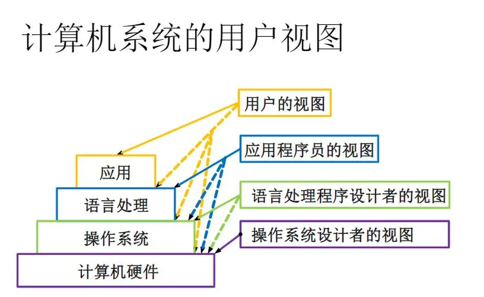

# 计算机系统

[计算机操作系统笔记（一） 南京大学慕课版](https://blog.csdn.net/m0_51787573/article/details/122614586)

电子数字计算机，是一种能够自行按照已设定的程序进行数据处理的电子设备。

电子数字计算机，是软件与硬件想结果、面向系统、侧重应用的自动化求解工具。

计算机系统：包括硬件子系统和软件子系统

硬件：借助点、磁、光、机械等原理构成的各种物理部件的有机组合，是系统工作的实体。CPU、主存储器、I/O控制系统、外围设备

软件：各种程序和文件，用于指挥计算机系统按指定的要求进行协同工作

- 包括系统软件、支撑软件和应用软件
- 关键系统软件是：操作系统与语言处理程序

