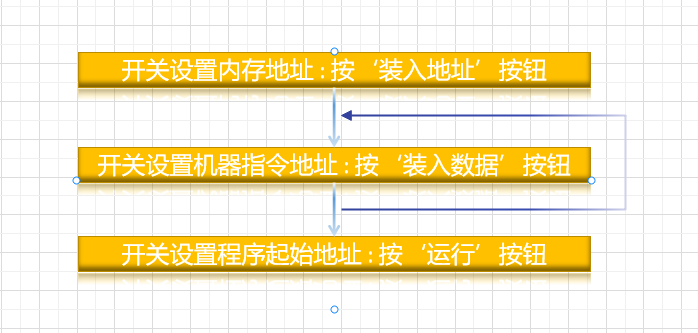
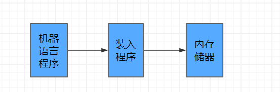
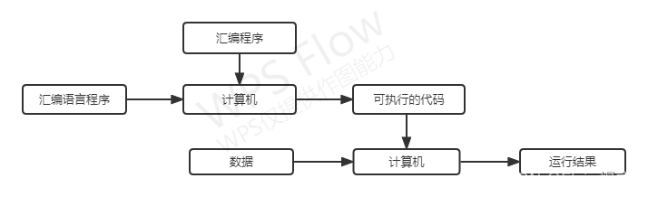
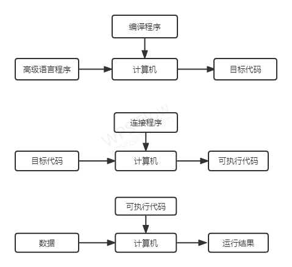

# 计算机操作系统

## 计算机的手工操作

- 开关标识，按钮控制，亮灯显示

- 问题：手工操作速度与电子计算速度不匹配

## 装入程序的引进

- 引入卡片和纸带描述程序指令与数据
- 引入装入程序（Loader）
    - 自动化执行程序装入，必要时进行地址转换
    - 通常存放在ROM中

## 引入汇编语言后的计算机控制

## 引入高级语言后的计算机控制

其中连接程序具有重要价值，如果每个人都需要从起始字符串开始编码效率极其低下，有了连接程序后，通过引进库函数的方式极大地减少工作量，提高工作效率，但此时还存在手工操作效率和计算机运算效率严重不匹配的问题，所以进行改进，引入了简单批处理方式

## 简单批处理系统的操作控制

- 引入作业控制语言，用户编写作业说明书，描述对一次计算机求解（作业）的控制
- 操作员控制计算机成批输入作业，成批执行作业
- 这一方式明显缩短了手工操作的时间，提高了计算机系统利用率
- 这一阶段，磁带的出现，使得卡片和纸带等机械输入方式得以进一步提高

优点：明显减少了手工操作的时间，提高了计算机系统的利用率，同时，磁带的出现替代了卡片和纸带使机械输入方式的效率有了进一步提高

缺点：是半自动化的处理系统，虽然解决了手工操作和计算机的机械操作不匹配的矛盾，但并没有解决与中央处理器，电子速度不匹配的矛盾，要解决这样的矛盾就需要同时输入多个程序，使得电子速度和机械速度的矛盾得到调和，使得机械的外围设备和电子的CPU充分地并行

## 操作系统与自动化操作控制

- 电子计算机速度与机械I/O速度的矛盾
    - 你在输入，我在等
- 在程序执行过程中，能否同事输入作业，重叠时间
    - 需要多道程序同时执行
    - 程序切换需要高速的外存储设备
- 磁盘设备出现
    - 计算机操作系统浓墨登场，实现了计算机系统的自动化控制 