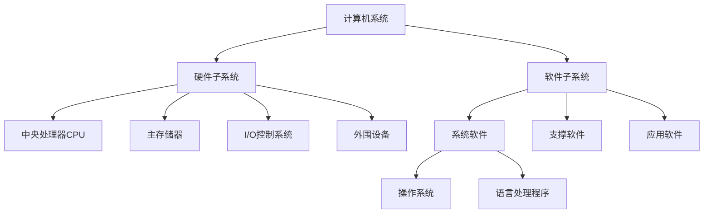
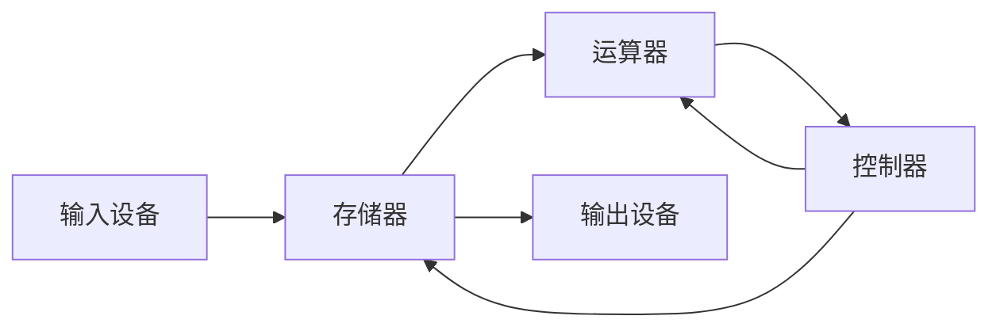
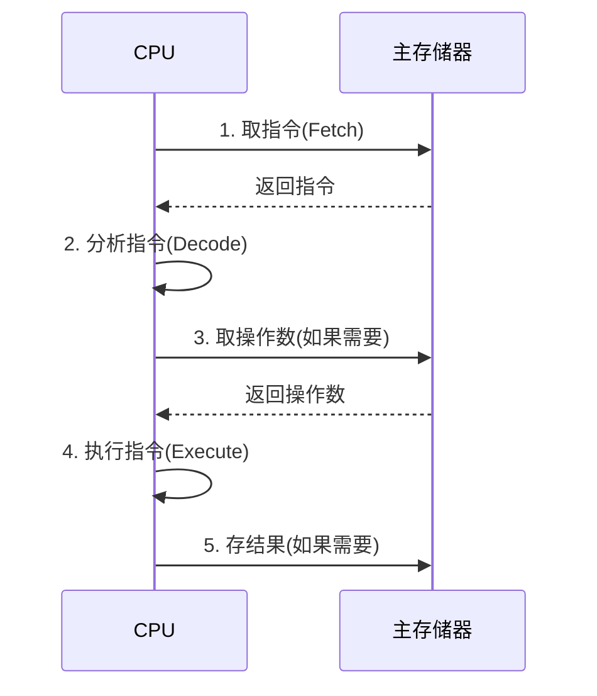
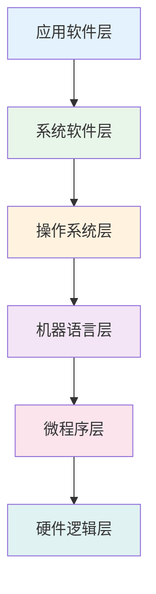
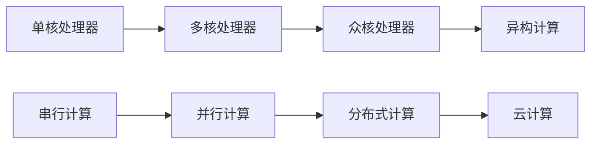

# 计算机系统

## 概述

电子数字计算机是一种能够自行按照已设定的程序进行数据处理的电子设备。

!!! note "计算机系统定义"
    计算机系统是软件与硬件相结合、面向系统、侧重应用的自动化求解工具。包括硬件子系统和软件子系统。

## 计算机系统的组成

### 硬件子系统

    <strong>硬件子系统</strong>
    
借助电、磁、光、机械等原理构成的各种物理部件的有机组合,是系统工作的实体。

**主要组成部分:**

- **中央处理器(CPU)**: 计算机的核心,负责执行指令和处理数据
- **主存储器**: 临时存储数据和指令,供CPU直接访问
- **I/O控制系统**: 管理输入输出设备的数据传输
- **外围设备**: 包括输入设备、输出设备、外存储器等

### 软件子系统

    <strong>软件子系统</strong>
    
各种程序和文件,用于指挥计算机系统按指定的要求进行协同工作。

**软件分类:**

- **系统软件**: 为计算机系统提供基本功能和服务
    - 操作系统: 管理硬件资源,提供用户接口
    - 语言处理程序: 编译器、解释器等
- **支撑软件**: 支持用户使用计算机的环境
    - 接口软件、工具软件、环境数据库
- **应用软件**: 用户按需自行编写的专用程序

## 存储程序原理

!!! tip "冯·诺依曼体系结构"
    存储程序原理是现代计算机的基础,由冯·诺依曼提出。

**核心思想:**

1. **程序和数据存储**: 程序和数据都以二进制形式统一存储在主存储器中
2. **顺序执行**: 计算机自动地从存储器中取出指令并顺序执行
3. **五大部件**: 运算器、控制器、存储器、输入设备、输出设备

## 计算机系统的工作原理

### 指令执行过程

    <strong>指令执行周期</strong>

### 指令周期

!!! info "指令周期"
    CPU取出并执行一条指令所需的全部时间。

**组成:**

- **取指周期**: 从存储器取出指令
- **执行周期**: 执行指令操作
- **间址周期**: 获取操作数有效地址(可选)
- **中断周期**: 处理中断(可选)

## 计算机系统的层次结构

### 各层功能

    <table style="width: 100%; border-collapse: collapse; margin: 10px 0;">
        <tr style="background-color: #4CAF50; color: white;">
            <th style="padding: 10px; border: 1px solid #ddd;">层次</th>
            <th style="padding: 10px; border: 1px solid #ddd;">功能</th>
            <th style="padding: 10px; border: 1px solid #ddd;">特点</th>
        </tr>
        <tr>
            <td style="padding: 10px; border: 1px solid #ddd;">应用软件层</td>
            <td style="padding: 10px; border: 1px solid #ddd;">解决用户特定问题</td>
            <td style="padding: 10px; border: 1px solid #ddd;">面向用户</td>
        </tr>
        <tr style="background-color: #f9f9f9;">
            <td style="padding: 10px; border: 1px solid #ddd;">系统软件层</td>
            <td style="padding: 10px; border: 1px solid #ddd;">提供开发环境</td>
            <td style="padding: 10px; border: 1px solid #ddd;">语言处理程序</td>
        </tr>
        <tr>
            <td style="padding: 10px; border: 1px solid #ddd;">操作系统层</td>
            <td style="padding: 10px; border: 1px solid #ddd;">资源管理和调度</td>
            <td style="padding: 10px; border: 1px solid #ddd;">系统调用接口</td>
        </tr>
        <tr style="background-color: #f9f9f9;">
            <td style="padding: 10px; border: 1px solid #ddd;">机器语言层</td>
            <td style="padding: 10px; border: 1px solid #ddd;">执行机器指令</td>
            <td style="padding: 10px; border: 1px solid #ddd;">二进制代码</td>
        </tr>
        <tr>
            <td style="padding: 10px; border: 1px solid #ddd;">微程序层</td>
            <td style="padding: 10px; border: 1px solid #ddd;">实现机器指令</td>
            <td style="padding: 10px; border: 1px solid #ddd;">微指令序列</td>
        </tr>
        <tr style="background-color: #f9f9f9;">
            <td style="padding: 10px; border: 1px solid #ddd;">硬件逻辑层</td>
            <td style="padding: 10px; border: 1px solid #ddd;">物理电路实现</td>
            <td style="padding: 10px; border: 1px solid #ddd;">门电路、触发器</td>
        </tr>
    </table>

## 计算机系统的性能指标

!!! success "主要性能指标"
    评价计算机系统性能的重要参数。

### 1. 机器字长

    <strong>机器字长</strong>
    
CPU一次整数运算所能处理的二进制数据的位数。

**影响:**

- 决定计算精度
- 影响运算速度
- 决定内存容量上限

### 2. 主频

    <strong>主频</strong>
    
CPU的时钟频率,单位为Hz(赫兹)。

**意义:**

- 主频越高,CPU速度越快
- 但不是唯一决定因素
- 需结合IPC(每周期指令数)综合评价

### 3. 存储容量

    <strong>存储容量</strong>
    
主存储器能存储的信息总量。

**计算:**

- 存储容量 = 存储单元个数 × 存储字长
- 单位: B(字节)、KB、MB、GB、TB

### 4. 运算速度

    <strong>运算速度</strong>
    
单位时间内执行的指令数。

**衡量指标:**

- **MIPS**: 百万条指令每秒
- **FLOPS**: 浮点运算次数每秒
- **CPI**: 执行一条指令所需的时钟周期数

## 计算机系统结构的发展

### 摩尔定律

!!! warning "摩尔定律"
    集成电路上可容纳的晶体管数目约每隔18个月会增长一倍,整体性能也将提升一倍。

**意义:**

- 揭示了信息技术进步的速度
- 指导计算机产业发展
- 预测技术发展趋势

### 发展趋势

## 参考资料

- [计算机操作系统笔记（一） 南京大学慕课版](https://blog.csdn.net/m0_51787573/article/details/122614586)
- [计算机组成原理（详细）CSDN社区](https://blog.csdn.net/weixin_42303403/article/details/129932204)

