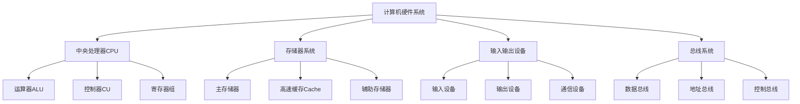
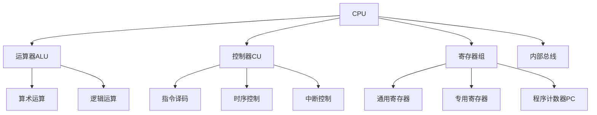
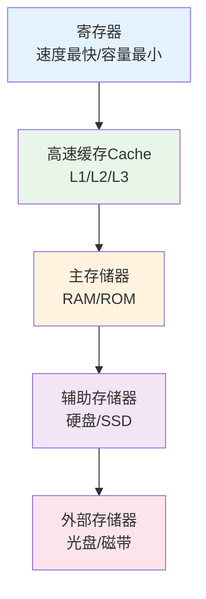
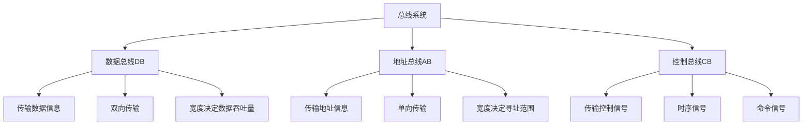
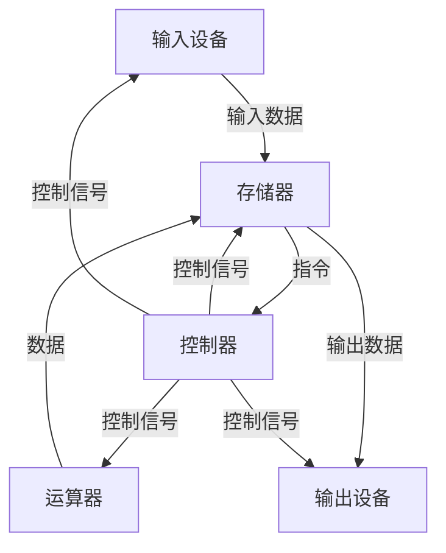

# 计算机硬件系统

## 概述

计算机硬件系统是计算机系统的物理基础,由电子、机械、光电等元件组成的各种物理装置的总称。

!!! note "硬件系统定义"
    硬件系统是计算机系统的物质基础,包括中央处理器、存储器、输入输出设备和总线等。

## 硬件系统的组成



## 中央处理器(CPU)

<div style="background-color: #E3F2FD; padding: 15px; margin: 10px 0; border-left: 4px solid #2196F3; border-radius: 5px;">
    <strong>中央处理器(CPU)</strong>
    <p style="margin: 5px 0;">计算机的核心部件,负责执行指令、处理数据和控制各种硬件设备。</p>
</div>

### CPU的组成



### 1. 运算器(Arithmetic Logic Unit, ALU)

!!! tip "运算器"
    执行各种算术运算和逻辑运算的部件。

**功能:**

- **算术运算**: 加、减、乘、除等
- **逻辑运算**: 与、或、非、异或等
- **移位操作**: 左移、右移、循环移位
- **比较运算**: 等于、大于、小于等

**组成:**

- 算术逻辑单元
- 累加器(ACC)
- 状态寄存器(PSW)

### 2. 控制器(Control Unit, CU)

<div style="background-color: #E8F5E9; padding: 15px; margin: 10px 0; border-left: 4px solid #4CAF50; border-radius: 5px;">
    <strong>控制器</strong>
    <p style="margin: 5px 0;">指挥和协调计算机各部件工作的指挥中心。</p>
</div>

**功能:**

- **指令译码**: 分析指令功能
- **时序控制**: 产生时序信号
- **操作控制**: 产生控制信号
- **中断控制**: 处理中断请求

**组成:**

- 程序计数器(PC)
- 指令寄存器(IR)
- 指令译码器(ID)
- 时序发生器
- 操作控制器

### 3. 寄存器组

!!! info "寄存器"
    CPU内部的高速存储单元,用于暂存数据和地址。

**类型:**

- **通用寄存器**: 存放操作数和运算结果
- **专用寄存器**:
    - 程序计数器(PC): 存放下一条指令地址
    - 指令寄存器(IR): 存放当前指令
    - 存储器地址寄存器(MAR): 存放访问存储器的地址
    - 存储器数据寄存器(MDR): 存放读写存储器的数据
    - 状态寄存器(PSW): 存放状态标志

## 存储器系统

!!! success "存储器系统"
    计算机的存储系统采用层次结构,从高速小容量到低速大容量。

### 存储器层次结构



### 1. 主存储器

<div style="background-color: #FFF3E0; padding: 15px; margin: 10px 0; border-left: 4px solid #FF9800; border-radius: 5px;">
    <strong>主存储器(内存)</strong>
    <p style="margin: 5px 0;">临时存储数据和指令,供CPU直接访问。</p>
</div>

**类型:**

- **RAM(随机存取存储器)**:
    - SRAM(静态RAM): 速度快,用作Cache
    - DRAM(动态RAM): 容量大,用作主存
- **ROM(只读存储器)**:
    - MROM: 掩膜ROM
    - PROM: 可编程ROM
    - EPROM: 可擦除可编程ROM
    - EEPROM: 电可擦除可编程ROM

**性能指标:**

- 存储容量
- 存取时间
- 存储周期
- 带宽

### 2. 高速缓存(Cache)

<div style="background-color: #F3E5F5; padding: 15px; margin: 10px 0; border-left: 4px solid #9C27B0; border-radius: 5px;">
    <strong>高速缓存</strong>
    <p style="margin: 5px 0;">位于CPU和主存之间,用于缓解速度不匹配问题。</p>
</div>

**工作原理:**

- 局部性原理:
    - 时间局部性: 最近访问的数据可能再次访问
    - 空间局部性: 访问数据的邻近数据可能被访问

**映射方式:**

- 直接映射
- 全相联映射
- 组相联映射

### 3. 辅助存储器

!!! warning "辅助存储器"
    用于永久存储大量数据的外部存储器。

**类型:**

- **硬盘(HDD)**: 磁盘存储,容量大,速度慢
- **固态硬盘(SSD)**: 闪存存储,速度快,无机械结构
- **光盘**: CD、DVD、蓝光光盘
- **U盘**: 便携式闪存存储

## 输入输出系统

### 外围设备

<div style="background-color: #FCE4EC; padding: 15px; margin: 10px 0; border-left: 4px solid #E91E63; border-radius: 5px;">
    <strong>外围设备</strong>
    <p style="margin: 5px 0;">计算机系统与外部世界进行信息交换的设备。</p>
</div>

#### 1. 输入设备

**功能:** 将外部数据转换为计算机能够识别的形式并输入到计算机系统。

**常见设备:**

- 键盘: 文本输入
- 鼠标: 指针控制
- 扫描仪: 图像输入
- 麦克风: 音频输入
- 摄像头: 视频输入

#### 2. 输出设备

**功能:** 将计算机处理后的数据以适合人类阅读或其他设备使用的形式输出。

**常见设备:**

- 显示器: 图像显示
- 打印机: 文档打印
- 音响: 音频输出
- 投影仪: 大屏显示

#### 3. 通信设备

**功能:** 负责计算机系统与其他设备或网络之间的数据传输。

**常见设备:**

- 网卡: 网络连接
- 路由器: 网络路由
- 调制解调器: 信号转换

### I/O控制方式


**各种方式比较:**

<div style="overflow-x: auto;">
    <table style="width: 100%; border-collapse: collapse; margin: 10px 0;">
        <tr style="background-color: #4CAF50; color: white;">
            <th style="padding: 10px; border: 1px solid #ddd;">方式</th>
            <th style="padding: 10px; border: 1px solid #ddd;">特点</th>
            <th style="padding: 10px; border: 1px solid #ddd;">适用场景</th>
        </tr>
        <tr>
            <td style="padding: 10px; border: 1px solid #ddd;">程序查询</td>
            <td style="padding: 10px; border: 1px solid #ddd;">CPU不断查询设备状态</td>
            <td style="padding: 10px; border: 1px solid #ddd;">简单低速设备</td>
        </tr>
        <tr style="background-color: #f9f9f9;">
            <td style="padding: 10px; border: 1px solid #ddd;">程序中断</td>
            <td style="padding: 10px; border: 1px solid #ddd;">设备就绪时中断CPU</td>
            <td style="padding: 10px; border: 1px solid #ddd;">中低速设备</td>
        </tr>
        <tr>
            <td style="padding: 10px; border: 1px solid #ddd;">DMA</td>
            <td style="padding: 10px; border: 1px solid #ddd;">直接存储器访问</td>
            <td style="padding: 10px; border: 1px solid #ddd;">高速块传输</td>
        </tr>
        <tr style="background-color: #f9f9f9;">
            <td style="padding: 10px; border: 1px solid #ddd;">通道方式</td>
            <td style="padding: 10px; border: 1px solid #ddd;">专用I/O处理器</td>
            <td style="padding: 10px; border: 1px solid #ddd;">大量I/O操作</td>
        </tr>
    </table>
</div>

## 总线系统

!!! note "总线定义"
    总线是计算机各种功能部件之间传送信息的公共通信干线,是CPU、内存、输入输出设备传递信息的公用通道。

### 总线的组成



### 总线的分类

<div style="background-color: #E3F2FD; padding: 15px; margin: 10px 0; border-left: 4px solid #2196F3; border-radius: 5px;">
    <strong>按层次结构分类</strong>
</div>

#### 1. 内部总线

**功能:** 用于CPU芯片内部连接各元件。

**特点:**

- 速度最快
- 连接ALU、寄存器、控制器等
- 数据带宽高

#### 2. 系统总线

<div style="background-color: #E8F5E9; padding: 15px; margin: 10px 0; border-left: 4px solid #4CAF50; border-radius: 5px;">
    <strong>系统总线</strong>
    <p style="margin: 5px 0;">用于连接CPU、存储器和各种I/O模块等主要部件。</p>
</div>

**常见标准:**

- **ISA总线**: 工业标准结构总线
- **PCI总线**: 外设部件互连标准总线
- **PCI-E总线**: PCI Express,高速串行总线

#### 3. 通信总线

**功能:** 用于计算机系统之间或计算机与外部设备之间的通信。

**常见标准:**

- **USB**: 通用串行总线
- **RS-232**: 串行通信接口
- **IEEE 1394**: 高速串行总线

### 总线性能指标

!!! tip "总线性能指标"
    评价总线性能的重要参数。

**主要指标:**

- **总线宽度**: 数据总线的位数(8位、16位、32位、64位)
- **总线频率**: 总线工作的时钟频率
- **总线带宽**: 单位时间内传输的数据量
    - 总线带宽 = 总线宽度 × 总线频率 / 8

**计算示例:**

```
假设总线宽度为64位,总线频率为100MHz
总线带宽 = 64 × 100 × 10^6 / 8 = 800 MB/s
```

## 存储程序计算机

!!! success "冯·诺依曼结构特点"
    存储程序计算机在体系结构上的主要特点。

**核心特征:**

1. **以运算单元为中心**: 控制流由指令流产生
2. **存储程序原理**: 面向主存组织数据流
3. **线性编址**: 主存是按地址访问、线性编址的空间
4. **指令结构**: 指令由操作码和地址码组成
5. **二进制编码**: 数据以二进制编码



## 现代计算机结构

### 哈佛结构

<div style="background-color: #FFF3E0; padding: 15px; margin: 10px 0; border-left: 4px solid #FF9800; border-radius: 5px;">
    <strong>哈佛结构</strong>
    <p style="margin: 5px 0;">程序存储器和数据存储器独立编址,可同时访问。</p>
</div>

**优点:**

- 指令和数据并行访问
- 执行效率高
- 适合嵌入式系统

### 改进的冯·诺依曼结构

!!! info "现代计算机"
    当今计算机硬件的经典结构和主流组织方式。

**改进措施:**

- **流水线技术**: 指令并行执行
- **多级缓存**: L1、L2、L3 Cache
- **多核技术**: 多个CPU核心
- **虚拟存储**: 扩大地址空间
- **乱序执行**: 提高指令级并行度

## 参考资料

- [计算机组成原理 百度百科](https://baike.baidu.com/item/计算机组成原理)
- [计算机硬件系统 百度百科](https://baike.baidu.com/item/计算机硬件)