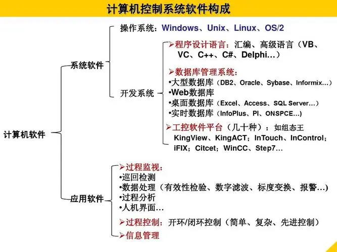
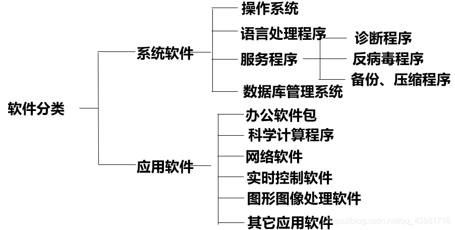
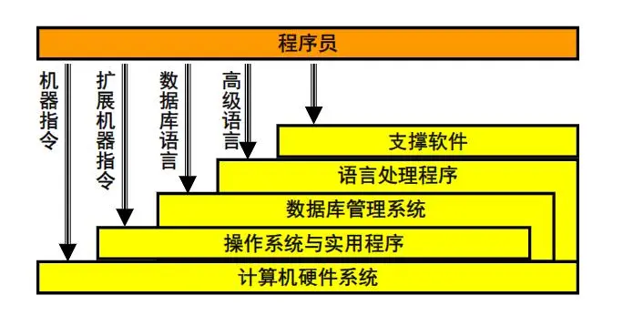
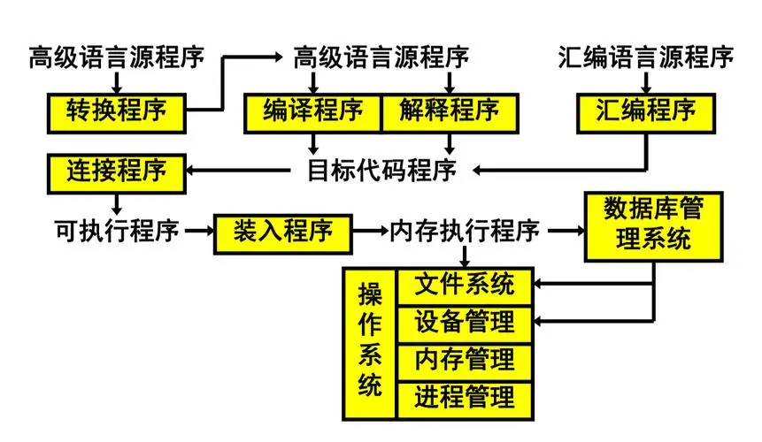

# 计算机软件

## 计算机软件系统组成

- 系统软件：为计算机系统提供基本功能和服务的软件，操作系统、实用程序、语言处理程序、数据库管理系统
    - 操作系统：计算机系统的基础软件，负责管理硬件资源、提供用户接口和运行应用程序等功能。常见的操作系统包括Windows、macOS、Linux等。
    - 实用程序：针对特定任务或需求开发的软件，如文本编辑器、图像处理软件、游戏等。
    - 语言处理程序：把用汇编语言/高级语言变现的程序，翻译成可执行的机器语言程序
- 支撑软件有接口软件、工具软件、环境数据库，支持用户使用计算机的环境，提供开发工具
    - 也可以认为是系统软件的一部分
- 应用软件是用户按其需要自行编写的专用程序。

## 软件开发的不同层次

- 计算机硬件系统：机器语言
- 操作系统之资源管理：机器语言+广义指令（扩充了硬件资源管理）
- 操作系统之文件系统：机器语言+系统调用（扩充了信息资源管理）
- 数据库管理系统：机器语言+数据库语言（扩充了功能更强的信息资源管理）
- 语言处理程序：面向问题的语言

## 计算机程序的执行过程

