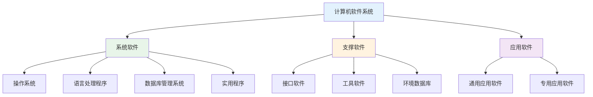
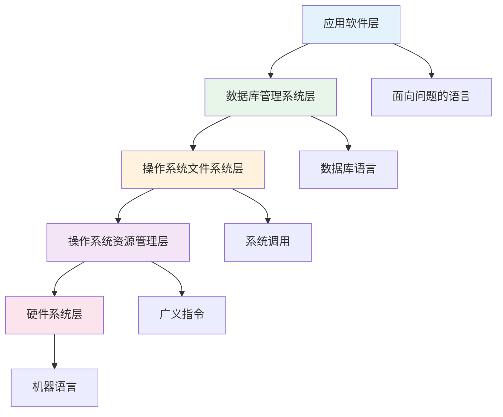
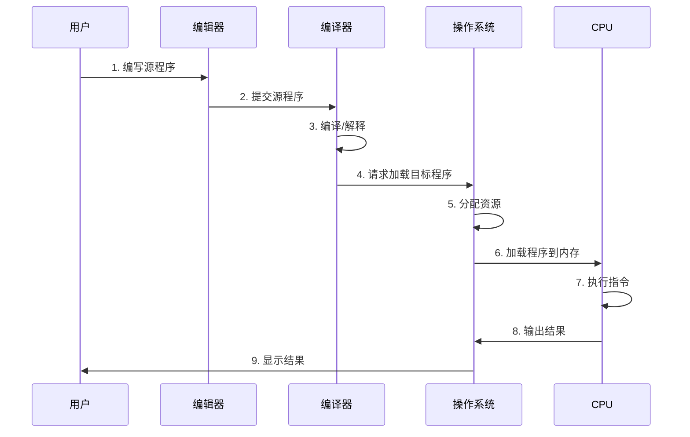

# 计算机软件系统

## 概述

计算机软件系统是指计算机系统中除硬件以外的所有程序和文档的总称。

!!! note "软件系统定义"
    软件系统是用户与硬件之间的接口,指挥硬件完成各种任务。

## 软件系统的组成

```mermaid
graph TB
    A[计算机软件系统] --> B[系统软件]
    A --> C[支撑软件]
    A --> D[应用软件]

    B --> B1[操作系统]
    B --> B2[语言处理程序]
    B --> B3[数据库管理系统]
    B --> B4[实用程序]

    C --> C1[接口软件]
    C --> C2[工具软件]
    C --> C3[环境数据库]

    D --> D1[通用应用软件]
    D --> D2[专用应用软件]

    style A fill:#E3F2FD
    style B fill:#E8F5E9
    style C fill:#FFF3E0
    style D fill:#F3E5F5
```

## 系统软件

    <strong>系统软件</strong>
    
为计算机系统提供基本功能和服务的软件,是计算机系统的基础。

### 1. 操作系统

!!! tip "操作系统"
    计算机系统的基础软件,负责管理硬件资源、提供用户接口和运行应用程序。

**主要功能:**

- **处理器管理**: 进程调度、CPU分配
- **存储器管理**: 内存分配、虚拟存储
- **设备管理**: 设备驱动、I/O控制
- **文件管理**: 文件存储、目录管理
- **用户接口**: 命令行、图形界面

**常见操作系统:**

    <table style="width: 100%; border-collapse: collapse; margin: 10px 0;">
        <tr style="background-color: #4CAF50; color: white;">
            <th style="padding: 10px; border: 1px solid #ddd;">操作系统</th>
            <th style="padding: 10px; border: 1px solid #ddd;">类型</th>
            <th style="padding: 10px; border: 1px solid #ddd;">特点</th>
        </tr>
        <tr>
            <td style="padding: 10px; border: 1px solid #ddd;">Windows</td>
            <td style="padding: 10px; border: 1px solid #ddd;">桌面操作系统</td>
            <td style="padding: 10px; border: 1px solid #ddd;">图形界面友好、应用丰富</td>
        </tr>
        <tr style="background-color: #f9f9f9;">
            <td style="padding: 10px; border: 1px solid #ddd;">macOS</td>
            <td style="padding: 10px; border: 1px solid #ddd;">桌面操作系统</td>
            <td style="padding: 10px; border: 1px solid #ddd;">苹果系统、稳定性好</td>
        </tr>
        <tr>
            <td style="padding: 10px; border: 1px solid #ddd;">Linux</td>
            <td style="padding: 10px; border: 1px solid #ddd;">服务器/桌面</td>
            <td style="padding: 10px; border: 1px solid #ddd;">开源、稳定、安全</td>
        </tr>
        <tr style="background-color: #f9f9f9;">
            <td style="padding: 10px; border: 1px solid #ddd;">Android</td>
            <td style="padding: 10px; border: 1px solid #ddd;">移动操作系统</td>
            <td style="padding: 10px; border: 1px solid #ddd;">开源、应用丰富</td>
        </tr>
        <tr>
            <td style="padding: 10px; border: 1px solid #ddd;">iOS</td>
            <td style="padding: 10px; border: 1px solid #ddd;">移动操作系统</td>
            <td style="padding: 10px; border: 1px solid #ddd;">苹果移动系统、封闭生态</td>
        </tr>
    </table>

### 2. 语言处理程序

    <strong>语言处理程序</strong>
    
把用汇编语言/高级语言编写的程序翻译成可执行的机器语言程序。

**类型:**

- **汇编程序**: 将汇编语言翻译成机器语言
- **编译程序**: 将高级语言翻译成目标程序
    - C、C++、Java编译器等
- **解释程序**: 直接解释执行高级语言程序
    - Python、JavaScript解释器等

**编译过程:**

```mermaid
graph LR
    A[源程序] --> B[词法分析]
    B --> C[语法分析]
    C --> D[语义分析]
    D --> E[中间代码生成]
    E --> F[代码优化]
    F --> G[目标代码生成]
    G --> H[目标程序]
```

### 3. 数据库管理系统

!!! info "数据库管理系统"
    用于定义、创建、维护和使用数据库的软件系统。

**功能:**

- 数据定义
- 数据操纵
- 数据控制
- 数据维护

**常见DBMS:**

- MySQL、Oracle、SQL Server
- MongoDB、Redis

### 4. 实用程序

    <strong>实用程序</strong>
    
完成特定系统维护任务的程序。

**类型:**

- 文件管理工具
- 系统诊断工具
- 磁盘管理工具
- 网络工具

## 支撑软件

!!! warning "支撑软件"

    支持用户使用计算机的环境,提供开发工具,介于系统软件和应用软件之间。

### 1. 接口软件

**功能:** 提供软件之间的接口。

**类型:**

- API(应用程序接口)
- SDK(软件开发工具包)
- 中间件

### 2. 工具软件

    <strong>工具软件</strong>
    
辅助软件开发的工具。

**类型:**

- **编辑器**: 代码编辑(如VS Code、Vim)
- **调试器**: 程序调试(如GDB)
- **性能分析器**: 性能优化
- **版本控制**: Git、SVN

### 3. 环境数据库

**功能:** 存储开发环境配置和项目信息。

## 应用软件

!!! success "应用软件"
    用户按其需要自行编写的专用程序,解决特定问题。

### 1. 通用应用软件

**类型:**

- **办公软件**: Microsoft Office、WPS
- **图像处理**: Photoshop、GIMP
- **音视频播放**: VLC、PotPlayer
- **网络应用**: 浏览器、邮件客户端

### 2. 专用应用软件

    <strong>专用应用软件</strong>
    
针对特定领域或行业开发的软件。

**类型:**

- **科学计算**: MATLAB、Mathematica
- **工程设计**: AutoCAD、SolidWorks
- **财务管理**: 用友、金蝶
- **医疗系统**: HIS、PACS

## 软件开发的不同层次

```mermaid
graph TB
    A[应用软件层] --> B[数据库管理系统层]
    B --> C[操作系统文件系统层]
    C --> D[操作系统资源管理层]
    D --> E[硬件系统层]

    A --> A1[面向问题的语言]
    B --> B1[数据库语言]
    C --> C1[系统调用]
    D --> D1[广义指令]
    E --> E1[机器语言]

    style A fill:#E3F2FD
    style B fill:#E8F5E9
    style C fill:#FFF3E0
    style D fill:#F3E5F5
    style E fill:#FCE4EC
```

### 各层说明

    <table style="width: 100%; border-collapse: collapse; margin: 10px 0;">
        <tr style="background-color: #4CAF50; color: white;">
            <th style="padding: 10px; border: 1px solid #ddd;">层次</th>
            <th style="padding: 10px; border: 1px solid #ddd;">语言/接口</th>
            <th style="padding: 10px; border: 1px solid #ddd;">功能扩充</th>
        </tr>
        <tr>
            <td style="padding: 10px; border: 1px solid #ddd;">硬件系统</td>
            <td style="padding: 10px; border: 1px solid #ddd;">机器语言</td>
            <td style="padding: 10px; border: 1px solid #ddd;">基本硬件功能</td>
        </tr>
        <tr style="background-color: #f9f9f9;">
            <td style="padding: 10px; border: 1px solid #ddd;">操作系统资源管理</td>
            <td style="padding: 10px; border: 1px solid #ddd;">机器语言+广义指令</td>
            <td style="padding: 10px; border: 1px solid #ddd;">硬件资源管理</td>
        </tr>
        <tr>
            <td style="padding: 10px; border: 1px solid #ddd;">操作系统文件系统</td>
            <td style="padding: 10px; border: 1px solid #ddd;">机器语言+系统调用</td>
            <td style="padding: 10px; border: 1px solid #ddd;">信息资源管理</td>
        </tr>
        <tr style="background-color: #f9f9f9;">
            <td style="padding: 10px; border: 1px solid #ddd;">数据库管理系统</td>
            <td style="padding: 10px; border: 1px solid #ddd;">机器语言+数据库语言</td>
            <td style="padding: 10px; border: 1px solid #ddd;">更强的信息资源管理</td>
        </tr>
        <tr>
            <td style="padding: 10px; border: 1px solid #ddd;">应用软件</td>
            <td style="padding: 10px; border: 1px solid #ddd;">面向问题的语言</td>
            <td style="padding: 10px; border: 1px solid #ddd;">解决特定问题</td>
        </tr>
    </table>

## 计算机程序的执行过程

### 程序执行流程

```mermaid
sequenceDiagram
    participant User as 用户
    participant Editor as 编辑器
    participant Compiler as 编译器
    participant OS as 操作系统
    participant CPU as CPU

    User->>Editor: 1. 编写源程序
    Editor->>Compiler: 2. 提交源程序
    Compiler->>Compiler: 3. 编译/解释
    Compiler->>OS: 4. 请求加载目标程序
    OS->>OS: 5. 分配资源
    OS->>CPU: 6. 加载程序到内存
    CPU->>CPU: 7. 执行指令
    CPU->>OS: 8. 输出结果
    OS->>User: 9. 显示结果
```

### 程序的装入过程

!!! info "程序装入"
    将程序从外存装入内存执行的过程。

    **步骤:**

    1. **编译**: 源程序 → 目标模块
    2. **链接**: 目标模块 → 装入模块
    3. **装入**: 装入模块 → 内存

    **装入方式:**

    - **绝对装入**: 直接装入指定内存位置
    - **可重定位装入**: 装入时进行地址重定位
    - **动态运行时装入**: 运行时进行地址重定位

## 软件工程

### 软件生命周期

    <strong>软件生命周期</strong>
    
软件从提出到废弃的整个过程。

```mermaid
graph LR
    A[问题定义] --> B[需求分析]
    B --> C[软件设计]
    C --> D[程序编码]
    D --> E[软件测试]
    E --> F[运行维护]
```

### 软件开发模型

**常见模型:**

- **瀑布模型**: 线性顺序模型
- **增量模型**: 渐增式开发
- **螺旋模型**: 风险驱动模型
- **敏捷开发**: 迭代式开发

## 参考资料

- [计算机软件 百度百科](https://baike.baidu.com/item/计算机软件)
- [软件工程 百度百科](https://baike.baidu.com/item/软件工程)