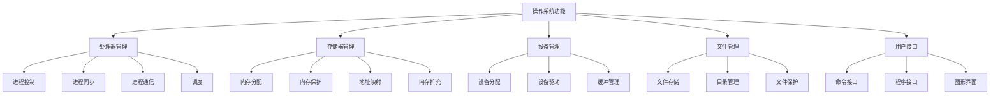
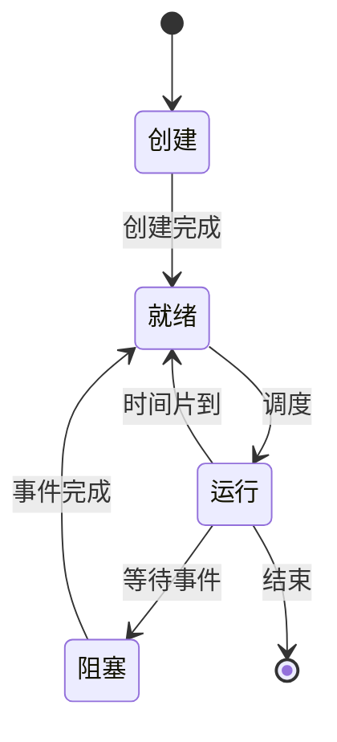
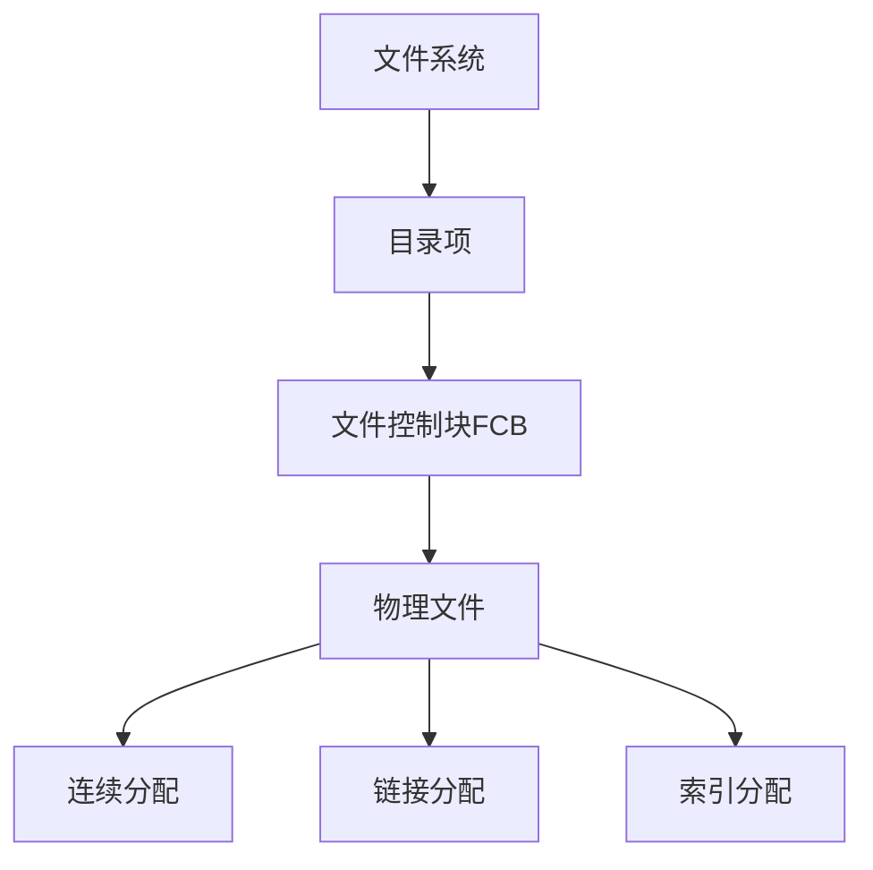

# 计算机操作系统

## 概述

操作系统是计算机系统中最基本的系统软件,负责管理计算机硬件资源,为应用程序提供运行环境。

!!! note "操作系统定义"
    操作系统是控制和管理计算机硬件和软件资源,合理组织计算机工作流程,方便用户使用的程序集合。

## 操作系统的发展历程

### 1. 手工操作阶段

    <strong>手工操作阶段(1946-1950年代)</strong>
    
用户直接通过开关、按钮控制计算机,亮灯显示结果。

**特点:**

- 用户独占全机
- CPU等待人工操作
- 资源利用率低

**问题:** 手工操作速度与电子计算速度严重不匹配

### 2. 批处理阶段

!!! tip "批处理系统"
    引入作业控制语言,实现作业的成批处理。

#### 简单批处理

**特点:**

- 引入作业控制语言(JCL)
- 用户编写作业说明书
- 操作员成批输入、成批执行
- 磁带替代卡片和纸带

**优点:**

- 减少手工操作时间
- 提高系统利用率

**缺点:**

- 半自动化处理
- 未解决CPU与I/O速度不匹配问题

#### 多道批处理

    <strong>多道批处理系统</strong>
    
内存中同时存放多个作业,CPU在它们之间切换。

**特点:**

- 多道程序并行执行
- 磁盘设备出现
- 实现自动化控制

**优点:**

- CPU与I/O并行
- 资源利用率高
- 系统吞吐量大

### 3. 分时系统

!!! info "分时系统"
    多个用户通过终端同时使用一台计算机,系统轮流为每个用户服务。

**特点:**

- 多路性: 多个用户同时使用
- 独立性: 用户感觉独占机器
- 及时性: 响应时间短
- 交互性: 人机对话

### 4. 实时系统

    <strong>实时系统</strong>
    
系统能及时响应外部事件的请求,在规定时间内完成处理。

**类型:**

- **实时控制系统**: 工业控制、军事应用
- **实时信息处理系统**: 航空订票、银行业务

**特点:**

- 实时性: 响应时间严格
- 可靠性: 高可靠性要求
- 确定性: 响应时间可预测

## 操作系统的功能

### 1. 处理器管理

!!! success "处理器管理"
    管理CPU资源,合理分配CPU时间。

**主要功能:**

- **进程控制**: 创建、撤销、阻塞、唤醒进程
- **进程同步**: 协调进程执行
- **进程通信**: 进程间信息交换
- **调度**: 作业调度、进程调度

#### 进程状态

#### 进程调度算法

    <table style="width: 100%; border-collapse: collapse; margin: 10px 0;">
        <tr style="background-color: #4CAF50; color: white;">
            <th style="padding: 10px; border: 1px solid #ddd;">算法</th>
            <th style="padding: 10px; border: 1px solid #ddd;">特点</th>
            <th style="padding: 10px; border: 1px solid #ddd;">适用场景</th>
        </tr>
        <tr>
            <td style="padding: 10px; border: 1px solid #ddd;">FCFS(先来先服务)</td>
            <td style="padding: 10px; border: 1px solid #ddd;">简单、公平</td>
            <td style="padding: 10px; border: 1px solid #ddd;">批处理系统</td>
        </tr>
        <tr style="background-color: #f9f9f9;">
            <td style="padding: 10px; border: 1px solid #ddd;">SJF(短作业优先)</td>
            <td style="padding: 10px; border: 1px solid #ddd;">平均等待时间最短</td>
            <td style="padding: 10px; border: 1px solid #ddd;">批处理系统</td>
        </tr>
        <tr>
            <td style="padding: 10px; border: 1px solid #ddd;">RR(时间片轮转)</td>
            <td style="padding: 10px; border: 1px solid #ddd;">公平、响应快</td>
            <td style="padding: 10px; border: 1px solid #ddd;">分时系统</td>
        </tr>
        <tr style="background-color: #f9f9f9;">
            <td style="padding: 10px; border: 1px solid #ddd;">优先级调度</td>
            <td style="padding: 10px; border: 1px solid #ddd;">重要进程优先</td>
            <td style="padding: 10px; border: 1px solid #ddd;">实时系统</td>
        </tr>
    </table>

### 2. 存储器管理

    <strong>存储器管理</strong>
    
管理内存资源,为进程分配内存空间。

**主要功能:**

- **内存分配**: 为进程分配内存空间
- **内存保护**: 防止进程互相干扰
- **地址映射**: 逻辑地址到物理地址的转换
- **内存扩充**: 虚拟存储器

#### 存储管理方式

- **连续分配**: 单一连续、固定分区、动态分区
- **非连续分配**: 分页、分段、段页式

#### 虚拟存储器

!!! warning "虚拟存储器"
    逻辑上扩充内存容量,允许程序部分装入内存执行。

**实现方式:**

- **请求分页**: 按需调入页面
- **请求分段**: 按需调入段

**页面置换算法:**

- OPT: 最佳置换(理论)
- FIFO: 先进先出
- LRU: 最近最少使用
- Clock: 时钟算法

### 3. 设备管理

    <strong>设备管理</strong>
    
管理各类外部设备,实现设备与CPU的并行操作。

**主要功能:**

- **设备分配**: 分配设备给进程
- **设备驱动**: 控制设备操作
- **缓冲管理**: 缓解速度不匹配

#### I/O控制方式

### 4. 文件管理

!!! info "文件管理"
    管理文件资源,提供文件的存储、检索和共享。

**主要功能:**

- **文件存储**: 管理文件存储空间
- **目录管理**: 建立文件目录
- **文件保护**: 控制文件访问权限

#### 文件系统结构

### 5. 用户接口

    <strong>用户接口</strong>
    
操作系统提供给用户使用的接口。

**类型:**

- **命令接口**: 命令行(CLI)
- **程序接口**: 系统调用
- **图形界面**: GUI

## 操作系统的类型

### 1. 批处理操作系统

**特点:**

- 多道程序设计
- 作业成批处理
- 无交互能力

### 2. 分时操作系统

!!! tip "分时操作系统"
    多个用户通过终端同时使用计算机。

**特点:**

- 多路性、独立性、及时性、交互性
- 代表: UNIX、Linux

### 3. 实时操作系统

**特点:**

- 实时响应
- 高可靠性
- 代表: VxWorks、QNX

### 4. 网络操作系统

    <strong>网絡操作系统</strong>
    
在普通操作系统基础上增加网络功能。

**特点:**

- 网络通信
- 资源共享
- 代表: Windows Server、Linux

### 5. 分布式操作系统

**特点:**

- 多计算机协同工作
- 资源全局管理
- 透明性

### 6. 个人计算机操作系统

**特点:**

- 单用户、多任务
- 图形界面友好
- 代表: Windows、macOS

## 操作系统的特征

!!! success "操作系统特征"
    现代操作系统具有以下基本特征。

### 1. 并发性

**含义:** 两个或多个事件在同一时间间隔内发生。

**区别:**

- **并行**: 多个事件同时发生(多核CPU)
- **并发**: 多个事件交替发生(单核CPU)

### 2. 共享性

    <strong>共享性</strong>
    
系统资源被多个进程共同使用。

**类型:**

- **互斥共享**: 资源在一段时间内只允许一个进程访问
- **同时共享**: 资源在一段时间内允许多个进程交替访问

### 3. 虚拟性

**含义:** 将物理实体变为多个逻辑实体。

**例子:**

- 虚拟存储器
- 虚拟设备

### 4. 异步性

    <strong>异步性</strong>
    
进程以不可预知的速度向前推进。

## 常见操作系统

    <table style="width: 100%; border-collapse: collapse; margin: 10px 0;">
        <tr style="background-color: #4CAF50; color: white;">
            <th style="padding: 10px; border: 1px solid #ddd;">操作系统</th>
            <th style="padding: 10px; border: 1px solid #ddd;">类型</th>
            <th style="padding: 10px; border: 1px solid #ddd;">特点</th>
            <th style="padding: 10px; border: 1px solid #ddd;">应用领域</th>
        </tr>
        <tr>
            <td style="padding: 10px; border: 1px solid #ddd;">Windows</td>
            <td style="padding: 10px; border: 1px solid #ddd;">个人计算机</td>
            <td style="padding: 10px; border: 1px solid #ddd;">图形界面友好</td>
            <td style="padding: 10px; border: 1px solid #ddd;">桌面、办公</td>
        </tr>
        <tr style="background-color: #f9f9f9;">
            <td style="padding: 10px; border: 1px solid #ddd;">Linux</td>
            <td style="padding: 10px; border: 1px solid #ddd;">分时/网络</td>
            <td style="padding: 10px; border: 1px solid #ddd;">开源、稳定</td>
            <td style="padding: 10px; border: 1px solid #ddd;">服务器、嵌入式</td>
        </tr>
        <tr>
            <td style="padding: 10px; border: 1px solid #ddd;">macOS</td>
            <td style="padding: 10px; border: 1px solid #ddd;">个人计算机</td>
            <td style="padding: 10px; border: 1px solid #ddd;">美观、稳定</td>
            <td style="padding: 10px; border: 1px solid #ddd;">苹果设备</td>
        </tr>
        <tr style="background-color: #f9f9f9;">
            <td style="padding: 10px; border: 1px solid #ddd;">Android</td>
            <td style="padding: 10px; border: 1px solid #ddd;">移动设备</td>
            <td style="padding: 10px; border: 1px solid #ddd;">开源、应用丰富</td>
            <td style="padding: 10px; border: 1px solid #ddd;">智能手机、平板</td>
        </tr>
        <tr>
            <td style="padding: 10px; border: 1px solid #ddd;">iOS</td>
            <td style="padding: 10px; border: 1px solid #ddd;">移动设备</td>
            <td style="padding: 10px; border: 1px solid #ddd;">封闭、安全</td>
            <td style="padding: 10px; border: 1px solid #ddd;">iPhone、iPad</td>
        </tr>
    </table>

## 参考资料

- [计算机操作系统 百度百科](https://baike.baidu.com/item/计算机操作系统)
- [操作系统笔记 南京大学慕课版](https://blog.csdn.net/m0_51787573/article/details/122614586) 