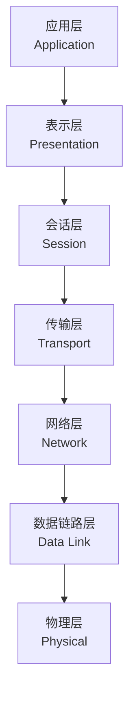
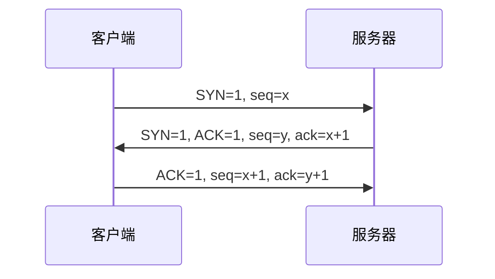
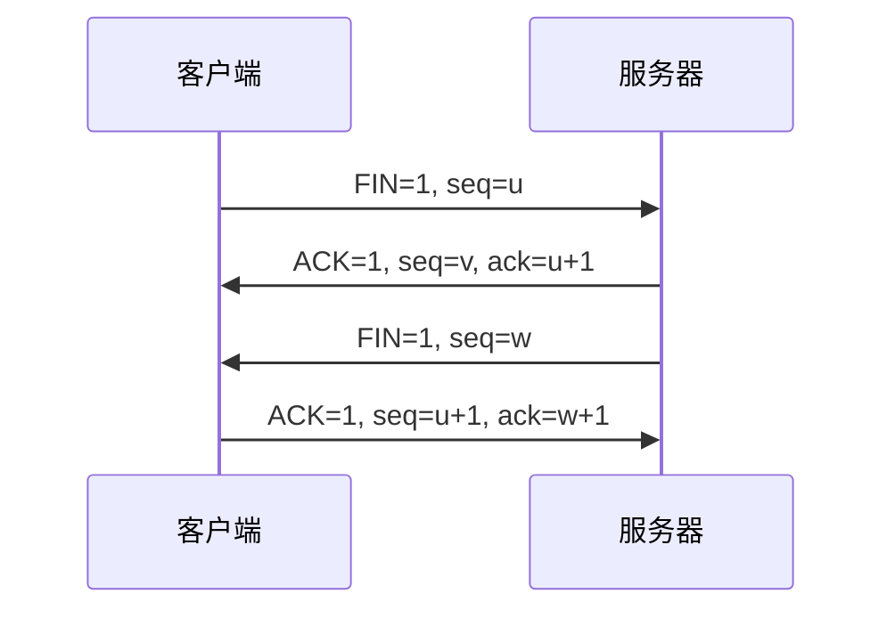
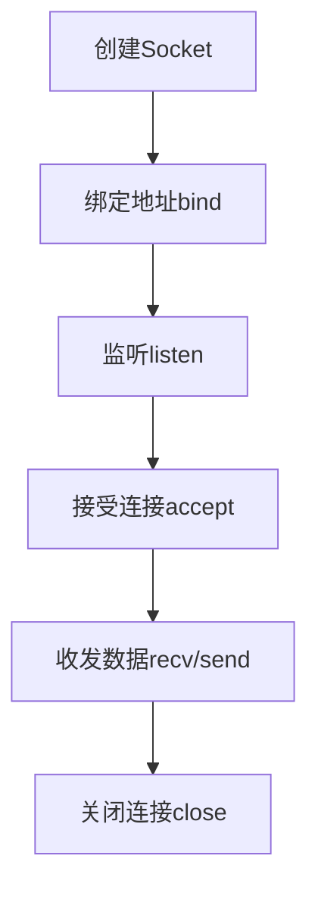

# 计算机网络

## 概述

计算机网络是将地理上分散的、具有独立功能的计算机系统,通过通信设备和线路连接起来,在网络软件支持下实现数据通信和资源共享的系统。

!!! note "计算机网络定义"
    计算机网络是计算机技术与通信技术相结合的产物,实现了资源共享和信息传递。

## 网络的功能

    <strong>计算机网络的主要功能</strong>
    <ul style="margin: 5px 0;">
        <li>数据通信: 信息传递</li>
        <li>资源共享: 硬件、软件、数据共享</li>
        <li>分布式处理: 协同工作</li>
        <li>提高可靠性: 冗余备份</li>
    </ul>

## 网络的分类

### 按覆盖范围分类

    <table style="width: 100%; border-collapse: collapse; margin: 10px 0;">
        <tr style="background-color: #4CAF50; color: white;">
            <th style="padding: 10px; border: 1px solid #ddd;">类型</th>
            <th style="padding: 10px; border: 1px solid #ddd;">覆盖范围</th>
            <th style="padding: 10px; border: 1px solid #ddd;">示例</th>
        </tr>
        <tr>
            <td style="padding: 10px; border: 1px solid #ddd;">局域网(LAN)</td>
            <td style="padding: 10px; border: 1px solid #ddd;">几米到几公里</td>
            <td style="padding: 10px; border: 1px solid #ddd;">办公室、校园</td>
        </tr>
        <tr style="background-color: #f9f9f9;">
            <td style="padding: 10px; border: 1px solid #ddd;">城域网(MAN)</td>
            <td style="padding: 10px; border: 1px solid #ddd;">几公里到几十公里</td>
            <td style="padding: 10px; border: 1px solid #ddd;">城市</td>
        </tr>
        <tr>
            <td style="padding: 10px; border: 1px solid #ddd;">广域网(WAN)</td>
            <td style="padding: 10px; border: 1px solid #ddd;">几十公里到几千公里</td>
            <td style="padding: 10px; border: 1px solid #ddd;">国家、洲际</td>
        </tr>
        <tr style="background-color: #f9f9f9;">
            <td style="padding: 10px; border: 1px solid #ddd;">互联网(Internet)</td>
            <td style="padding: 10px; border: 1px solid #ddd;">全球范围</td>
            <td style="padding: 10px; border: 1px solid #ddd;">全球互联</td>
        </tr>
    </table>

### 按拓扑结构分类

!!! tip "网络拓扑结构"
    网络中节点的连接方式。

#### 1. 星型拓扑

    <strong>星型拓扑</strong>
    
所有节点连接到中心节点。

**优点:**

- 结构简单
- 易于扩展
- 故障隔离容易

**缺点:**

- 中心节点负担重
- 中心节点故障影响全网

#### 2. 环型拓扑

    <strong>环型拓扑</strong>
    
节点首尾相连形成环。

**优点:**

- 结构简单
- 传输延迟确定

**缺点:**

- 可靠性差
- 扩展困难

#### 3. 总线型拓扑

    <strong>总线型拓扑</strong>
    
所有节点连接到一条总线上。

**优点:**

- 结构简单
- 成本低

**缺点:**

- 可靠性差
- 性能受限

## 网络协议

!!! info "网络协议"
    网络协议是计算机网络中进行数据交换的规则、标准或约定。

### OSI七层模型

### TCP/IP四层模型

    <strong>TCP/IP模型</strong>

**各层功能:**

- **应用层**: 提供网络应用服务(HTTP, FTP, SMTP)
- **传输层**: 提供端到端通信(TCP, UDP)
- **网际层**: 提供路由选择(IP, ICMP)
- **网络接口层**: 提供物理传输

## 网络设备

!!! success "常见网络设备"
    网络中使用的各种设备。

### 1. 中继器(Repeater)

    <strong>中继器</strong>
    
物理层设备,放大和转发信号。

### 2. 集线器(Hub)

    <strong>集线器</strong>
    
物理层设备,多端口中继器。

### 3. 网桥(Bridge)

    <strong>网桥</strong>
    
数据链路层设备,连接两个网段。

### 4. 交换机(Switch)

    <strong>交换机</strong>
    
数据链路层设备,多端口网桥。

### 5. 路由器(Router)

    <strong>路由器</strong>
    
网络层设备,实现路由选择。

## 网络安全

!!! warning "网络安全"
    保护网络系统免受攻击和威胁。

### 常见安全威胁

- 病毒和恶意软件
- 黑客攻击
- 数据泄露
- 拒绝服务攻击(DoS)

### 安全措施

- 防火墙
- 加密技术
- 认证和授权
- 入侵检测系统

## IP地址与子网

!!! info "IP地址"
    网络中设备的唯一标识符。

### IPv4地址

    <strong>IPv4地址</strong>
    
32位地址,通常表示为4个十进制数,如192.168.1.1。

**分类:**

- **A类**: 1.0.0.0 ~ 126.255.255.255 (大型网络)
- **B类**: 128.0.0.0 ~ 191.255.255.255 (中型网络)
- **C类**: 192.0.0.0 ~ 223.255.255.255 (小型网络)
- **D类**: 224.0.0.0 ~ 239.255.255.255 (多播地址)
- **E类**: 240.0.0.0 ~ 255.255.255.255 (保留地址)

**特殊地址:**

- 0.0.0.0: 本机
- 127.0.0.1: 本地回环地址
- 255.255.255.255: 广播地址

### IPv6地址

    <strong>IPv6地址</strong>
    
128位地址,解决IPv4地址枯竭问题。

**特点:**

- 地址空间巨大(2^128个地址)
- 表示为8组16进制数,如2001:0db8:85a3:0000:0000:8a2e:0370:7334
- 支持自动配置
- 内置安全性

### 子网掩码

!!! tip "子网掩码"
    用于划分网络地址和主机地址。

**作用:**

- 确定网络部分和主机部分
- 支持子网划分
- 提高IP地址利用率

**CIDR表示法:** 192.168.1.0/24

## 网络协议详解

### TCP协议

    <strong>TCP(传输控制协议)</strong>
    
面向连接的、可靠的传输层协议。

**特点:**

- 面向连接: 三次握手建立连接
- 可靠传输: 确认、重传、流量控制
- 有序传输: 数据按序到达
- 全双工通信

**三次握手:**

**四次挥手:**

### UDP协议

!!! warning "UDP(用户数据报协议)"
    无连接的、不可靠的传输层协议。

**特点:**

- 无连接: 不需要建立连接
- 不可靠: 不保证数据到达
- 无序: 数据可能乱序到达
- 高效: 开销小,速度快

**应用场景:**

- 实时音视频传输
- DNS查询
- 在线游戏

### HTTP协议

    <strong>HTTP(超文本传输协议)</strong>
    
应用层协议,用于Web数据传输。

**版本:**

- **HTTP/1.0**: 短连接,每次请求建立新连接
- **HTTP/1.1**: 持久连接,管道化请求
- **HTTP/2**: 多路复用,头部压缩,服务器推送
- **HTTP/3**: 基于QUIC协议,使用UDP

**请求方法:**

- GET: 获取资源
- POST: 提交数据
- PUT: 更新资源
- DELETE: 删除资源
- HEAD: 获取头部信息

**状态码:**

- 1xx: 信息性状态码
- 2xx: 成功状态码(200 OK)
- 3xx: 重定向状态码(301 永久重定向)
- 4xx: 客户端错误(404 Not Found)
- 5xx: 服务器错误(500 Internal Server Error)

## 网络编程

### Socket编程

!!! success "Socket"
    网络通信的端点,应用程序与网络协议栈的接口。

**类型:**

- **流式Socket(SOCK_STREAM)**: TCP
- **数据报Socket(SOCK_DGRAM)**: UDP
- **原始Socket(SOCK_RAW)**: 直接访问IP层

**编程流程:**

## 网络新技术

### 5G网络

    <strong>5G网络</strong>
    
第五代移动通信网络。

**特点:**

- 高速率: 峰值速率10Gbps
- 低延迟: 端到端延迟1ms
- 大连接: 每平方公里百万级设备
- 高可靠: 99.999%可靠性

**应用场景:**

- 增强移动宽带(eMBB)
- 海量机器类通信(mMTC)
- 超可靠低延迟通信(uRLLC)

### 物联网(IoT)

!!! info "物联网"
    物物相连的互联网,实现万物互联。

**架构:**

- 感知层: 传感器、RFID
- 网络层: 通信网络
- 应用层: 智能应用

**关键技术:**

- 传感器技术
- 嵌入式系统
- 无线通信
- 云计算

### 软件定义网络(SDN)

    <strong>软件定义网络</strong>
    
控制平面与数据平面分离的新型网络架构。

**特点:**

- 控制集中化
- 网络可编程
- 开放接口

## 参考资料

- [计算机网络 百度百科](https://baike.baidu.com/item/计算机网络)
- [TCP/IP详解](https://book.douban.com/subject/1088055/)
- [计算机网络:自顶向下方法](https://book.douban.com/subject/3028655/)
