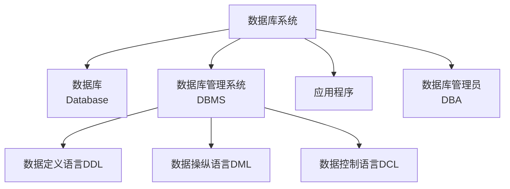
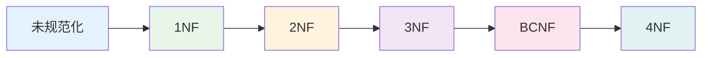
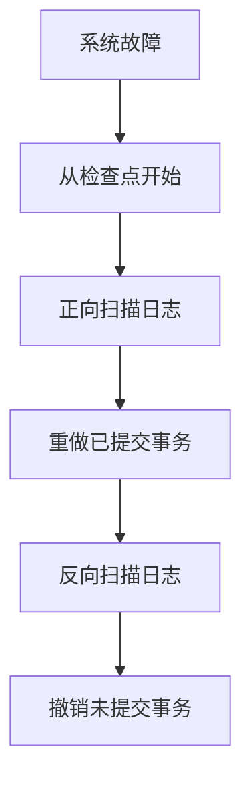

# 数据库系统

## 概述

数据库系统是具有数据管理功能的计算机系统,是实现有组织地、动态地存储大量关联数据,方便多用户访问的计算机软、硬件资源组成的系统。

!!! note "数据库系统定义"
    数据库系统 = 数据库 + 数据库管理系统(DBMS) + 应用程序 + 数据库管理员(DBA)

## 数据库系统的组成

### 1. 数据库

    <strong>数据库(Database)</strong>
    
长期存储在计算机内的、有组织的、可共享的数据集合。

**特点:**

- 持久存储
- 有组织
- 可共享
- 冗余度小
- 独立性高

### 2. 数据库管理系统

    <strong>数据库管理系统(DBMS)</strong>
    
对数据库进行定义、操纵、管理和维护的软件系统。

**功能:**

- 数据定义
- 数据操纵
- 数据控制
- 数据维护

### 3. 应用程序

    <strong>应用程序</strong>
    
利用数据库管理系统访问和操作数据库的程序。

### 4. 数据库管理员

    <strong>数据库管理员(DBA)</strong>
    
负责数据库系统的设计、维护和管理的人员。

## 数据模型

!!! tip "数据模型"
    数据模型是数据库系统中用于提供信息表示和操作手段的形式构架。

### 1. 层次模型

    <strong>层次模型</strong>
    
用树形结构表示实体之间联系的模型。

**特点:**

- 有且仅有一个根节点
- 除根节点外,其他节点有且仅有一个父节点

### 2. 网状模型

    <strong>网状模型</strong>
    
用图结构表示实体之间联系的模型。

**特点:**

- 允许一个节点有多个父节点
- 允许多个节点没有父节点

### 3. 关系模型

    <strong>关系模型</strong>
    
用二维表结构表示实体之间联系的模型。

**特点:**

- 数据结构简单
- 理论基础扎实
- 使用广泛

## 关系数据库

!!! info "关系数据库"
    基于关系模型的数据库。

### 基本概念

#### 1. 关系(表)

    <strong>关系</strong>
    
一个二维表,表示实体集。

#### 2. 元组(行)

    <strong>元组</strong>
    
表中的一行,表示一个实体。

#### 3. 属性(列)

    <strong>属性</strong>
    
表中的一列,表示实体的一个特征。

### 关系运算

- **选择(Selection)**: 从关系中选取满足条件的元组
- **投影(Projection)**: 从关系中选取若干属性列
- **连接(Join)**: 将两个关系按条件连接

## SQL语言

!!! success "SQL语言"
    结构化查询语言,用于操作关系数据库。

### SQL语言分类

    <table style="width: 100%; border-collapse: collapse; margin: 10px 0;">
        <tr style="background-color: #4CAF50; color: white;">
            <th style="padding: 10px; border: 1px solid #ddd;">类型</th>
            <th style="padding: 10px; border: 1px solid #ddd;">功能</th>
            <th style="padding: 10px; border: 1px solid #ddd;">主要语句</th>
        </tr>
        <tr>
            <td style="padding: 10px; border: 1px solid #ddd;">数据定义语言(DDL)</td>
            <td style="padding: 10px; border: 1px solid #ddd;">定义数据结构</td>
            <td style="padding: 10px; border: 1px solid #ddd;">CREATE, ALTER, DROP</td>
        </tr>
        <tr style="background-color: #f9f9f9;">
            <td style="padding: 10px; border: 1px solid #ddd;">数据操纵语言(DML)</td>
            <td style="padding: 10px; border: 1px solid #ddd;">操作数据</td>
            <td style="padding: 10px; border: 1px solid #ddd;">SELECT, INSERT, UPDATE, DELETE</td>
        </tr>
        <tr>
            <td style="padding: 10px; border: 1px solid #ddd;">数据控制语言(DCL)</td>
            <td style="padding: 10px; border: 1px solid #ddd;">控制数据访问</td>
            <td style="padding: 10px; border: 1px solid #ddd;">GRANT, REVOKE</td>
        </tr>
    </table>

## 数据库设计

!!! warning "数据库设计"
    设计数据库结构和应用的过程。

### 设计步骤

1. **需求分析**: 了解用户需求
2. **概念设计**: 设计E-R模型
3. **逻辑设计**: 转换为关系模式
4. **物理设计**: 确定存储结构
5. **实施**: 创建数据库
6. **运行维护**: 维护和优化

## 常见数据库系统

    <table style="width: 100%; border-collapse: collapse; margin: 10px 0;">
        <tr style="background-color: #4CAF50; color: white;">
            <th style="padding: 10px; border: 1px solid #ddd;">数据库</th>
            <th style="padding: 10px; border: 1px solid #ddd;">类型</th>
            <th style="padding: 10px; border: 1px solid #ddd;">特点</th>
        </tr>
        <tr>
            <td style="padding: 10px; border: 1px solid #ddd;">MySQL</td>
            <td style="padding: 10px; border: 1px solid #ddd;">关系型</td>
            <td style="padding: 10px; border: 1px solid #ddd;">开源、轻量级</td>
        </tr>
        <tr style="background-color: #f9f9f9;">
            <td style="padding: 10px; border: 1px solid #ddd;">Oracle</td>
            <td style="padding: 10px; border: 1px solid #ddd;">关系型</td>
            <td style="padding: 10px; border: 1px solid #ddd;">企业级、高性能</td>
        </tr>
        <tr>
            <td style="padding: 10px; border: 1px solid #ddd;">SQL Server</td>
            <td style="padding: 10px; border: 1px solid #ddd;">关系型</td>
            <td style="padding: 10px; border: 1px solid #ddd;">微软产品、易用</td>
        </tr>
        <tr style="background-color: #f9f9f9;">
            <td style="padding: 10px; border: 1px solid #ddd;">MongoDB</td>
            <td style="padding: 10px; border: 1px solid #ddd;">NoSQL</td>
            <td style="padding: 10px; border: 1px solid #ddd;">文档型、灵活</td>
        </tr>
    </table>

## 数据库事务

!!! info "事务"
    数据库中一组操作的逻辑单元,要么全部成功,要么全部失败。

### ACID特性

    <strong>ACID特性</strong>
    
事务的四个基本特性。

**四个特性:**

- **原子性(Atomicity)**: 事务是不可分割的工作单位
- **一致性(Consistency)**: 事务执行后数据库状态一致
- **隔离性(Isolation)**: 多个事务并发执行互不干扰
- **持久性(Durability)**: 事务一旦提交,永久生效

### 事务隔离级别

    <table style="width: 100%; border-collapse: collapse; margin: 10px 0;">
        <tr style="background-color: #4CAF50; color: white;">
            <th style="padding: 10px; border: 1px solid #ddd;">隔离级别</th>
            <th style="padding: 10px; border: 1px solid #ddd;">脏读</th>
            <th style="padding: 10px; border: 1px solid #ddd;">不可重复读</th>
            <th style="padding: 10px; border: 1px solid #ddd;">幻读</th>
        </tr>
        <tr>
            <td style="padding: 10px; border: 1px solid #ddd;">读未提交</td>
            <td style="padding: 10px; border: 1px solid #ddd;">可能</td>
            <td style="padding: 10px; border: 1px solid #ddd;">可能</td>
            <td style="padding: 10px; border: 1px solid #ddd;">可能</td>
        </tr>
        <tr style="background-color: #f9f9f9;">
            <td style="padding: 10px; border: 1px solid #ddd;">读已提交</td>
            <td style="padding: 10px; border: 1px solid #ddd;">不可能</td>
            <td style="padding: 10px; border: 1px solid #ddd;">可能</td>
            <td style="padding: 10px; border: 1px solid #ddd;">可能</td>
        </tr>
        <tr>
            <td style="padding: 10px; border: 1px solid #ddd;">可重复读</td>
            <td style="padding: 10px; border: 1px solid #ddd;">不可能</td>
            <td style="padding: 10px; border: 1px solid #ddd;">不可能</td>
            <td style="padding: 10px; border: 1px solid #ddd;">可能</td>
        </tr>
        <tr style="background-color: #f9f9f9;">
            <td style="padding: 10px; border: 1px solid #ddd;">串行化</td>
            <td style="padding: 10px; border: 1px solid #ddd;">不可能</td>
            <td style="padding: 10px; border: 1px solid #ddd;">不可能</td>
            <td style="padding: 10px; border: 1px solid #ddd;">不可能</td>
        </tr>
    </table>

## 数据库规范化

!!! tip "规范化"
    消除数据冗余,减少更新异常的过程。

### 范式

    <strong>范式(Normal Form)</strong>
    
关系模式满足的不同程度的规范化要求。

**各级范式:**

- **第一范式(1NF)**: 属性不可再分
- **第二范式(2NF)**: 消除非主属性对码的部分函数依赖
- **第三范式(3NF)**: 消除非主属性对码的传递函数依赖
- **BCNF**: 消除主属性对码的部分和传递函数依赖
- **第四范式(4NF)**: 消除非平凡且非函数依赖的多值依赖

### 规范化过程

## 数据库索引

!!! success "索引"
    提高数据检索速度的数据结构。

### 索引类型

    <strong>常见索引类型</strong>

**类型:**

- **B+树索引**: 最常用的索引结构
    - 支持范围查询
    - 自动排序
    - 适合磁盘存储

- **哈希索引**: 基于哈希表
    - 等值查询快
    - 不支持范围查询
    - 不支持排序

- **全文索引**: 用于文本搜索
    - 支持模糊匹配
    - 支持自然语言搜索

- **空间索引**: 用于地理数据
    - R树索引
    - 支持空间查询

### 索引设计原则

**应该创建索引的情况:**

- 频繁作为WHERE条件的字段
- 频繁用于JOIN的字段
- 频繁用于ORDER BY的字段
- 频繁用于GROUP BY的字段

**不应该创建索引的情况:**

- 频繁更新的字段
- 区分度低的字段(如性别)
- 数据量小的表

## 数据库并发控制

!!! warning "并发控制"
    保证多个事务并发执行时数据库的一致性。

### 封锁协议

    <strong>封锁协议</strong>
    
通过加锁实现并发控制。

**锁类型:**

- **共享锁(S锁)**: 用于读操作,多个事务可同时加S锁
- **排他锁(X锁)**: 用于写操作,独占锁

**三级封锁协议:**

- **一级封锁协议**: 修改数据前加X锁,防止丢失更新
- **二级封锁协议**: 一级+读取数据前加S锁,防止读脏数据
- **三级封锁协议**: 二级+S锁直到事务结束,防止不可重复读

### MVCC

    <strong>多版本并发控制(MVCC)</strong>
    
通过保存数据的多版本来实现并发控制。

**优点:**

- 读操作不阻塞写操作
- 写操作不阻塞读操作
- 提高并发性能

**实现:**

- 保存数据的多个版本
- 通过版本号或时间戳判断可见性
- 定期清理旧版本

## 数据库恢复

!!! info "数据库恢复"
    在故障发生后将数据库恢复到一致状态。

### 恢复技术

**日志文件:**

- **重做日志(Redo Log)**: 重做已提交事务的修改
- **撤销日志(Undo Log)**: 撤销未提交事务的修改

**检查点(Checkpoint):**

- 定期将内存数据写入磁盘
- 记录检查点位置
- 恢复时从检查点开始

### 恢复策略

## NoSQL数据库

    <strong>NoSQL数据库</strong>
    
非关系型数据库,适合大数据和Web应用。

### 类型

**1. 键值存储:**

- Redis、Memcached
- 简单快速
- 适合缓存

**2. 文档存储:**

- MongoDB、CouchDB
- 存储JSON/BSON文档
- 灵活的数据模型

**3. 列族存储:**

- HBase、Cassandra
- 适合海量数据
- 高写入性能

**4. 图数据库:**

- Neo4j、JanusGraph
- 存储图结构数据
- 适合社交网络、推荐系统

### CAP理论

!!! tip "CAP理论"
    分布式系统最多只能同时满足三项中的两项。

**三个特性:**

- **一致性(Consistency)**: 所有节点数据一致
- **可用性(Availability)**: 每个请求都有响应
- **分区容错性(Partition tolerance)**: 网络分区时系统仍能运行

**权衡:**

- CA: 传统关系数据库(单机)
- CP: MongoDB、HBase
- AP: Cassandra、DynamoDB

## 参考资料

- [数据库系统 百度百科](https://baike.baidu.com/item/数据库系统)
- [数据库系统概念](https://book.douban.com/subject/1054861/)
- [高性能MySQL](https://book.douban.com/subject/4241824/)
